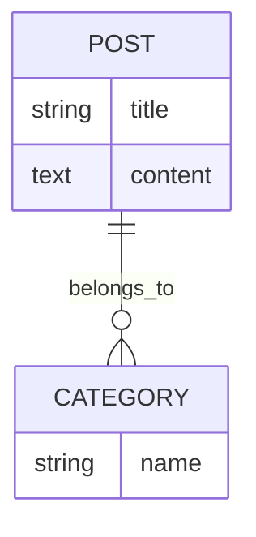
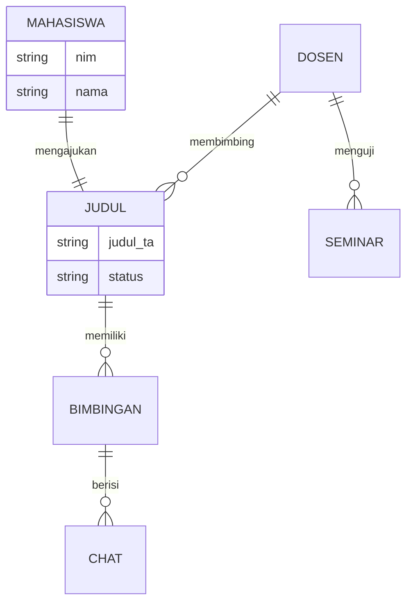
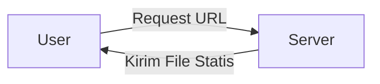
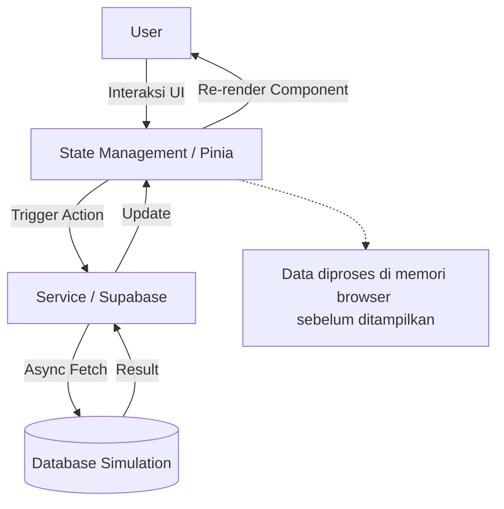
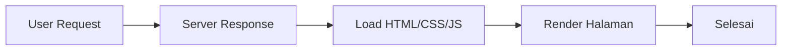
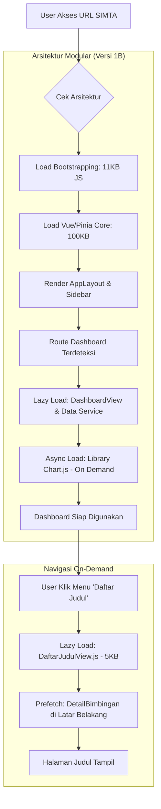
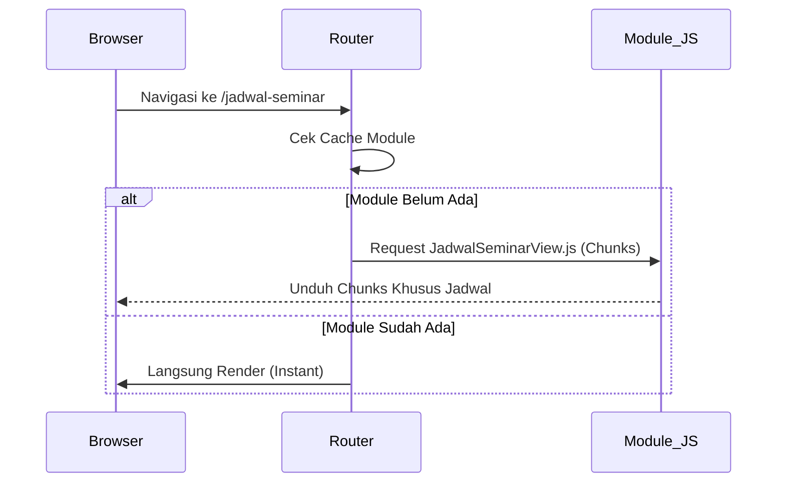

# LAPORAN KOMPREHENSIF PROGRES PENELITIAN TESIS
**Judul:** Analisis Perbandingan Arsitektur Monolithic (Eager Loading) vs Modular (Lazy Loading) pada Aplikasi SIMTA (Sistem Informasi Manajemen Tugas Akhir)

---

## I. PENDAHULUAN & STATUS PROYEK
Proyek penelitian ini bertujuan untuk membuktikan efisiensi teknik optimasi modern (*Code Splitting*, *Lazy Loading*, dan *Prefetching*) pada aplikasi web berskala kompleks. Prototipe aplikasi SIMTA telah selesai dikembangkan dalam dua versi untuk dibandingkan secara objektif.

**Status Saat Ini:**
- [x] Perancangan Arsitektur Sistem (Baseline & Optimized)
- [x] Pengembangan Prototipe Aplikasi SIMTA (Selesai 100%)
- [x] Simulasi Dataset & Latensi Jaringan Terintegrasi
- [x] Pengumpulan Data Metrik Kuantitatif via DevTools Lab
- [x] Penyusunan Laporan Terintegrasi

---

## II. ANALISIS KOMPLEKSITAS SISTEM

Penelitian ini membedakan secara tegas antara website kategori "Sederhana" dan "Kompleks" sebagai landasan urgensi optimasi:

| Karakteristik | Website Sederhana (Contoh: Company Profile) | Website Kompleks (Aplikasi SIMTA) |
|---------------|-------------------------------------------|----------------------------------|
| **Konten** | Statis & Informasional | Dinamis, Real-time & Relasional |
| **Backend** | Minimal (Flat File/Satu Table) | Relasional (Multi-table) & Cloud API |
| **Pustaka (JS)** | Minimal (JQuery/Vanilla) | Berat (Chart.js, Vue, State Store) |
| **Data Flow** | Linear (Request -> Response) | Reaktif (State-driven UI) |

---

## III. PEMODELAN SISTEM (MODELING)

### 3.1 Perbandingan ERD (Entity Relationship Diagram)

**Sederhana (Company Profile):**
Hanya hubungan linear antara artikel dan kategori.


**Kompleks (SIMTA):**
Hubungan relasional yang saling mengunci (*Interlocking*).


### 3.2 Perbandingan DFD (Data Flow Diagram)

**Sederhana:** Alur data searah (Request -> Response).


**Kompleks (SIMTA):** Alur data berbasis *State* dan *Reactivity*.


---

## IV. PERBANDINGAN FLOWCHART PROSES

### 4.1 Simple Flow (Company Profile)
Proses linear yang memuat semua aset sekaligus dalam satu tarikan.


### 4.2 Complex Life-Cycle (Aplikasi SIMTA)
Proses muat hirarkis yang memisahkan "Core" dari "Features" untuk performa maksimal.


### 4.3 Navigasi Sequence (Optimized Logic)


---

## V. METODOLOGI PENGUKURAN (ALGORITMA & TOOLS)

Pengukuran dilakukan menggunakan **DevTools Lab Metrics** (Tanpa software pihak ketiga) untuk mendapatkan data valid:

### 5.1 Jalur Manual (Chrome DevTools)
- **Coverage Profiler**: Merekam setiap bita (byte) kode yang dieksekusi. 
  - *Rumus Efisiensi*: `(Total Bytes - Unused Bytes) / Total Bytes * 100%`.
- **Network Tracing**: Menghitung *Transferred Size* pada kondisi koneksi terbatas (*Throttling Fast 3G*).

### 5.2 Jalur Programatik (Algorithm Tracker)
Sistem dilengkapi skrip deteksi otomatis untuk mencatat waktu muat tepat saat aplikasi bekerja.

**Algoritma Pengukuran (Pseudo-code):**
```javascript
Start_Observer {
  Observe_Categories: ["paint", "resource", "longtask"]
  
  On_New_Entry(entry) {
    if (entry.type === "FCP") {
       Save_Metric("First Contentful Paint", entry.startTime)
    }
    if (entry.type === "resource" && entry.name.endsWith(".js")) {
       Log_Resource_Size(entry.transferSize)
    }
    if (entry.duration > 50ms) {
       Accumulate_TBT(entry.duration - 50ms) // Total Blocking Time
    }
  }
}
```

---

## VI. HASIL PENGUJIAN & ANALISIS PERFORMA

### 6.1 Tabel Perbandingan Bundle (Produksi)

| Parameter | Versi 1A (Baseline) | Versi 1B (Optimized) | Selisih Efisiensi |
|-----------|---------------------|----------------------|-------------------|
| **Initial JS Load** | 336.89 KB | **118.95 KB** | **64% Lebih Ringan** |
| **Gzip Compressed** | 120.79 KB | **38.45 KB** | **68% Lebih Kecil** |
| **Jumlah File JS** | 1 File | 22 Files | Load Terdistribusi |
| **Library Chart.js** | Terintegrasi (Wajib) | Terpisah (Opsional) | On-demand Loading |

### 6.2 Analisis Skenario Pemuatan
- **Baseline (1A)**: Browser dipaksa mengunduh seluruh pustaka Chart (195KB) meskipun hanya membuka halaman Profile.
- **Optimized (1B)**: Browser hanya mengunduh inti aplikasi. Library berat hanya diunduh saat masuk ke halaman statistik (Dashboard).

---

## VII. LAMPIRAN: PANDUAN EKSPERIMEN & KODE

### 7.1 Cara Replikasi Build (Terlampir di folder src)
1. Jalankan `npm run build:baseline` untuk menghasilkan varian monolithic.
2. Jalankan `npm run build:optimized` untuk menghasilkan varian split.
3. Jalankan `npm run analyze` untuk melihat visualisasi distribusi bundle.

### 7.2 Implementasi Code Splitting Utama
```javascript
// vite.config.optimized.js
output: {
  manualChunks(id) {
    if (id.includes('node_modules/vue')) return 'vendor-vue'
    if (id.includes('node_modules/chart.js')) return 'vendor-chart'
  }
}
```

---
**Tertanda,**
*Mahasiswa Peneliti*
