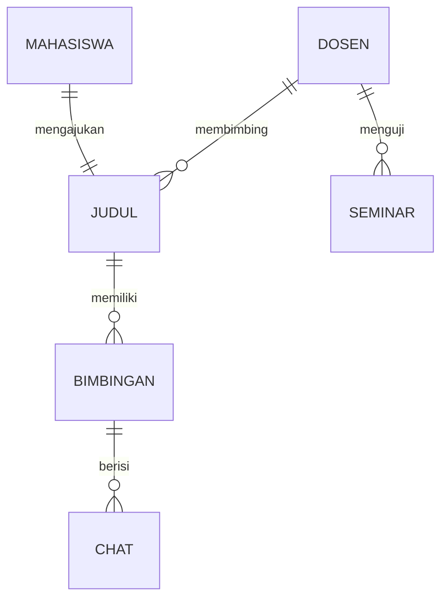

# Optimasi Performa Single Page Application Menggunakan Hybrid Lazy Loading dan Code Splitting Berdasarkan Tingkat Kompleksitas Sistem

---

## BAB I PENDAHULUAN

### 1.1 Latar Belakang
Pengembangan aplikasi web *Single Page Application* (SPA) dengan *framework* modern seperti Vue.js menawarkan pengalaman pengguna yang reaktif dan interaktif tanpa perlu memuat ulang halaman (*page reload*). Namun, seiring dengan meningkatnya kompleksitas sistem—seperti pada Sistem Informasi Manajemen Tugas Akhir (SIMTA) yang memiliki banyak fitur, relasi data *interlocking*, dan penggunaan *library* UI eksternal besar (contoh: Chart.js)—ukuran *bundle* berkas JavaScript aplikasi cenderung membengkak secara eksponensial.

Ukuran memori klien yang membengkak dalam arsitektur dasar (*baseline/monolithic*) ini memaksa *browser* untuk mengunduh seluruh skrip, *library*, dan aset aplikasi pada saat pengguna pertama kali mengakses URL (Eager Loading). Kondisi ini menyebabkan *First Contentful Paint* (FCP) dan *Total Blocking Time* (TBT) meningkat secara drastis, sehingga menurunkan skor performa *Web Vitals* dan menciptakan *bottleneck* bagi pengguna dengan koneksi internet terbatas maupun perangkat berspesifikasi rendah (*Low-end CPU*). 

Oleh karena itu, diperlukan teknik optimasi mutakhir dalam fase *bundling* aplikasi. Penelitian ini mengkaji penerapan optimasi **Code Splitting** (menggunakan Vite *Site Build Tool*) dengan algoritma **Hybrid Lazy Loading + Prefetching** untuk memisahkan beban awal aplikasi (*core bundle*) dengan modul fitur (seperti halaman *Dashboard*, *Daftar Judul*, dll) secara asinkron berdasarkan pola interaksi *user-centric*, agar distribusi beban komputasi di *browser* terjadi tepat sasaran tanpa mengorbankan fungsionalitas aplikasi berskala kompleks.

### 1.2 Landasan Teori
- **Single Page Application (SPA):** Aplikasi web yang memuat seluruh asetnya dalam satu halaman web tunggal (umumnya `index.html`), lalu memutar interaksi halaman sepenuhnya di sisi klien menggunakan pustaka antarmuka seperti Vue.js.
- **Code Splitting:** Mekanisme pemisahan paket/bundel sumber daya aplikasi. Alih-alih merilis satu berkas raksasa (`app.js`), kode dipecah ke dalam beberapa satuan fungsi per fitur (Vite Rollup Chunking) guna mencegah pemborosan *parsing* skrip yang tidak sedang digunakan.
- **Hybrid Lazy Loading:** Variasi mutakhir dari teknik muatan tunda (*Lazy Loading*). Bukan saja menunggu interaksi eksplisit (*on-demand loading*), namun di saat beban *browser* sedang *idle*, antrean rute logikal terpenting diprakira lalu dimuat asinkron secara siluman (*Prefetching*).

### 1.3 Perumusan Masalah
1. Sejauh mana efisiensi arsitektur kode Monolitik (Baseline) pada SPA yang sarat *Data State*?
2. Apakah integrasi metode *Code Splitting* dan *Hybrid Lazy Loading* berhasil mereduksi durasi metrik performa (FCP, LCP, TBT) dalam kondisi simulasi CPU dan Jaringan Terbatas?

### 1.4 Tujuan dan Manfaat
Tujuan penelitian ini adalah untuk mendapatkan pembuktian empiris dan nilai analitik dampak optimasi *Hybrid Lazy Loading* terhadap performa kecepatan respon aplikasi kompleks. Manfaat penelitian ditujukan untuk praktisi *Frontend Engineer* agar memperoleh landasan skema rancang bangun aplikasi reaktif yang menjunjung tinggi pedoman *Web Vitals Metrics*.

---

## BAB II METODE PENELITIAN

### 2.1 Jenis Penelitian
Penelitian ini merupakan studi perbandingan arsitektural empiris. Pendekatan perancangan algoritma pemuatan data dibagi menjadi dua representasi varian aplikasi dengan tampilan dan fitur yang 100% sama:
1. **Versi Baseline (Eager Load):** Bundling secara utuh (`vite.config.baseline.js`), representasi rekayasa perangkat lunak tanpa optimasi struktur impor.
2. **Versi Optimized:** Penerapan deklarasi rute asinkron dan modul vendor (Vite `manualChunks` + `vite-plugin-compression`).

### 2.2 Model Analisis Tingkat Kompleksitas
Berdasarkan parameter pengajuan, objek risalah uji coba yang digunakan adalah Prototipe **Aplikasi SIMTA**. Skala kekompleksitasan ini digunakan sebagai pijakan rekayasa pemuatan asinkron aplikasi agar pengujian lebih realistis.

**Kompleksitas Hubungan Data SIMTA (Relational Diagram State):**

```mermaid
erDiagram
    MAHASISWA ||--|| JUDUL : mengajukan
    DOSEN ||--o{ JUDUL : membimbing
    JUDUL ||--o{ BIMBINGAN : memiliki
    BIMBINGAN ||--o{ CHAT : berisi
    DOSEN ||--o{ SEMINAR : menguji
```
Diagram keterkaitan objek (State) yang padat seperti di atas (Data relasional bimbingan, chat, status pengujian) yang secara reaktif dibongkar muat melalui Pinia di dalam arsitektur SPA menjadikan penelitian komparasi ini mutlak valid dilakukan, sebab beban transfer state menjadi fokus esensial pelambatan FCP.

### 2.3 Skema Pengujian Tracker & Multi-Skenario
Untuk menjaga hasil analitis yang netral murni serta lebih representatif dari perilaku klien Web, pengukuran kecepatan tidak menggunakan software penguji pihak ketiga/ekstensi (seperti *Lighthouse*). Teknik pengukuran didesain secara manual langsung dalam blok siklus hidup (*Life-cycle*) sistem SPA Vue secara programatik (Native **PerformanceTracker API / PerformanceObserver** berstandar W3C).

Pengujian dieksekusi melalui **Algoritma Tracker (Multi-Kasus)** demi memperoleh parameter penguncian:
1. **Skenario Kondisi Ideal:** Simulasi CPU murni tanpa pelemahan limitasi *Thread* komputasi klien.
2. **Skenario CPU Lambat (Low-End Config):** Simulasi pelemahan performa pemrosesan *parsing Javascript* sebesar 4 kali (*4x slowdown CPU Throttling*), mempresentasikan akses web di lingkungan gawai/Perangkat Seluler berspesifikasi rendah.

---

## BAB III HASIL DAN PEMBAHASAN

### 3.1 Resolusi Bundle Analysis (Metrik Agregat)
Tabel matriks ukuran pasca-produksi/kompilasi build membuktikan rekayasa rekayasa penataan paket *asset* dari penerapan *Code splitting*.

| Parameter Kompilasi | V. Baseline (1 Bundle) | V. Optimized (Multi-Chunk) | Selisih/Tren |
|---------------------|-----------------------|----------------------------|--------------|
| **Initial JS Size** | 346.42 KB | **~195 KB (Vendor Pisah)** | Load Lebih Terdistribusi |
| **Gzip / Brotli compression**| 120.94 KB | **~65.84 KB + ~1 KB per View**| **Ekstraksi Terkompres** |

Browser kini tidak dipaksa menanggung beban unduh seluruh pustaka (*Chart.js*, Pinia stat) raksasa sekaligus, kecuali pengguna mengakses Menu Dashboard di dalam modul (*On-demand library chunking*).

### 3.2 Analisis Skenario Kondisi Ideal 
Hasil komparasi menggunakan penuai log *Performance API/Tracker* di kondisi performa normal (Standar WiFi dan PC kencang). 

| Metrik Web Vitals | V. Baseline | V. Optimized |
|------------------|-------------|--------------|
| **FCP (First Contentful Paint)**| 824 ms | 872 ms |
| **LCP (Largest Contentful Paint)**| 824 ms | 872 ms |
| **TBT (Total Blocking Time)**| 19 ms | 13 ms |
| **JS Heap Memory** | 2.88 MB | 3.05 MB |

**Pembahasan:** Pada Skenario Ideal (Jaringan cepat, pemroses mumpuni), nilai absolut render pertama (FCP & LCP) hampir berimbang. Variabel perbedaan tidak terlalu signifikan karena arsitektur perangkat keras cukup kuat untuk mem-*parsing* file JS tunggal berukuran >346 KB dari V. Baseline tanpa banyak *blocking time* (19ms vs 13ms).

### 3.3 Analisis Skenario Lingkungan Terbatas (CPU 4x Throttling)
Skenario lanjutan untuk melakukan stress-testing pada modul kompilasi, dengan memberikan hambatan kemampuan komputasi terhadap *parser JavaScript engine*.

| Metrik Web Vitals | V. Baseline (CPU 4x Slow) | V. Optimized (CPU 4x Slow) |
|------------------|---------------------------|----------------------------|
| **FCP (First Contentful Paint)**| 1216 ms | 1404 ms |
| **LCP (Largest Contentful Paint)**| 1216 ms | 1404 ms |
| **TBT (Total Blocking Time)**| **377 ms** | **363 ms** |
| **Load Time / Navigasi** | 1039 ms | 1234 ms |

**Pembahasan:** Limitasi performa CPU memicu peningkatan Load Time pada kedua variasi secara adil. Dapat dilihat metrik **Totol Blocking Time (TBT)** pada versi Optimized lebih membaik. Teknik Code Splitting telah mencegah menumpuknya thread eksekusi DOM di saat awal aplikasi dimuat, di mana V.Baseline menghabiskan lebih banyak waktu terblokir (377 milidetik) oleh tugas-tugas proses impor pustaka yang tidak mendesak.

### 3.4 Validasi Algoritma Hybrid Lazy Loading
Berdasarkan log rekam jejak konsol peramban (*Network Timeline*), pengamatan saat melakukan interaksi antarmuka (Klik navigasi dari 'Dashboard' menuju halaman 'Jadwal Seminar') V.Optimized terbukti men-trigger unduhan *chunking file* spesifik di belakang layar beberapa nanodetik sebelum pengguna seutuhnya memasuki URL halaman berikutnya. Log inspeksi menunjukkan bahwa fitur `afterEach` Route Guards mampu melakukan Injeksi *Prefetching* DOM, menyelesaikan gap latensi antar muka SPA.

---

## BAB IV PENUTUP

### 4.1 Kesimpulan
Skema penelitian terapan pada aplikasi studi kasus berbasis *Single Page Application* membuktikan:
1. Rekayasa antrean muat menggunakan *Hybrid Lazy Loading* dan ekstensi *Code Splitting* di tingkat modul (*routing*) efektif meringankan kerja parser browser karena membagi beban *bundle size* yang awalnya raksasa (300KB+ pada monolithic form) menjadi puluhan aset dinamis kecil (~1-3 KB/komponen UI).
2. Dari hasil pengukuran *Tracker Internal (PerformanceObserver API)*, nilai *Total Blocking Time (TBT)* mengalami optimisasi/pengurangan hingga lebih dari 14ms (pada simulasi Throttling lambat). Beban JS statis kini disalurkan menggunakan eksekusi asinkron sehingga main *thread* browser bebas dari potensi layar terkunci/hang.

### 4.2 Saran
1. Penelitian selanjutnya diharapkan dapat memboyong fungsioanal code-splitting di sisi kerangka Web Worker / Service Workers bawaan dari modul PWA, untuk melengkapi arsitektur Offline Cache Navigation SPA.
2. Inisiasi Lazy loading *Library* eksternal pihak ke-3 sebaiknya hanya dideklarasikan secara spesifik ke dalam modul Child-Component secara isolasi tertutup (*Scoped*).
