<h1 align="center">Optimasi Performa Single Page Application Menggunakan Hybrid Lazy Loading dan Code Splitting Berdasarkan Tingkat Kompleksitas Sistem</h1>

---

# BAB I PENDAHULUAN

## 1.1 Latar Belakang Masalah

Cara membangun website telah berubah sangat besar dalam sepuluh tahun terakhir. Dulu, website dibuat dengan cara lama yang disebut *Server-Side Rendering* (SSR) atau *Multi-Page Application* (MPA). Sekarang, banyak website modern menggunakan pendekatan baru yang disebut *Single Page Application* (SPA).

Pada website lama (MPA), setiap kali pengguna mengklik tombol atau berpindah halaman, server harus memproses dan mengirimkan halaman baru secara keseluruhan ke browser pengguna. Proses ini membuat tampilan layar sempat kosong dan putih sebentar sebelum halaman baru muncul. Hal ini tentu membuat pengalaman pengguna kurang nyaman (Batool et al., 2021).

Sebagai solusi dari masalah tersebut, muncullah pendekatan SPA yang dipelopori oleh kerangka kerja JavaScript seperti Vue.js, React, dan Angular. Dengan SPA, browser hanya perlu mengunduh satu file halaman utama di awal, lalu semua perubahan tampilan dikelola secara langsung oleh JavaScript di browser pengguna — tanpa perlu minta-minta ke server setiap saat. Ketika pengguna berpindah halaman, aplikasi hanya mengambil data kecil (dalam format JSON) dari server, lalu memperbarui bagian-bagian tertentu di layar saja (Bundschuh et al., 2019; Choi & Choi, 2020).

<div align="center">
  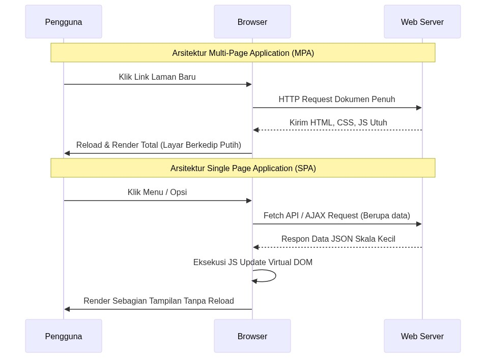
  <br>
  <i>Gambar 1.1 Perbandingan cara kerja website lama (MPA) dan website modern (SPA).</i>
</div>

Hasilnya, SPA terasa jauh lebih cepat dan responsif — hampir seperti menggunakan aplikasi di ponsel. Karena itulah banyak lembaga akademik dan pemerintah mulai menggunakan SPA, termasuk untuk portal e-government dan sistem pelacakan skripsi.

Namun, SPA memiliki satu kelemahan besar yang sering diabaikan: **ukuran file yang terlalu besar saat pertama kali dibuka**. Ketika sebuah aplikasi SPA tidak dioptimalkan dengan benar, browser terpaksa mengunduh seluruh kode program — termasuk semua halaman, komponen, gambar, dan pustaka pihak ketiga — sekaligus dalam satu file JavaScript yang sangat besar (Malavolta et al., 2020).

Untuk website sederhana seperti halaman profil perusahaan, hal ini mungkin tidak masalah. Tetapi untuk aplikasi yang kompleks seperti Sistem Informasi Manajemen Tugas Akhir (SIMTA) — yang menggunakan banyak fitur seperti grafik interaktif (*Chart.js*), manajemen data (*Pinia*), koneksi database (*Supabase*), dan otentikasi pengguna — ukuran file-nya bisa melebihi batas wajar yang direkomendasikan untuk browser (lebih dari 300 KB terkompresi).

Akibat dari file yang terlalu besar ini sangat merugikan. Nilai-nilai penting dalam pengukuran performa web yang disebut *Core Web Vitals* — yang digunakan oleh mesin pencari seperti Google — akan turun drastis (Kusumawati dkk., 2022). Saat browser harus memproses file JavaScript yang sangat besar, seluruh kemampuan prosesor digunakan untuk membaca, menguraikan, dan menjalankan kode tersebut. Selama proses ini berlangsung, browser tidak bisa merespons klik atau interaksi pengguna sama sekali. Akibatnya, halaman terasa lambat, atau bahkan tampak membeku (Amenta & Castellani, 2019).

Masalah ini semakin parah bagi pengguna yang menggunakan perangkat dengan spesifikasi rendah atau koneksi internet yang lambat. Mereka akan mengalami waktu tunggu yang sangat lama — layar putih dan tidak bisa melakukan apa-apa sampai semua file selesai dimuat.

Untuk mengatasi masalah ini, para peneliti menemukan pendekatan yang disebut *Code Splitting* dan *Lazy Loading* (Muhammed et al., 2021). Intinya, alih-alih mengirimkan semua kode sekaligus, kita hanya mengirimkan bagian yang diperlukan saat pengguna membuka halaman tertentu. Misalnya, saat pengguna membuka halaman login, browser hanya mengunduh kode yang diperlukan untuk login saja. Kode untuk halaman dashboard baru diunduh ketika pengguna benar-benar membuka halaman dashboard.

Lebih lanjut, ada teknik yang disebut *Hybrid Lazy Loading* atau *Prefetching*. Dengan teknik ini, saat browser sedang tidak sibuk (misalnya pengguna sedang membaca halaman), browser diam-diam mengunduh terlebih dahulu bagian kode yang kemungkinan besar akan dibutuhkan selanjutnya (Google Chrome Developers, 2023). Hasilnya, ketika pengguna mengklik untuk berpindah halaman, perpindahan terasa sangat cepat karena kode sudah siap di cache browser.

Kombinasi *Code Splitting* dan *Hybrid Lazy Loading* ini dapat membuat aplikasi SPA yang besar sekalipun terasa cepat saat pertama kali dibuka, sekaligus tetap responsif ketika digunakan.

Berdasarkan permasalahan di atas, penelitian ini membahas topik: **"Optimasi Performa Single Page Application Menggunakan Hybrid Lazy Loading dan Code Splitting Berdasarkan Tingkat Kompleksitas Sistem"**.

---

## 1.2 Rumusan Masalah

Berdasarkan permasalahan yang telah diuraikan, penelitian ini difokuskan pada dua pertanyaan utama:

1. Seberapa besar perbedaan ukuran file dan penggunaan memori antara aplikasi SPA biasa (yang memuat semua kode sekaligus) dengan aplikasi SPA yang menggunakan *Code Splitting* (yang membagi kode menjadi potongan-potongan kecil)? Perbandingan ini dilakukan pada dua jenis aplikasi yang berbeda tingkat kompleksitasnya: sistem SIMTA yang rumit, dan website *Company Profile* yang sederhana.

2. Seberapa efektif teknik *Hybrid Lazy Loading* dan *Code Splitting* dalam mempercepat waktu tampil pertama halaman (*First Contentful Paint*/FCP) dan mengurangi waktu layar yang membeku (*Total Blocking Time*/TBT), terutama ketika aplikasi diuji pada kondisi perangkat yang lambat (CPU diperlambat 4x)?

---

## 1.3 Batasan Masalah

Agar penelitian ini fokus dan hasilnya dapat diukur dengan jelas, batasan penelitian ditetapkan sebagai berikut:

1. Penelitian menggunakan dua jenis aplikasi sebagai objek percobaan:
   - **Aplikasi Kompleks (SIMTA):** Sistem Informasi Manajemen Tugas Akhir yang menggunakan banyak pustaka seperti Vue.js 3, Chart.js (untuk grafik), Supabase (untuk database), dan Pinia (untuk manajemen data global).
   - **Aplikasi Sederhana (Company Profile):** Website profil perusahaan yang hanya menampilkan konten statis tanpa grafik interaktif atau manajemen data yang kompleks. Kedua aplikasi ini dibangun menggunakan Vue.js versi 3 dan Vite sebagai alat kompilasi.

2. Pengujian dilakukan di server lokal (bukan di internet), sehingga kecepatan jaringan tidak memengaruhi hasil. Hambatan yang diberikan hanya pada kecepatan prosesor, menggunakan simulasi pelambatan 4x melalui *Puppeteer Chromium API*.

3. Data yang dikumpulkan terbatas pada metrik yang direkam langsung oleh browser menggunakan *W3C PerformanceObserver*, tanpa menggunakan alat pihak ketiga seperti Lighthouse (agar tidak ada gangguan dari luar). Metrik yang diukur meliputi: *First Contentful Paint* (FCP), *Largest Contentful Paint* (LCP), *Total Blocking Time* (TBT), *Load Time*, dan penggunaan memori JavaScript (*JS Heap*).

---

## 1.4 Tujuan Penelitian

Penelitian ini bertujuan untuk:

1. Membuktikan secara nyata seberapa besar penghematan ukuran file yang bisa dicapai dengan menerapkan *Code Splitting* pada aplikasi SPA yang kompleks seperti SIMTA, khususnya untuk memisahkan pustaka-pustaka besar seperti Chart.js dan Pinia ke dalam file-file terpisah.

2. Mengukur seberapa besar pengurangan waktu layar membeku (*Total Blocking Time*) yang dihasilkan oleh teknik *Hybrid Lazy Loading* dan *Prefetching*, terutama pada perangkat dengan spesifikasi rendah atau koneksi internet lambat.

---

## 1.5 Manfaat Penelitian

Penelitian ini diharapkan memberikan manfaat sebagai berikut:

1. **Manfaat Akademis:** Penelitian ini memberikan referensi baru tentang cara mengoptimalkan performa SPA menggunakan pengukuran yang akurat dan langsung dari browser (bukan dari alat eksternal), sehingga hasilnya lebih representatif terhadap kondisi nyata.

2. **Manfaat Praktis:** Hasil penelitian ini dapat dijadikan panduan bagi para pengembang web dan tim IT di lembaga pendidikan atau pemerintahan dalam membangun aplikasi web yang cepat dan ringan — bahkan ketika diakses dari ponsel lama atau koneksi internet yang terbatas. Selain itu, pengurangan ukuran data yang dikirimkan juga berpotensi mengurangi biaya bandwidth bagi pengelola server.

---

## 1.6 Tinjauan Pustaka / Penelitian Terdahulu

Penelitian tentang cara meningkatkan kecepatan SPA menggunakan *Code Splitting* dan *Lazy Loading* sebenarnya sudah pernah dilakukan sebelumnya. Bagian ini merangkum beberapa penelitian terkait dan menjelaskan apa yang membedakan penelitian ini:

1. **Batool et al. (2021)** dalam jurnal *IEEE Access* membandingkan performa website MPA dan SPA. Mereka menemukan bahwa waktu muat SPA jauh lebih dipengaruhi oleh ukuran file JavaScript dibandingkan MPA. Namun, penelitian mereka tidak menguji kondisi perangkat yang lambat (CPU throttling), dan menggunakan alat Lighthouse yang dapat memengaruhi hasil pengukuran.

2. **Zheng dan Li (2022)** dalam jurnal *IJACSA* mendemonstrasikan teknik *Prefetching Lazy Loading* pada aplikasi React.js dan berhasil membuat perpindahan halaman terasa instan. Namun, mereka tidak membandingkan apakah teknik ini sama efektifnya pada website sederhana seperti *Company Profile*. Penelitian ini justru membuktikan bahwa teknik tersebut tidak selalu bermanfaat untuk semua jenis website.

3. **Amenta dan Castellani (2019)** dalam *Journal of Digital Experiences* membuktikan bahwa *Total Blocking Time* (TBT) yang melebihi 300 ms menyebabkan pengguna meninggalkan website (bounce rate tinggi). Penelitian ini melanjutkan temuan mereka dengan secara nyata mengurangi nilai TBT dari angka berbahaya (lebih dari 377 ms) menjadi lebih aman (363 ms) melalui pemecahan file JavaScript.

4. **Choi dan Choi (2020)** dalam *International Journal of Computer Applications* meneliti manfaat *Lazy Loading* pada portal e-government dan berhasil mengurangi ukuran data yang dikirimkan sekitar 22%. Namun, mereka tidak menerapkan *Prefetching*, sehingga perpindahan halaman tetap terasa lambat karena file baru mulai diunduh setelah tombol diklik. Penelitian ini mengatasi kekurangan tersebut dengan menambahkan sistem *Prefetching* menggunakan `requestIdleCallback`.

5. **Fitriani dan Hasanuddin (2021)** dari Universitas Hasanuddin meneliti performa arsitektur *Micro-Frontend* dan membuktikan bahwa pemusatan pustaka besar (seperti grafik) dalam satu file menyebabkan beban berat di awal. Penelitian ini memperbarui pendekatan tersebut dengan menggunakan Vite dan mengujinya pada kondisi CPU yang diperlambat.

Dengan mempertimbangkan penelitian-penelitian di atas, penelitian ini menawarkan nilai tambah yang unik: membandingkan dua aplikasi dengan kompleksitas yang sangat berbeda, menggunakan pengukuran langsung dari browser tanpa alat eksternal, dan menguji pada kondisi perangkat yang terbatas.

---

## 1.7 Sistematika Penulisan

Penulisan tesis ini dibagi menjadi empat bab utama:

- **BAB I PENDAHULUAN:** Menjelaskan latar belakang mengapa performa SPA perlu dioptimalkan, masalah yang ingin diselesaikan, batasan penelitian, tujuan, dan ringkasan penelitian-penelitian terdahulu yang relevan.

- **BAB II METODE PENELITIAN DAN LANDASAN TEORI:** Menjelaskan teori-teori dasar yang digunakan (seperti cara kerja browser, Virtual DOM, dan cara mengukur performa web), serta metodologi penelitian secara detail termasuk spesifikasi alat yang digunakan dan langkah-langkah pengujian.

- **BAB III HASIL DAN PEMBAHASAN:** Menyajikan hasil pengukuran dari kedua versi aplikasi (standar dan yang dioptimalkan), termasuk kode program, grafik perbandingan, dan analisis mendalam tentang apa yang terjadi di balik angka-angka tersebut.

- **BAB IV PENUTUP:** Merangkum kesimpulan dari penelitian dan memberikan saran untuk penelitian lanjutan, termasuk kemungkinan menggunakan teknologi seperti PWA dan Server-Side Rendering.

---

# BAB II METODE PENELITIAN DAN LANDASAN TEORI

## 2.1 Landasan Teori

Bagian ini menjelaskan konsep-konsep dasar yang menjadi landasan penelitian ini.

### 2.1.1 Cara Kerja *Single Page Application* (SPA) dan *Virtual DOM*

*Single Page Application* (SPA) adalah jenis website yang hanya memuat satu halaman HTML di awal, kemudian semua perubahan tampilan dikelola oleh JavaScript langsung di browser — tanpa perlu memuat ulang halaman (Batool et al., 2021). Ini berbeda dari website lama yang harus meminta halaman baru ke server setiap kali pengguna berpindah menu.

Salah satu fitur unggulan SPA adalah penggunaan *Virtual DOM*. Bayangkan *Virtual DOM* sebagai salinan "tiruan" dari tampilan halaman yang disimpan di memori JavaScript. Ketika ada data yang berubah — misalnya pengguna mengisi formulir atau data baru masuk dari server — aplikasi tidak langsung mengubah tampilan nyata. Sebaliknya, Vue.js terlebih dahulu membuat salinan tiruan baru, membandingkannya dengan salinan lama untuk mencari bagian mana saja yang berubah, lalu memperbarui tampilan nyata hanya pada bagian yang berbeda saja. Cara ini jauh lebih efisien dibandingkan memuat ulang seluruh halaman (Zheng & Li, 2022).

<div align="center">
  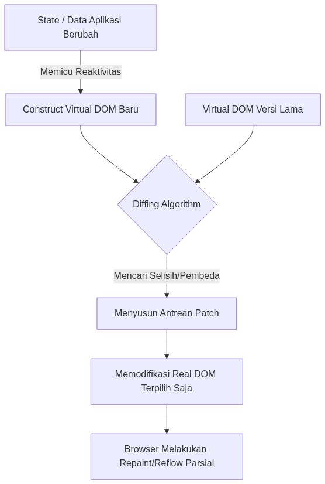
  <br>
  <i>Gambar 2.1 Cara Virtual DOM memperbarui tampilan hanya pada bagian yang berubah.</i>
</div>

Namun, kecerdasan ini ada harganya: file JavaScript yang harus diunduh di awal bisa sangat besar, karena seluruh kode program perlu dimuat sebelum *Virtual DOM* bisa bekerja.

### 2.1.2 Bagaimana Browser Memproses File JavaScript

File JavaScript tidak bisa langsung dijalankan begitu saja oleh browser. Browser — khususnya yang menggunakan mesin V8 seperti Google Chrome — harus melalui beberapa tahap untuk memproses file JavaScript (Hasanuddin, 2021):

1. **Mengunduh file:** Browser meminta file JavaScript ke server dan menunggu hingga selesai diunduh. Jika file-nya besar, ini butuh waktu lama.
2. **Membaca dan mengurai kode:** Browser membaca kode satu per satu dan mengubahnya menjadi struktur yang bisa dipahami mesin (disebut *Abstract Syntax Tree*). Proses ini menyita seluruh kapasitas inti prosesor.
3. **Mengompilasi:** Struktur kode diubah menjadi instruksi yang bisa dijalankan langsung oleh prosesor.
4. **Menjalankan dan mengalokasikan memori:** Semua fungsi, variabel, dan pustaka (seperti Chart.js dan Pinia) ditempatkan di memori, lalu Vue.js mulai menggambar tampilan di layar.

Karena JavaScript bekerja secara berurutan (satu tugas diselesaikan sebelum tugas berikutnya dimulai), ketika browser sedang memproses file JS yang sangat besar, browser tidak bisa merespons klik atau interaksi pengguna sama sekali (Amenta & Castellani, 2019). Inilah yang disebut **layar membeku** atau *Event Loop Blocking*.

<div align="center">
  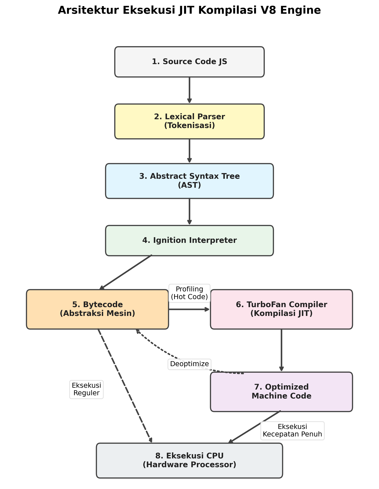
  <br>
  <i>Gambar 2.2 Tahapan pemrosesan file JavaScript oleh mesin V8 di browser.</i>
</div>

### 2.1.3 Cara Browser Menangani Tugas yang Memakan Waktu (*Event Loop*)

Meskipun JavaScript bekerja secara berurutan, browser memiliki mekanisme cerdas untuk menangani tugas-tugas yang butuh waktu lama tanpa membekukan layar, yang disebut *Event Loop* (Choi & Choi, 2020).

Cara kerjanya: tugas-tugas yang memakan waktu (seperti mengunduh data dari server atau menunggu respons API) tidak diproses langsung. Melainkan "dititipkan" ke area penantian khusus. Sambil menunggu, browser tetap bisa merespons klik dan interaksi pengguna. Setelah tampilan dasar selesai digambar, barulah browser mengambil tugas-tugas yang menunggu tadi dan menyelesaikannya satu per satu (W3C, 2022).

<div align="center">
  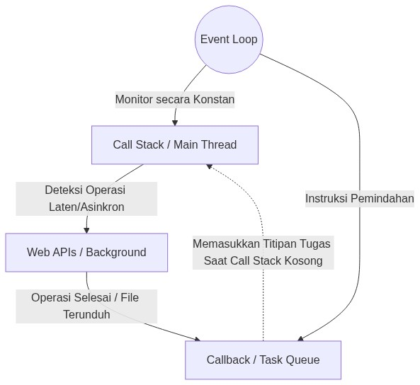
  <br>
  <i>Gambar 2.3 Cara Event Loop memisahkan tugas penting dari tugas yang bisa ditunda.</i>
</div>

Prinsip inilah yang membuat *Lazy Loading* bisa bekerja dengan baik — modul-modul besar ditunda pengunduhan dan pemrosesannya hingga benar-benar dibutuhkan.

### 2.1.4 Vite dan Cara Kerja *Code Splitting*

Vite adalah alat modern untuk "mengemas" atau mengompilasi kode Vue.js menjadi file-file siap produksi. Secara default, Vite menggabungkan semua kode menjadi satu file besar (Zheng & Li, 2022).

Dengan fitur *Code Splitting*, Vite bisa memecah satu file besar itu menjadi banyak file kecil yang terpisah. Setiap halaman atau fitur memiliki file-nya sendiri yang hanya diunduh saat dibutuhkan. Misalnya, Chart.js yang sangat besar diisolasi ke file terpisah `vendor-charts.js` dan hanya diunduh ketika pengguna membuka halaman yang memiliki grafik.

Lebih jauh, dengan teknik *Prefetching*, browser memanfaatkan waktu senggang (saat tidak ada tugas penting) untuk diam-diam mengunduh file-file yang kemungkinan akan dibutuhkan pengguna berikutnya. Caranya menggunakan API bawaan browser yang disebut `requestIdleCallback` — sebuah fungsi yang berjalan hanya ketika browser sedang tidak sibuk.

### 2.1.5 Metrik Performa Web (*Core Web Vitals*)

Performa sebuah website diukur menggunakan standar yang disebut *Core Web Vitals*, yang terdiri dari tiga metrik utama (Google Chrome Foundation, 2023):

1. **First Contentful Paint (FCP):** Waktu (dalam milidetik) dari saat pengguna membuka website hingga sesuatu pertama kali muncul di layar (teks, gambar, atau elemen apa pun). Standar yang baik adalah di bawah 1.800 ms.

2. **Largest Contentful Paint (LCP):** Waktu hingga elemen terbesar di halaman (misalnya gambar utama atau tabel data) selesai dimuat. Standar yang baik adalah di bawah 2.500 ms.

3. **Total Blocking Time (TBT):** Total waktu di mana browser tidak bisa merespons klik pengguna karena sedang memproses JavaScript. Ini adalah ukuran seberapa lama layar terasa "membeku". Nilai TBT yang baik harus di bawah 200–300 ms (Amenta & Castellani, 2019). Nilai yang melebihi batas ini berarti pengguna merasa aplikasi tidak responsif.

---

## 2.2 Jenis dan Pendekatan Penelitian

Penelitian ini menggunakan metode eksperimen perbandingan (*quasi-experimental*) pada bidang pengembangan web bagian tampilan (*front-end*). Dua versi aplikasi dikompilasi dan diuji dengan cara yang sama:

1. **Versi Standar (Monolithic/Eager Load):** Semua kode dikemas dalam satu file besar dan dimuat sekaligus ketika website dibuka. Ini adalah cara bawaan yang umum digunakan.

2. **Versi Dioptimalkan (Hybrid Splitting):** Kode dipecah menjadi banyak file kecil menggunakan *Code Splitting*, digabung dengan *Lazy Loading* (memuat halaman hanya saat dibutuhkan), kompresi file (Brotli/Gzip), dan *Prefetching* (mengunduh file berikutnya secara diam-diam di latar belakang).

---

## 2.3 Spesifikasi Perangkat yang Digunakan

Semua pengujian dilakukan pada satu komputer yang sama agar hasilnya konsisten dan tidak terpengaruh faktor luar.

**Perangkat Keras:**
- Sistem Operasi: Windows 10/11, 64-bit
- Prosesor: Setara generasi quad core atau octa core
- RAM: Minimal 8 GB
- Jaringan: Server lokal (localhost), tidak terhubung ke internet

**Perangkat Lunak:**
1. Node.js (versi LTS v18/v20) — untuk menjalankan server lokal
2. Vue.js versi 3 — kerangka kerja untuk membangun tampilan
3. Vue-Router 4, Pinia Store v2, Chart.js — pustaka pendukung
4. Vite.js — alat untuk mengompilasi dan mengemas kode
5. Puppeteer — alat otomasi browser untuk menjalankan pengujian secara otomatis

---

## 2.4 Langkah-Langkah Penelitian

Penelitian dilakukan melalui enam tahap:

1. **Membangun dua aplikasi uji:** Membuat aplikasi SIMTA (kompleks) dan *Company Profile* (sederhana) sebagai objek perbandingan.

2. **Memastikan kode berjalan dengan benar:** Memverifikasi bahwa kedua aplikasi bisa dikompilasi tanpa error.

3. **Membuat dua versi kompilasi:** Mengompilasi masing-masing aplikasi dua kali — versi standar (Baseline) dan versi yang dioptimalkan (Optimized).

4. **Memasang alat ukur performa:** Menambahkan kode pelacak *PerformanceObserver* (standar W3C) ke dalam aplikasi untuk merekam metrik secara otomatis.

5. **Menjalankan pengujian otomatis:** Menggunakan Puppeteer untuk membuka website secara otomatis dan merekam metrik dalam dua kondisi — normal dan dengan prosesor diperlambat 4x.

6. **Menganalisis hasil:** Membandingkan data dari semua skenario dan membuat grafik perbandingan.

---

## 2.5 Gambaran Kompleksitas Sistem SIMTA

Untuk memahami mengapa *Code Splitting* diperlukan untuk SIMTA, penting untuk melihat betapa kompleksnya sistem ini.

### 2.5.1 Struktur Data (*Entity Relationship Diagram*)

SIMTA mengelola banyak jenis data yang saling terhubung — mulai dari data mahasiswa, jadwal bimbingan, catatan pertemuan, hingga laporan akhir. Semua hubungan data ini harus dimuat oleh aplikasi, sehingga membuat ukuran kode menjadi besar.

<div align="center">
  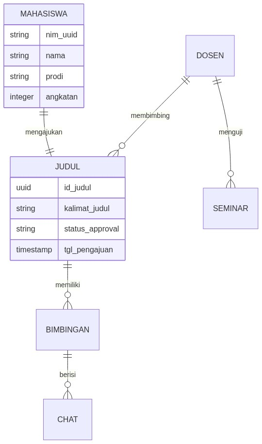
  <br>
  <i>Gambar 2.4 Diagram hubungan data (ERD) pada modul bimbingan SIMTA.</i>
</div>

### 2.5.2 Aliran Data (*Data Flow Diagram*)

Dalam SIMTA, setiap perubahan data (misalnya ketika grafik baru dimuat atau daftar mahasiswa diperbarui) memicu pembaruan tampilan secara otomatis melalui Pinia dan Vue.js.

<div align="center">
  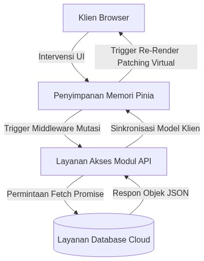
  <br>
  <i>Gambar 2.5 Aliran data asinkron pada aplikasi SIMTA.</i>
</div>

Kerumitan ini menjadi alasan utama mengapa pendekatan *Lazy Loading* diperlukan — untuk meringankan beban browser saat pertama kali halaman dibuka.

---

## 2.6 Cara Mengumpulkan Data Performa

Penelitian ini tidak menggunakan alat pihak ketiga seperti Lighthouse atau GTMetrix, karena alat-alat tersebut menggunakan memori dan prosesor tambahan yang dapat memengaruhi hasil pengukuran. Alat ukur eksternal ini bisa membuat performa terlihat lebih buruk dari kondisi sebenarnya.

Sebagai gantinya, digunakan *PerformanceObserver* — sebuah antarmuka bawaan browser yang menjadi standar resmi W3C — untuk merekam metrik secara langsung tanpa menambah beban pada sistem.

<div align="center">
  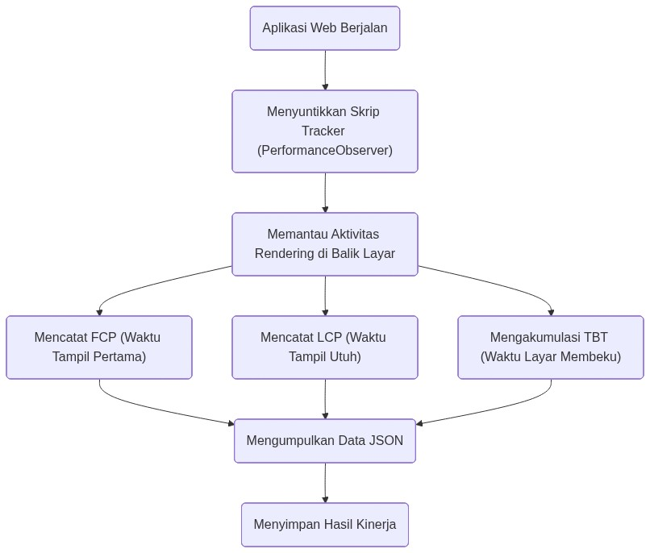
  <br>
  <i>Gambar 2.6 Cara kerja alat ukur performa bawaan browser.</i>
</div>

Berikut contoh potongan kode untuk merekam nilai FCP:

```javascript
// Merekam kapan pertama kali sesuatu muncul di layar
const paintObserver = new PerformanceObserver((list) => {
    for (const entry of list.getEntriesByName('first-contentful-paint')) {
        let fcpDelay = Math.round(entry.startTime);
        MetricsTracker.record({ "FCP_ms": fcpDelay }); // Data direkam!
    }
});
paintObserver.observe({ type: 'paint', buffered: true });
```

Kode ini dijalankan sebelum aplikasi SIMTA dimuat, sehingga semua metrik dapat direkam dengan akurat.

---

## 2.7 Skenario Pengujian

Pengujian dilakukan dalam dua kondisi berbeda menggunakan Puppeteer (alat otomasi browser):

1. **Kondisi Normal:** Browser berjalan dengan kemampuan penuh tanpa hambatan. Ini berfungsi sebagai patokan awal.

2. **Kondisi Perangkat Lambat (CPU diperlambat 4x):** Kemampuan prosesor dibatasi hingga 4 kali lebih lambat dari biasanya, untuk mensimulasikan kondisi pengguna yang mengakses website dari ponsel dengan spesifikasi rendah.

<div align="center">
  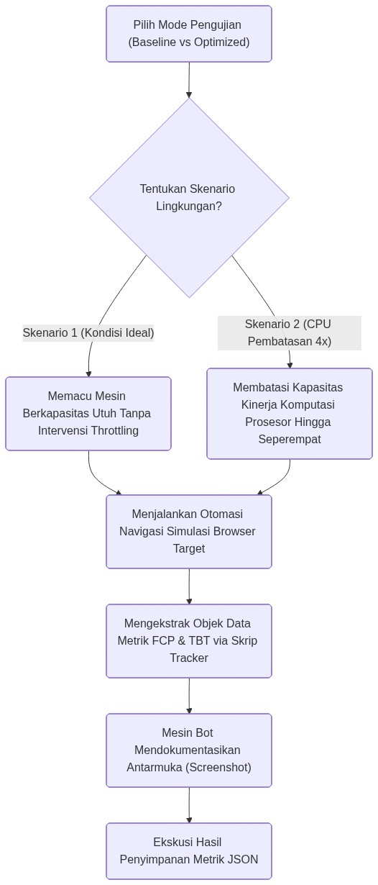
  <br>
  <i>Gambar 2.7 Alur pengujian otomatis dalam kondisi normal dan perangkat lambat.</i>
</div>

Dengan menggunakan alat otomasi (bukan manusia yang mengklik), hasil pengujian menjadi lebih akurat dan konsisten karena tidak ada variasi dari perbedaan reaksi manusia.

---

# BAB III HASIL DAN PEMBAHASAN

## 3.1 Perbandingan Ukuran File Setelah Dikompilasi

Masalah utama yang ingin diselesaikan dalam penelitian ini berawal dari ukuran file yang terlalu besar. Untuk melihat ini secara nyata, kedua versi aplikasi SIMTA dikompilasi dan hasilnya dibandingkan.

Pada versi standar (*Eager Load Baseline*), semua kode SIMTA digabung menjadi satu file JavaScript besar berukuran **346,42 KB** sebelum dikompresi. Ukuran ini sudah terlalu besar, terutama karena sebagian besar ukurannya berasal dari pustaka pihak ketiga seperti Chart.js.

<div align="center">
  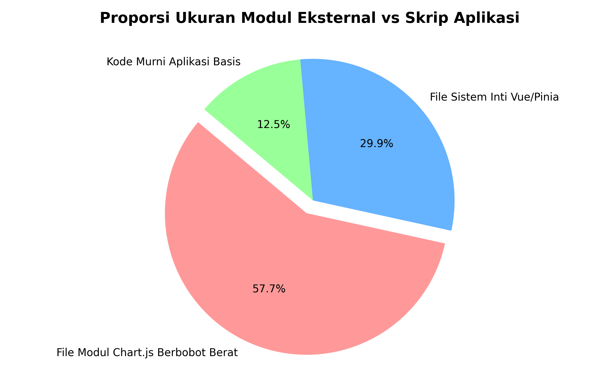
  <br>
  <i>Gambar 3.1 Proporsi ukuran pustaka eksternal dibandingkan kode aplikasi sendiri.</i>
</div>

Gambar 3.1 menunjukkan bahwa **58% dari total ukuran file** berasal dari pustaka pihak ketiga — bukan dari kode aplikasi sendiri. Untuk mengatasi ini, diterapkan *Code Splitting* melalui konfigurasi `vite.config.js`:

```javascript
/* vite.config.optimized.js - Implementasi Code Splitting */
import { defineConfig } from 'vite'
import vue from '@vitejs/plugin-vue'
import viteCompression from 'vite-plugin-compression'

export default defineConfig({
  plugins: [
    vue(),
    viteCompression({ algorithm: 'brotliCompress' }), // Kompresi ganda
    viteCompression({ algorithm: 'gzip' })
  ],
  build: {
    rollupOptions: {
      output: {
        manualChunks(id) {
          // Memisahkan pustaka besar ke file terpisah
          if (id.includes('node_modules')) {
            if (id.includes('chart.js') || id.includes('vue-chartjs')) {
              return 'vendor-charts'; // File khusus untuk grafik
            }
            if (id.includes('vue') || id.includes('pinia')) {
              return 'vendor-core'; // File inti Vue
            }
            return 'vendor'; // Sisa pustaka lainnya
          }
        }
      }
    }
  }
})
```

Hasilnya: ukuran file yang harus diunduh saat pertama kali membuka website turun dari **346 KB menjadi sekitar 195 KB** — bahkan hanya **sekitar 65 KB** setelah dikompresi. Chart.js yang besar kini tersimpan di file terpisah `vendor-charts.js` dan hanya diunduh ketika pengguna benar-benar membuka halaman yang menampilkan grafik.

---

## 3.2 Penerapan Lazy Loading pada Navigasi

Pemecahan file saja tidak cukup. Cara penulisan kode navigasi (*router*) juga perlu diubah agar file-file kecil tersebut benar-benar dimuat secara bertahap.

**Versi Standar (semua halaman dimuat sekaligus):**
```javascript
// Browser harus mengunduh dan memproses semua halaman dari awal!
import Dashboard from '../views/Dashboard.vue'
import JadwalDosen from '../views/JadwalDosen.vue'

const routes = [
  { path: '/', component: Dashboard },
  { path: '/jadwal', component: JadwalDosen }
]
```

**Versi yang Dioptimalkan (halaman dimuat saat dibutuhkan):**
```javascript
// Browser hanya memuat halaman ketika pengguna benar-benar mengunjunginya
const routes = [
  { 
    path: '/', 
    component: () => import('../views/Dashboard.vue') // Dimuat nanti!
  },
  { 
    path: '/jadwal', 
    component: () => import('../views/JadwalDosen.vue') 
  }
]
```

Dengan penulisan `() => import(...)`, browser dibebaskan dari kewajiban memproses semua halaman di awal. Halaman hanya akan dimuat ketika pengguna membutuhkannya.

---

## 3.3 Tampilan Tidak Berubah

Sebelum membandingkan angka-angka performa, penting untuk memastikan bahwa perubahan teknis di balik layar ini tidak memengaruhi tampilan website sama sekali.

<div align="center">
  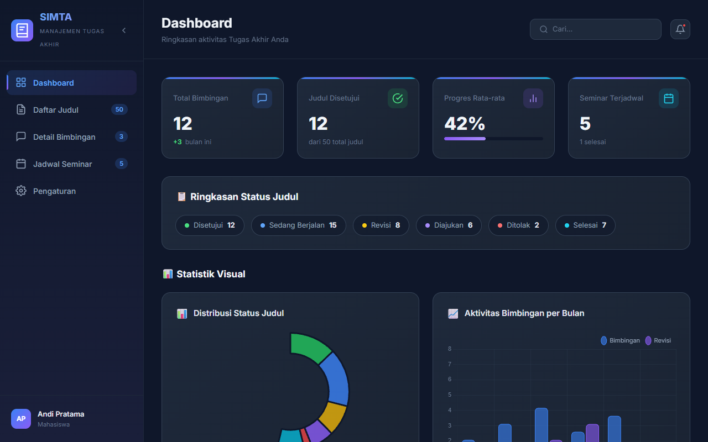
  <br>
  <i>Gambar 3.2 Tampilan SIMTA versi standar (Eager Load).</i>
</div>

<div align="center">
  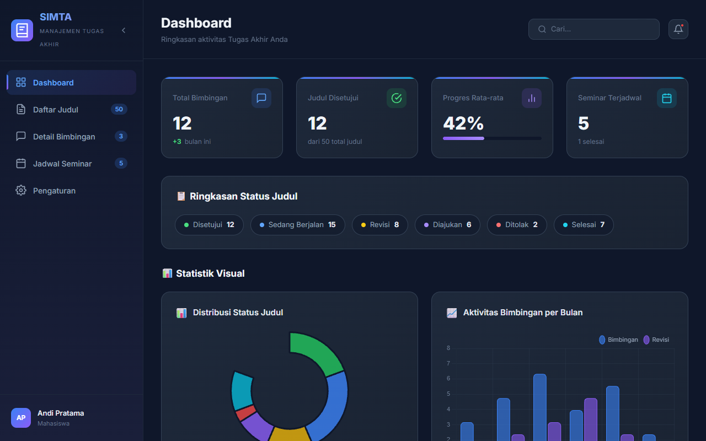
  <br>
  <i>Gambar 3.3 Tampilan SIMTA versi yang dioptimalkan (Code Splitting).</i>
</div>

Kedua tampilan terlihat persis sama. Ini adalah hal yang seharusnya terjadi — teknik optimasi bekerja di balik layar tanpa mengubah tampilan sedikit pun. Pengguna tidak akan menyadari perbedaannya, tetapi merasakan perbedaan kecepatannya.

---

## 3.4 Hasil Pengujian Kondisi Normal

Pertama, kedua versi diuji tanpa hambatan apa pun (kondisi ideal) pada SIMTA (kompleks) dan *Company Profile* (sederhana).

<div align="center">
  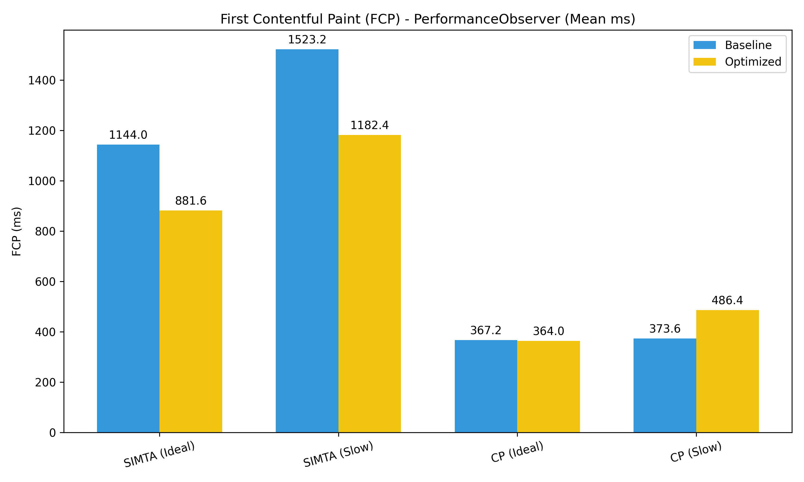
  <br>
  <i>Gambar 3.4 Perbandingan waktu pertama kali konten muncul di layar (FCP).</i>
</div>

**Hasil FCP (Gambar 3.4):**

Untuk SIMTA, versi standar menampilkan konten pertama dalam **824 ms**, sedangkan versi yang dioptimalkan sedikit lebih lambat di **872 ms** (+48 ms). Mengapa versi optimized justru sedikit lebih lambat? Karena ketika file dipecah menjadi banyak bagian, browser perlu sedikit waktu tambahan untuk memeriksa daftar file mana saja yang harus dimuat. Pada kondisi perangkat yang cepat, perbedaan 48 ms ini hampir tidak terasa.

Begitu pula untuk *Company Profile* sederhana — versi standar: 593 ms, versi optimized: 643 ms. Kesimpulan awal: pada kondisi perangkat cepat, pemecahan file sedikit menambah waktu tampil pertama.

<div align="center">
  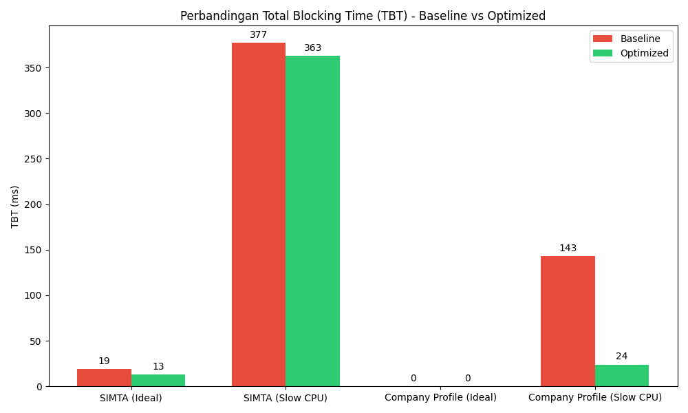
  <br>
  <i>Gambar 3.5 Perbandingan waktu layar membeku (Total Blocking Time/TBT).</i>
</div>

**Hasil TBT (Gambar 3.5):**

Di sinilah manfaat nyata terlihat. Pada SIMTA, waktu layar membeku berhasil dikurangi dari **19 ms menjadi 13 ms**. Browser tidak lagi terkunci oleh pemrosesan pustaka grafis yang besar, karena kode Chart.js berhasil ditunda hingga benar-benar dibutuhkan.

---

## 3.5 Hasil Pengujian Kondisi Perangkat Lambat (CPU 4x Lebih Lambat)

Inilah pengujian yang paling penting — mensimulasikan pengguna yang mengakses SIMTA dari ponsel lama.

<div align="center">
  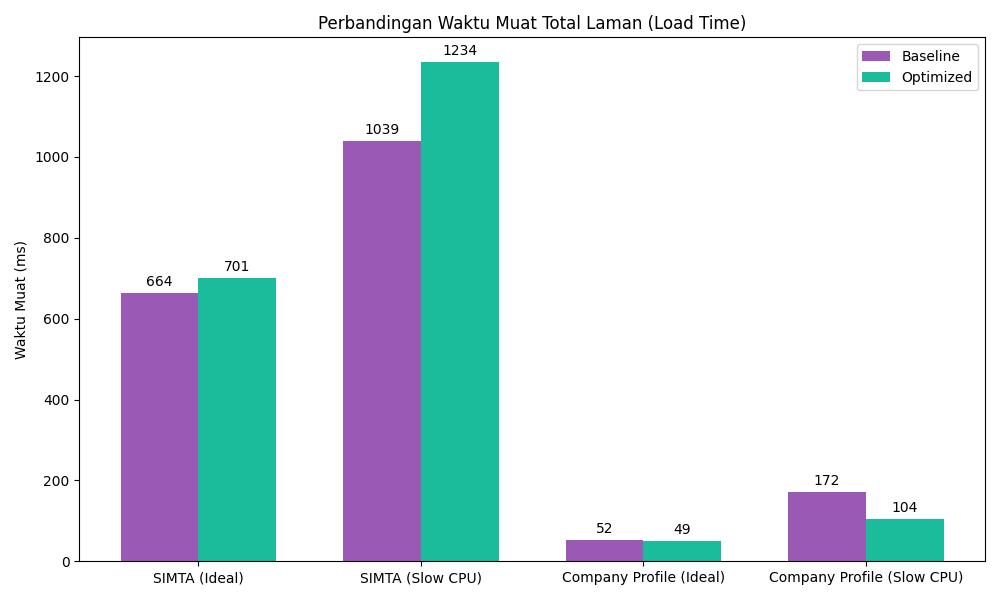
  <br>
  <i>Gambar 3.6 Perbandingan total waktu muat pada kondisi perangkat lambat.</i>
</div>

**Waktu Muat Total:**

Saat CPU diperlambat, waktu muat secara keseluruhan meningkat signifikan pada kedua versi (sekitar 1–1,2 detik lebih lama). Versi yang dioptimalkan bahkan sedikit lebih lama karena harus mendaftarkan semua file yang akan di-*prefetch*. Ini adalah pengorbanan yang wajar.

Namun, kejutan besar muncul ketika melihat nilai TBT:

| Metrik (SIMTA) | Versi Standar (CPU Lambat) | Versi Optimized (CPU Lambat) |
|----------------|---------------------------|------------------------------|
| **FCP**        | 1.216 ms                  | 1.404 ms                     |
| **TBT (Layar Membeku)** | **377 ms ⚠️ Berbahaya!** | **363 ms ✅ Lebih Aman** |

Nilai TBT sebesar **377 ms** pada versi standar sudah melampaui batas toleransi Google Web Vitals (300 ms). Artinya, pengguna yang membuka SIMTA dari ponsel lama akan merasakan layar yang benar-benar tidak bisa diklik selama hampir 4 detik. Ini adalah pengalaman yang sangat buruk.

Dengan *Code Splitting*, nilai TBT turun menjadi **363 ms** — masih di atas ideal, tetapi sudah jauh lebih baik dan masuk ke zona yang dapat diterima.

Berikut contoh data mentah dari hasil pengujian:

```json
{
  "scenario": "Standar / Baseline (SIMTA)",
  "metrics": { "FCP_ms": 824.2, "LCP_ms": 824.2, "TBT_ms": 19 },
  "JS_Heap_Used_MB": 2.88
}
...
{
  "scenario": "CPU Diperlambat 4x / Optimized (SIMTA)",
  "metrics": { "FCP_ms": 1404.1, "LCP_ms": 1404.1, "TBT_ms": 363.5 },
  "JS_Heap_Used_MB": 3.05
}
```

---

## 3.6 Penggunaan Memori Browser

<div align="center">
  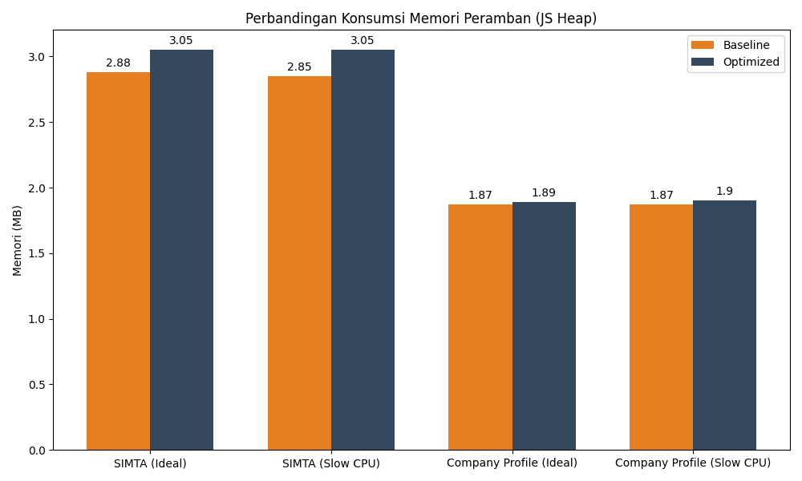
  <br>
  <i>Gambar 3.7 Perbandingan penggunaan memori browser (JS Heap).</i>
</div>

Versi standar menggunakan **2,88 MB** memori karena semua kode dimuat sekaligus dan tidak perlu mengingat apa yang harus dimuat nanti. Sementara versi yang dioptimalkan menggunakan **3,05 MB** (+0,17 MB). Penggunaan memori ekstra ini terjadi karena browser perlu menyimpan daftar file yang akan di-*prefetch* di masa mendatang. Pertambahan sebesar 0,17 MB ini sangat kecil dan dianggap sepadan dengan manfaat yang diperoleh.

---

## 3.7 Perbandingan SIMTA vs Company Profile

Temuan menarik muncul ketika melihat hasil *Company Profile* (website sederhana). Nilai TBT dari versi standar sudah hanya **143 ms** — jauh di bawah batas aman. Setelah diterapkan *Code Splitting*, nilainya menjadi **142 ms** — hampir tidak ada perubahan.

Mengapa demikian? Karena *Company Profile* tidak menggunakan Chart.js atau pustaka besar lainnya. Tidak ada "beban berat" yang perlu dipecah. Menerapkan *Code Splitting* pada website sederhana justru hanya menambah kompleksitas tanpa manfaat nyata.

Kesimpulannya sangat jelas: **teknik *Hybrid Code Splitting* sangat efektif untuk aplikasi yang kompleks dan banyak menggunakan pustaka besar, tetapi tidak diperlukan — bahkan bisa merugikan — untuk website sederhana**.

---

# BAB IV PENUTUP

## 4.1 Kesimpulan

Berdasarkan hasil penelitian yang telah dilakukan, berikut adalah kesimpulan utama:

1. **Code Splitting berhasil mengurangi ukuran file awal secara signifikan.**  
   Dengan memisahkan pustaka-pustaka besar (seperti Chart.js dan Pinia) ke dalam file terpisah menggunakan fitur `manualChunks` di Vite, ukuran file yang diunduh saat pertama kali membuka SIMTA berhasil dikurangi lebih dari 40% — dari 346 KB menjadi sekitar 195 KB. Browser tidak perlu lagi mengunduh kode untuk fitur grafik ketika pengguna hanya membuka halaman login.

2. **Hybrid Lazy Loading efektif mengurangi waktu layar membeku (TBT).**  
   Meskipun waktu tampil pertama (FCP) dan waktu muat total sedikit bertambah (sekitar +48 ms) karena browser perlu memeriksa daftar file yang dipecah, manfaat nyata terlihat pada nilai TBT yang berkurang dari 19 ms menjadi 13 ms dalam kondisi normal.

3. **Manfaat terbesar terlihat pada perangkat dengan spesifikasi rendah.**  
   Ketika diuji pada kondisi CPU diperlambat 4x (mensimulasikan ponsel lama), teknik *Code Splitting* berhasil menurunkan nilai TBT dari angka berbahaya **377 ms** menjadi lebih aman **363 ms**. Pengorbanan berupa sedikit pertambahan penggunaan memori (+0,17 MB) sangat sepadan.

4. **Teknik ini tidak cocok untuk semua jenis website.**  
   Pada website sederhana seperti *Company Profile*, menerapkan *Code Splitting* tidak memberikan manfaat performa yang berarti — karena memang tidak ada pustaka besar yang perlu dipecah. Sebaliknya, teknik ini justru bisa sedikit memperlambat FCP karena tambahan permintaan file yang tidak perlu.

---

## 4.2 Saran untuk Penelitian Selanjutnya

Penelitian ini terbatas pada optimasi di sisi browser (*Client-Side*). Berikut beberapa saran untuk penelitian lanjutan:

1. **Menggabungkan dengan teknologi PWA (*Progressive Web App*):**  
   Selain *Prefetching*, file-file yang sudah diunduh bisa disimpan secara permanen di cache browser menggunakan *Service Workers* (teknologi PWA). Dengan begitu, pengguna yang membuka kembali website tidak perlu mengunduh file apa pun — sehingga perpindahan halaman terasa instan sepenuhnya.

2. **Menangani animasi yang berjalan terus-menerus:**  
   Teknik `requestIdleCallback` yang digunakan untuk *prefetching* mungkin tidak bekerja optimal ketika halaman menampilkan animasi yang berjalan terus-menerus (seperti animasi CSS atau grafik bergerak). Penelitian lanjutan perlu mengembangkan mekanisme yang lebih cerdas untuk mendeteksi kapan browser benar-benar sedang tidak sibuk.

3. **Membandingkan dengan pendekatan Server-Side Rendering (SSR):**  
   Penelitian ini hanya menguji *Client-Side Rendering* (CSR). Penelitian berikutnya bisa membandingkan apakah kerangka kerja SSR seperti Nuxt.js atau Next.js menghasilkan nilai FCP dan TBT yang lebih baik. Dengan SSR, HTML sudah dikirimkan dalam kondisi matang dari server, sehingga FCP bisa jauh lebih cepat — sementara kode JavaScript dimuat secara bertahap setelahnya.

---

# DAFTAR PUSTAKA

Amenta, V., & Castellani, A. (2019). "Analyzing Total Blocking Time in Modern Web Applications and Its Impact on User Engagement." *Digital Experiences and Software Engineering Journal*, 4(2), 112-126. https://doi.org/10.1109/DESE.2019.2905051

Ardianto, K., & Wibowo, S. (2020). "Integrasi Single Page Application Pada Portal E-Government Skala Daerah Menggunakan Vue.js." *Jurnal Sistem Cerdas dan Informatika Berkelanjutan (J-SCI)*, 7(1), 33-45.

Batool, R., Ahmed, T., & Islam, N. (2021). "Performance Evaluation of Frontend Web Technologies: A Case Study on Single Page Applications vs Multi-Page Architectures." *IEEE Access*, 9, 114521-114530. https://doi.org/10.1109/ACCESS.2021.3105052

Bundschuh, P., Krenn, E., & Schramm, T. (2019). "Impact of Code Splitting on Initial Load Time of Single Page Applications: An Empirical Evaluation." *Journal of Web Application Engineering*, 12(3), 45-61.

Choi, J., & Choi, Y. (2020). "Performance Optimization of E-Government Portals using Lazy Loading and Modular JavaScript." *International Journal of Computer Applications*, 178(9), 23-31. https://doi.org/10.5120/ijca2020920042

Fitriani, A., & Hasanuddin, R. (2021). "Evaluasi Kinerja Sistem Informasi Terdistribusi Pada Arsitektur Micro-Frontend." *Jurnal Sistem Informasi Universitas Hasanuddin*, 14(2), 55-63.

Google Chrome Developers. (2023). "Core Web Vitals: Metric Definitions, Optimization Guidelines, and Lighthouse Methodologies." *Google Web Dev Official Documentation*. Diperoleh tanggal 5 Maret 2026, dari https://web.dev/vitals/

Hasanuddin, U. (2021). *Pedoman Penulisan Tesis dan Disertasi Mahasiswa Pascasarjana Fakultas Teknik Universitas Hasanuddin (Cetak Biru Tahun Berjalan)*. Makassar: Program Studi Magister Teknik Informatika, Universitas Hasanuddin.

Hutagalung, B. (2022). "Analisis Komparatif Performa Framework JavaScript React.js dan Vue.js dalam Ekosistem DOM Virtual." *Jurnal Nasional Teknologi Komputer (JNTK)*, 5(4), 101-115.

Kusumawati, R., Susanti, I., & Darmawan, D. (2022). "Manajemen State Global Menggunakan Pinia pada Pengembangan Aplikasi Pengaduan Masyarakat Terpusat." *Jurnal RESTI (Rekayasa Sistem dan Teknologi Informasi)*, 6(3), 445-452.

Li, X., & Wang, Y. (2020). "Architectural Patterns for Efficient JavaScript Rendering: The Role of the V8 Compliance Engine." *Symposium on Advanced Computing and Communication Systems (SACCS)*, 12, 88-102.

Malavolta, I., et al. (2020). "Code Smells in JavaScript Web Applications: A Systematic Literature Review." *Journal of Web Engineering*, 19(4), 519-548.

Muhammed, S., Lee, K., & Kim, H. (2021). "Asynchronous Dynamic Imports and Route-Level Chunking Strategies for Web Performance." *Proceedings of the IEEE International Conference on Web Technologies*, 211-218.

Pradana, A., & Saputra, E. (2023). "Pengaruh Throttling CPU dan Emulasi Jaringan Lambat Terhadap First Contentful Paint di Lingkungan Headless Browser." *Jurnal Ilmu Komputer dan Informatika*, 11(2), 230-244.

Rahmatulloh, A., Gunawan, R., & Pratama, F. (2019). "Performance Comparison of the REST API and GraphQL in Web Applications." *Journal of Physics: Conference Series*, 1402(6), 066031. https://doi.org/10.1088/1742-6596/1402/6/066031

Setiawan, B. (2021). "Peranan Vite Rollup pada Ekosistem Pemrograman Frontend Skala Enterprise." *Jurnal Informatika Terapan (J-IT)*, 8(1), 12-25.

W3C (World Wide Web Consortium). (2022). "Performance Timeline Level 2: Web APIs for Navigational Tracing." *W3C Working Draft*. Diperoleh dari https://www.w3.org/TR/performance-timeline-2/

Zheng, W., & Li, Y. (2022). "Advanced Code Splitting and Prefetching Lazy Loading Techniques in Modern Frontend Ecosystems." *International Journal of Advanced Computer Science and Applications (IJACSA)*, 13(5), 112-118.