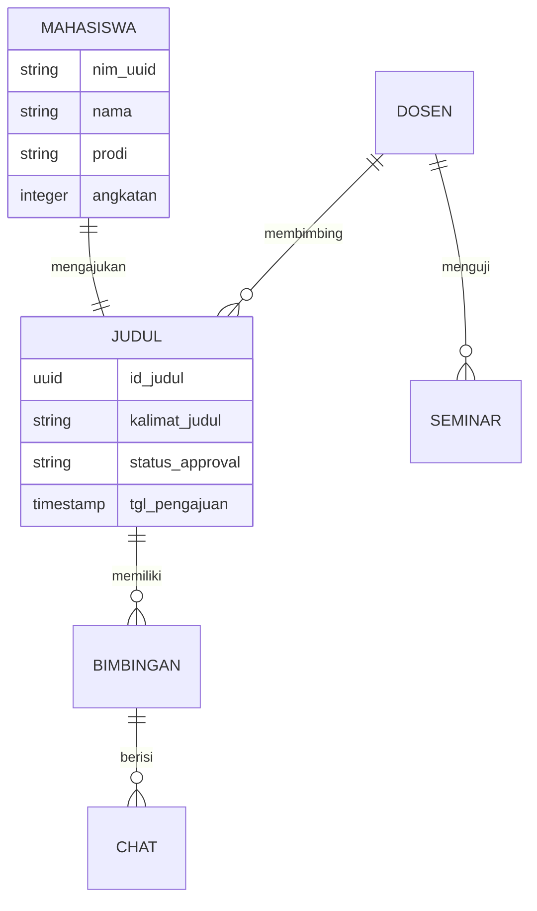
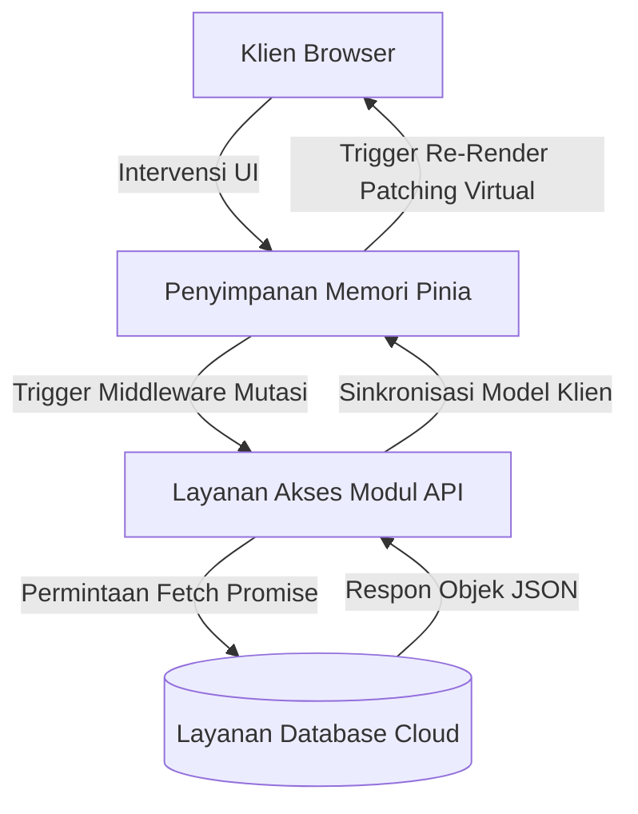

# BAB II METODE PENELITIAN

## 2.1 Jenis dan Pendekatan Penelitian
Desain metodologis dari tugas akhir riset tesis ini diklasifikasikan sebagai studi komparasi eksperimental (eksperimen semu atau *quasi-experimental*) terapan dalam rumpun keilmuan Rekayasa Perangkat Lunak Web Tingkat Lanjut. Model skema pengujian difokuskan pada perbandingan objektif dari dua *output* algoritma rute kompilasi atas purwarupa (prototipe) aplikasi *Single Page Application* (SPA) yang sama persis dalam hal rekayasa *frontend interface* (Antarmuka Pengguna) serta relasi basis data, namun dirangkai berbeda fondasinya terhadap distribusi *payload*.

Klasifikasi Varian Uji Kompilasi:
1. **Model Sistem Baseline (Monolithic / Eager Load):** Representasi perangkat lunak dasar menggunakan kompilasi reaktif polos (`vite.config.baseline.js`). Seluruh hierarki pohon komponen UI (halaman tunggal `DashboardView`, `JadwalSeminarView`, dll) dipanggil berserikat dalam *Eager Imports* pada ujung fail perute (*router*). Mesin penggubah akan menerbitkan seonggok fail skrip JavaScript raksasa gabungan (*vendor*+*core*) yang mendominasi sesi panggil perdana situs.
2. **Model Sistem Optimized (Hybrid Splitting):** Representasi iterasi pembaharuan yang menerapkan algoritma konfigurasi pemecahan biner (`vite.config.optimized.js`). Memanfaatkan fungsi deklaratif *Route-level Lazy Loading* (`() => import(...)`), isolasi ketergantungan paket perpustakaan bervolume berat (*manual chunks* untuk *Vue* dan *Chart.js*), aktivasi kompresi data transfer asetik ganda (*Gzip* & *Brotli*), hingga implantasi strategis agen *Prefetching W3C Callback* secara menyusup (*idle time tracking*).

## 2.2 Tahapan Pelaksanaan Eksperimen
Rencana riset direkayasa berkesinambungan melewati alur kerja investigatif sebagai berikut:
1. **Investigasi dan Pemodelan Sistem Berjalan:** Memastikan dan meracik level tingkat kekompleksitasan (*Complexity Density*) pada struktur aplikasi purwarupa pangkalan (Aplikasi Sistem Informasi Manajemen Tugas Akhir / SIMTA) untuk mencapai simulasi keruwetan yang esensial.
2. **Konstruksi Pengembangan Kode (*Development*):** Melakukan perancangan *Single Page Application* menggunakan kerangka bahasa *TypeScript/Javascript Framework Vue.js v3*, disokong *Vue Router 4* serta eksekusi sentral state pada manajemen penyimpanan memori dalam-klien (*Pinia Store*).
3. **Rekayasa Formulasi Kompilasi (*Bundling Formulation*):** Membangkitkan dua mode operasi target perakitan ke direktori statis tersendiri (satu versi ke `dist-baseline` dan peracikan ganda ke `dist-optimized`) menggunakan kompilator hibrida *Vite Bundler*. Pada mode *Optimasi*, Vite dipercayakan mengeksploitasi mesin di balik layarnya yakini *Rollup.js* untuk meracik *Module Dependency Graph* (Pohon Grafik Ketergantungan Modul) secara statis sehingga mengizinkan fragmentasi *manual chunks* yang akurat antar rute. Sarananya divalidasi juga memanfaatkan *Plugin Rollup Visualizer*.
4. **Instalasi dan Pemungutan Observasi (Pengumpulan Data):** Pemasangan log automasi menggunakan integrasi agen pendeteksi performa (*puppeteer* dikawinkan dengan API pelacak peramban asali/ *W3C Native PerformanceObserver*) untuk memperoleh integritas data kelancaran situs yang murni.
5. **Evaluasi Deskriptif & Komparasi Matriks:** Kegiatan diseminasi konversi olah hitung variabel ukur log jaringan untuk membuktikan kebenaran hipotesa peredaman latensi (*Web Vitals TBT/FCP*).

## 2.3 Pemodelan Tingkat Kompleksitas (Sistem SIMTA)
Landasan urgensi dari peletakan algoritma intervensi *Code Splitting* memerlukan pembenaran atas tingginya kompleksitas muatan bawaan sistem purwarupa. Berbeda totalnya rasio pemuatan komponen pada web portal statis linier, subsistem SIMTA memancarkan keterikatan reaktif padat (interaksi *interlocking state*) seperti tergambar di diagram berikut.

### 2.3.1 Relasi Basis Data (*Entity Relationship Diagram*)
Hubungan relasional multidimensi ini merepresentasikan bagaimana objek status mahasiswa, bimbingan, catatan asinkron dari pembimbing, sampai entitas riwayat ujian, terkompilasi ketat di selimut skrip klien sebelum dibongkar via API. Hal inilah yang mendorong mengapa SPA berskala raksasa seperti ini sangat riskan terhadap kelesuan *Render Time* jika masih berformat Monolitik.



### 2.3.2 Pola Sirkulasi Arus Data (*Data Flow Diagram Reaktif*)
Siklus aliran arsitektur SPA mutakhir ini (menggunakan *Pinia/Vuex* State Management) secara masif mengirimkan sinyal pembaruan (*Reactive Virtual-DOM Patching*) ketika bongkah *Library Chart.Js* atau tabel daftar antrean dimutasi secara langsung oleh respon *asynchronous* dari API.

Kerumitan beban kerja di siklus DFD asimetris mendemonstrasikan bahwa skrip di belakang layar tidak cukup diringkas, tetapi memang butuh untuk disingkirkan prioritas muatannya dari benang utama peramban *browser* guna menghindari stagnasi respon inisial, yang mana menjadi pembenatan di penelitian ini untuk menyisipkan *Lazy Load*.

## 2.4 Instrumen Pengumpulan Data (W3C Algoritma *Tracker* Tanpa Bias)
Bertujuan meminimalisir deviasi (bias gangguan atau *Observer Effect*) atas penyusup skrip tambahan pada piranti evaluasi purna pihak-ketiga tradisional (seperti ekstensi navigasi komersial skor *Google Lighthouse*, *GTMetrix*, atau *PageSpeed Insights* dlsb.), evaluasi durasi pemuatan sengaja dirancang secara murni tanpa campur tangan layanan perangkat lunak *tracer* tambahan ke klien. Penggunaan Lighthouse pada komputer lambat terbukti secara mandiri seringkali menyumbang penalti CPU dan fluktuasi RAM *overhead* semu ke atas angka matrik asli.

Alih-alih bersandar pada alat pengkaji simulasi metrik luar, pengujian dilacak 100% murni di habitat inti daur hidup kerangka SPA (*Web Vitals Programatic Native Metrics*). Algoritma penilaian sepenuhnya diklasifikasikan menggunakan obyek fungsi bawaan V8 peramban, yakni integrasi instans `PerformanceObserver` berbasis standar level dua ekstensi konsorsium W3C. Dengan begini, peramban sang klien merekam langsung getaran langkah waktu resolusinya secara otentik, di detik per detiknya langsung melalui perputaran eksekusi putaran kejadian internal *Event-Loop*.

Berikut rekonstruksi *pseudo-model* arsitektur instrumen pelacakan kecepatan (*PerformanceTracker.js*):
```javascript
// Arsitektur API native perekam titik metrik spesifik First Contentful Paint.
const paintObserver = new PerformanceObserver((list) => {
    // Mengekstrak matriks kemunculan cat piksel fungsional
    for (const entry of list.getEntriesByName('first-contentful-paint')) {
        let fcpDelay = Math.round(entry.startTime);
        MetricsTracker.record({ "FCP_ms": fcpDelay });
    }
});
paintObserver.observe({ type: 'paint', buffered: true });

// Observer untuk longTasks pembentuk TBT (Total Blocking Time)
const taskObserver = new PerformanceObserver((list) => {
    for (const entry of list.getEntries()) {
        if(entry.duration > 50) { 
           MetricsTracker.TBT_ms += (entry.duration - 50); 
        }
    }
});
```
Tracker disuntik paksa kepada titik injeksi blok-pertama sirkulasi `main.js`. *Tracer otomatis* ini bertanggung jawab memeras 4 pilar kunci utama ke layar konsol peramban secara otomatis (JSON Object Dump): *FCP*, *LCP*, *TBT Accumulator*, dan Jejak Memori Leksikal Terbuang (Heap Memory Megabytes).

## 2.5 Perumusan Skenario Multi-Kasus Simulasi (Stress-Tests)
Korelasi signifikansi atas penangguhan *Bundle* ke dalam satuan pecahan kepingan asinkron (Chunks) akan mustahil tervalidasi bila parameter diujikan mengorbit di iklim lab serba "Ideal" dari sistem server gawai premium sang perekayasa. Akurasi pelambatan justru memancarkan realisasinya saat beban penanganan tugas berat ditekankan berlebih pada klien peramban (Amenta & Castellani, 2019). Maka disusunlah 2 skema injeksi parameter tiruan terhadap peladen uji (melalui rekayasa interupsi *Google Chrome DevTools Protocol / Automasi Puppeteer Headless Node.js*):

1. **Skenario Baseline Optimal (*Ideal Kondisi Tanpa Interupsi*):** Mensimulasikan gawai klien dengan sistem arsitektural gahar tanpa keterbatasan utas *CPU Threads* maupun deviasi transfer lokal HTTP Localhost. Tujuannya sebagai tolak ukur parameter nol absolut.
2. **Skenario Penyempitan Jeroan CPU (*4x CPU Slowdown Throttling*):** Mensimulasikan dengan kejam perangkat lawas atau gawai tingkat akar-rumput (Mobile Phone 3-jutaan) dengan memperlambat laju clock *cycle* komputasi JavaScript Parser sang browser hingga perempat-laju (4 Kali Lebih Lambat). Inilah kancah perang sebenarnya untuk membuktikan efikasi pembebasan *Main Thread* dari *Code Splitting* yang melepaskan muatan modul dari ikatan *blank execution*.
