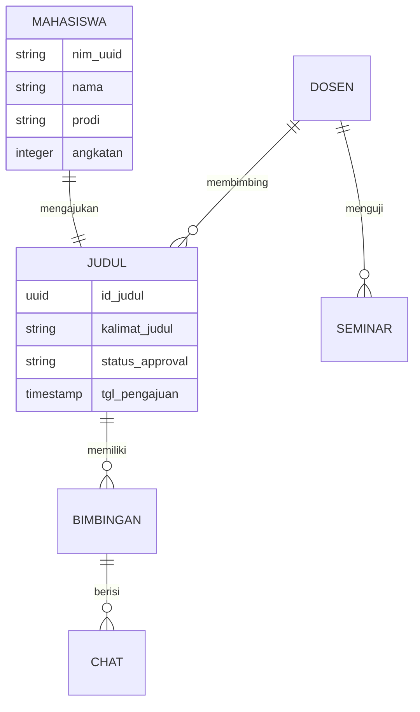
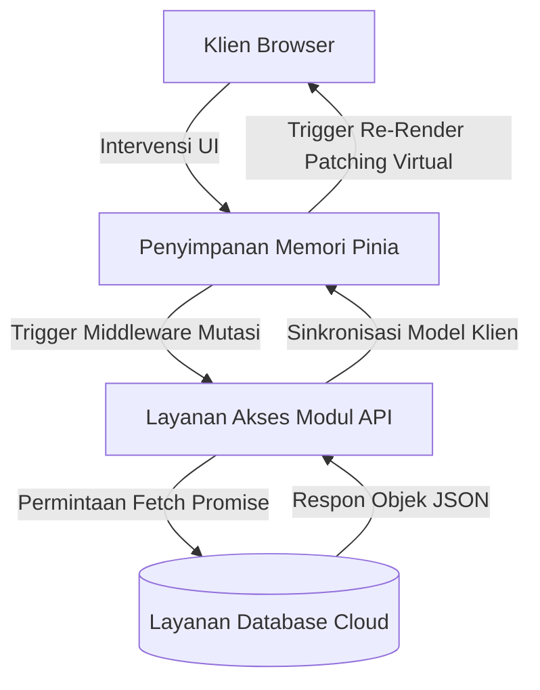
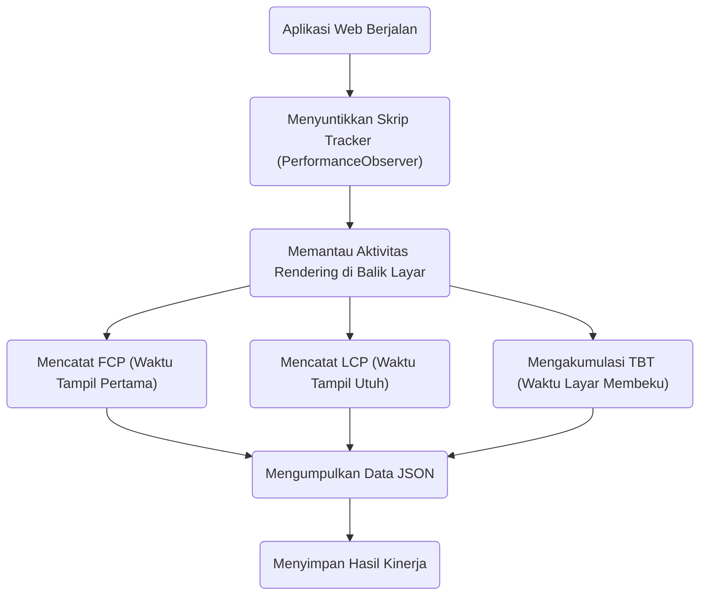
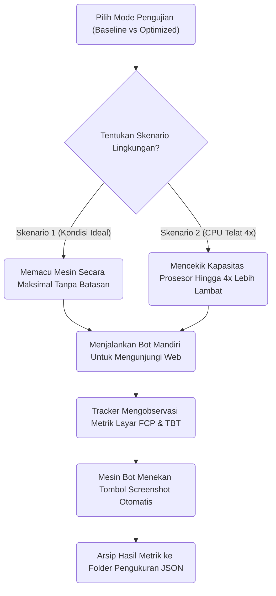

# BAB II METODE PENELITIAN

## 2.1 Jenis dan Pendekatan Penelitian
Desain metodologis dari tugas akhir riset tesis ini diklasifikasikan sebagai studi komparasi eksperimental (eksperimen semu atau *quasi-experimental*) terapan dalam rumpun keilmuan Rekayasa Perangkat Lunak Web Tingkat Lanjut. Model skema pengujian difokuskan pada perbandingan objektif dari dua *output* algoritma rute kompilasi atas purwarupa (prototipe) aplikasi *Single Page Application* (SPA) yang sama persis dalam hal rekayasa *frontend interface* (Antarmuka Pengguna) serta relasi basis data, namun dirangkai berbeda fondasinya terhadap distribusi *payload*.

Klasifikasi Varian Uji Kompilasi:
1. **Model Sistem Baseline (Monolithic / Eager Load):** Representasi perangkat lunak dasar menggunakan kompilasi reaktif polos (`vite.config.baseline.js`). Seluruh hierarki pohon komponen UI (halaman tunggal `DashboardView`, `JadwalSeminarView`, dll) dipanggil berserikat dalam *Eager Imports* pada ujung fail perute (*router*). Mesin penggubah akan menerbitkan seonggok fail skrip JavaScript raksasa gabungan (*vendor*+*core*) yang mendominasi sesi panggil perdana situs.
2. **Model Sistem Optimized (Hybrid Splitting):** Representasi iterasi pembaharuan yang menerapkan algoritma konfigurasi pemecahan biner (`vite.config.optimized.js`). Memanfaatkan fungsi deklaratif *Route-level Lazy Loading* (`() => import(...)`), isolasi ketergantungan paket perpustakaan bervolume berat (*manual chunks* untuk *Vue* dan *Chart.js*), aktivasi kompresi data transfer asetik ganda (*Gzip* & *Brotli*), hingga implantasi strategis agen *Prefetching W3C Callback* secara menyusup (*idle time tracking*).

## 2.2 Tahapan Pelaksanaan Eksperimen
Rencana riset direkayasa berkesinambungan melewati alur kerja investigatif sebagai berikut:
1. **Investigasi dan Pemodelan Sistem Berjalan:** Memastikan dan meracik level tingkat kekompleksitasan (*Complexity Density*) pada struktur aplikasi purwarupa pangkalan (Aplikasi Sistem Informasi Manajemen Tugas Akhir / SIMTA) untuk mencapai simulasi keruwetan yang esensial.
2. **Konstruksi Pengembangan Kode (*Development*):** Melakukan perancangan *Single Page Application* menggunakan kerangka bahasa *TypeScript/Javascript Framework Vue.js v3*, disokong *Vue Router 4* serta eksekusi sentral state pada manajemen penyimpanan memori dalam-klien (*Pinia Store*).
3. **Rekayasa Formulasi Kompilasi (*Bundling Formulation*):** Membangkitkan dua mode operasi target perakitan ke direktori statis tersendiri (satu versi ke `dist-baseline` dan peracikan ganda ke `dist-optimized`) menggunakan kompilator hibrida *Vite Bundler*. Pada mode *Optimasi*, Vite dipercayakan mengeksploitasi mesin di balik layarnya yakini *Rollup.js* untuk meracik *Module Dependency Graph* (Pohon Grafik Ketergantungan Modul) secara statis sehingga mengizinkan fragmentasi *manual chunks* yang akurat antar rute. Sarananya divalidasi juga memanfaatkan *Plugin Rollup Visualizer*.
4. **Instalasi dan Pemungutan Observasi (Pengumpulan Data):** Pemasangan log automasi menggunakan integrasi agen pendeteksi performa (*puppeteer* dikawinkan dengan API pelacak peramban asali/ *W3C Native PerformanceObserver*) untuk memperoleh integritas data kelancaran situs yang murni.
5. **Evaluasi Deskriptif & Komparasi Matriks:** Kegiatan diseminasi konversi olah hitung variabel ukur log jaringan untuk membuktikan kebenaran hipotesa peredaman latensi (*Web Vitals TBT/FCP*).

## 2.3 Pemodelan Tingkat Kompleksitas (Sistem SIMTA)
Landasan urgensi dari peletakan algoritma intervensi *Code Splitting* memerlukan pembenaran atas tingginya kompleksitas muatan bawaan sistem purwarupa. Berbeda totalnya rasio pemuatan komponen pada web portal statis linier, subsistem SIMTA memancarkan keterikatan reaktif padat (interaksi *interlocking state*) seperti tergambar di diagram berikut.

### 2.3.1 Relasi Basis Data (*Entity Relationship Diagram*)
Hubungan relasional multidimensi ini merepresentasikan bagaimana objek status mahasiswa, bimbingan, catatan asinkron dari pembimbing, sampai entitas riwayat ujian, terkompilasi ketat di selimut skrip klien sebelum dibongkar via API. Hal inilah yang mendorong mengapa SPA berskala raksasa seperti ini sangat riskan terhadap kelesuan *Render Time* jika masih berformat Monolitik.



### 2.3.2 Pola Sirkulasi Arus Data (*Data Flow Diagram Reaktif*)
Siklus aliran arsitektur SPA mutakhir ini (menggunakan *Pinia/Vuex* State Management) secara masif mengirimkan sinyal pembaruan (*Reactive Virtual-DOM Patching*) ketika bongkah *Library Chart.Js* atau tabel daftar antrean dimutasi secara langsung oleh respon *asynchronous* dari API.

Kerumitan beban kerja di siklus DFD asimetris mendemonstrasikan bahwa skrip di belakang layar tidak cukup diringkas, tetapi memang butuh untuk disingkirkan prioritas muatannya dari benang utama peramban *browser* guna menghindari stagnasi respon inisial, yang mana menjadi pembenatan di penelitian ini untuk menyisipkan *Lazy Load*.

## 2.4 Instrumen Pengumpulan Data (W3C Algoritma *Tracker*)
Dalam penelitian ini, kita sengaja menghindari penggunaan ekstensi pihak ketiga seperti Google Lighthouse atau GTMetrix. Mengapa demikian? Alat-alat eksternal seringkali membawa "beban bawaan" (*Observer Effect*). Artinya, ketika ekstensi tersebut digunakan pada perangkat dengan spesifikasi rendah, alat tersebut justru mengonsumsi RAM dan CPU tambahan yang membuat hasil pengukurannya menjadi lebih lambat dari kondisi aslinya.

Sebagai gantinya, penelitian ini menciptakan sebuah skrip pelacak mandiri (*Tracker*) menggunakan fitur standar bawaan dari peramban (*browser*) itu sendiri, yaitu `PerformanceObserver` berbasis standar W3C. Sederhananya, metode ini mengizinkan peramban mencatat sendiri seberapa cepat ia menampilkan halaman dan di titik mana ia merasa "tersendat", selayaknya seorang atlet yang menekan sendiri *stopwatch*-nya saat berlari tanpa harus direpotkan oleh beban monitor tambahan. 

Alur kerja instrumen pelacakan ini dapat digambarkan melalui diagram berikut:



Berikut adalah contoh potongan pemograman skrip yang bekerja merekam data di latar belakang:
```javascript
// Memantau kemunculan halaman bergambar (cat piksel) fungsional pertama
const paintObserver = new PerformanceObserver((list) => {
    for (const entry of list.getEntriesByName('first-contentful-paint')) {
        let fcpDelay = Math.round(entry.startTime);
        MetricsTracker.record({ "FCP_ms": fcpDelay }); // Data direkam!
    }
});
paintObserver.observe({ type: 'paint', buffered: true });
```
Skrip otomatis ini ditanamkan di baris paling awal pada sistem SIMTA. Tujuannya agar ia selalu "bangun" lebih dulu dan siap memanen keempat metrik utama (*FCP*, *LCP*, akumulasi kelambatan *TBT*, dan volume Jejak Memori RAM) secara mandiri.

## 2.5 Perumusan Skenario Pengujian (*Stress-Tests*)
Untuk melihat seberapa hebat efek dari teknik pemecahan kode ganda (Optimasi SPA) ini, pengujian tidak boleh hanya dilakukan dalam kondisi internet lancar dan komputer perancang yang super cepat. Dampak kemacetan lalu-lintas data (*Bundle Bloat*) justru baru terasa menyiksa ketika aplikasi dibuka pada perangkat keras yang biasa-biasa saja.

Oleh karena itu, penelitian ini merancang dua skenario simulasi pengujian secara otomatis dengan menggunakan kepanjangan tangan dari bot peramban otomatis (*Puppeteer Headless Node.js*):

1. **Skenario Optimal (Kondisi Ideal sebagai Acuan Dasar):** Skenario ini diuji murni dari komputer peladen (server) milik pengembang tanpa adanya perlakuan hambatan atau gangguan apapun (skor nol absolut). Skenario ini mengukur batasan laju terbaik yang mampu dicapai arsitektur web bila mesin klien punya spesifikasi kelas atas.
2. **Skenario Emulasi Perangkat Terbatas (*4x CPU Slowdown*):** Skenario inilah yang menjadi medan pertempuran pembuktian sesungguhnya. Mesin peramban dikontrol secara paksa dari luar untuk memangkas atau "mencekik" kekuatan kinerja prosesornya sehingga menjadi 4 kali lipat lebih melambat dari biasanya. Skenario penderitaan ini sengaja dijatuhkan guna meniru secara nyata nasib mahasiswa reguler yang barangkali mengakses sistem akademik kampus dari gawai (*smartphone*) keluaran lama yang spesifikasinya tertinggal. 

Alur simulasi untuk kedua skenario di atas berjalan secara robotik mengikuti diagram *flowchart* berikut:



Dengan mengutus bot otomatis ini (*Puppeteer automation*), kita mampu melenyapkan unsur kesalahan atau jeda reaksi (bias gerak) dari sentuhan tangan manusia. Mesin bot dipastikan me-klik tautan pada fraksi waktu milidetik yang presisi sama persis secara berulang-ulang dari skenario satu ke skenario kedua.
