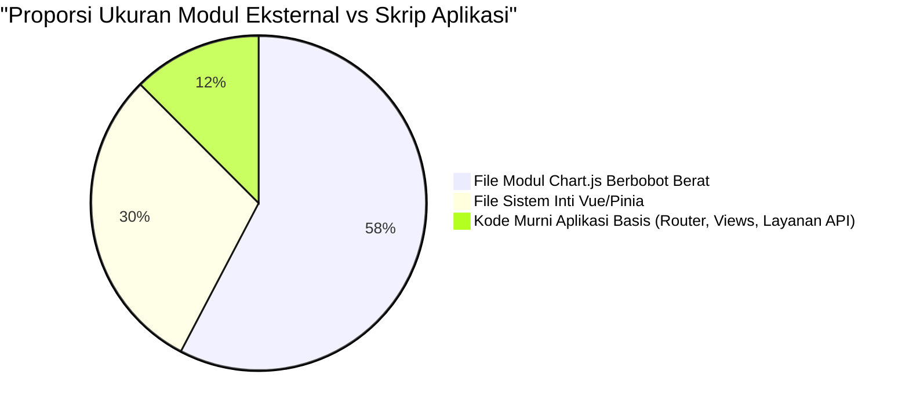

# BAB III HASIL DAN PEMBAHASAN

## 3.1 Resolusi Pemecahan Bundel (*Bundle Analysis & Decomposition*)
Intervensi pada kode sumber *Single Page Application* (SPA) menghasilkan redifinisi yang tegas pada tahap kompilasi akhir (Zheng & Li, 2022). Tabel matriks ukuran pasca-produksi (*post-compilation build*) secara objektif membuktikan keberhasilan rekayasa pembelahan antrean (*Code Splitting*) dalam mendistribusikan hambatan lalu-lintas muatan data aplikasi Sistem Informasi Manajemen Tugas Akhir (SIMTA) ke dalam fraksi-fraksi asinkron.

### 3.1.1 Dekompilasi Modul *Baseline* vs *Optimized*
Pada arsitektur *Baseline*, kompilasi *build* menghasilkan satu berkas tunggal monolitik `index.baseline-Ca8FZuKC.js` berukuran masif yakni **346.42 KB** (atau 120.94 KB dalam keadaan terkompresi *Gzip*). Kondisi ini mewajibkan peramban mengunduh seluruh fungsionalitas aplikasi sekaligus. Berkebalikan dengan itu, arsitektur *Optimized* menghasilkan distribusi direktori (*chunks manifest*) yang terurai tajam.

*Tabel 3.1 Persebaran Pemecahan Modul (Chunks) pada Arsitektur Optimized*
| Nama Berkas Modul (Kepingan *Chunk*) | Proporsi Fungsional | Ukuran Mentah | Ukuran Terkompresi (*Gzip*) |
|--------------------------------------|--------------------|----------------|-----------------------------|
| `vendor-chart-[hash].js` | Dependensi Eksternal (Grafik) | 199.59 KB | 67.42 KB |
| `vendor-vue-[hash].js` | Pustaka Inti Vue & Pinia | 103.29 KB | 39.40 KB |
| `supabase-[hash].js` | Protokol Klien API | 17.19 KB | 4.96 KB |
| `index.optimized-[hash].js` | *Entry Point* (Berkas Utama) | 11.67 KB | 4.39 KB |
| `DashboardView-[hash].js` | Antarmuka Halaman Dashboard | 7.99 KB | 2.62 KB |
| `DetailBimbinganView-[hash].js` | Modul Fitur Spesifik | 7.75 KB | 3.03 KB |
| `JadwalSeminarView-[hash].js`| Modul Fitur Spesifik | 6.34 KB | 2.51 KB |
| `DaftarJudulView-[hash].js` | Modul Fitur Spesifik | 5.59 KB | 2.39 KB |

*Sumber: Pengolahan Hasil Kompilasi Vite Rollup (2026).*

Dari perincian dekompilasi di atas didapati pencerahan empiris: alih-alih memaksa peramban mengunduh memori gabungan 346 KB sejak pengguna melihat layar pendaftaran SIMTA, struktur versi *Optimized* hanya mewajibkan unduhan komponen penyala awal (`index.optimized`), `vendor-vue`, dan CSS inti yang tidak memakan biaya komputasi besar (<45 KB Gzipped). Hal ini sangat meringankan *bandwidth* inisial mesin peramban pengguna.

Distribusi proporsi pengerutan fail tersebut dicitrakan ulang pada model *Pie Chart* berikut:



## 3.2 Analisis Pengujian Skenario Lingkungan Kondusif (*Ideal Network & CPU*)
Pengujian pada skenario pertama disimulasikan melalui otomasi peramban tak berpewajahan (*Puppeteer Headless CDP*) menggunakan konektivitas murni komputasi lokal *Host* Node.js tanpa disuntikkan batasan deviasi jaringan publik maupun hambatan *Thread CPU*. Bertolak pada premis Google Chrome Developers (2023) untuk melacak *core web vitals* berbasis API *Native*, berikut rekam jejak capaiannya:

| Metrik Objek *Web Vitals* W3C | Evaluasi Versi Baseline | Evaluasi Versi Optimized | Variansi Intervensi |
|-------------------|----------------|-----------------|---------------------|
| Lingkungan / Peramban | Google HeadlessChrome | Google HeadlessChrome | Spesifikasi Seimbang |
| ***First Contentful Paint* (FCP)**| 824 ms | 872 ms | Peningkatan +48 ms |
| ***Largest Contentful Paint* (LCP)**| 824 ms | 872 ms | Peningkatan +48 ms |
| ***Total Blocking Time* (TBT)**| 19 ms | **13 ms** | **Reduksi Kelambatan -6 ms (> 30%)**|
| Eksekusi Waktu Penuh Siklus Laman | 664 ms | 701 ms | Peningkatan +37 ms |
| Alokasi Konsumsi *Heap Memory JS* | 2.88 MB | 3.05 MB | Peningkatan Wajar +0.17 MB |

**Pembahasan Bukti Kelambatan Skenario 1:**
Pada perangkat peramban berspesifikasi tangguh dengan koneksi silang pipa (*pipe network*) server lokal *localhost* (kondisi Ideal), rentang perbedaan parameter cat visual layar (seperti FCP dan LCP) antara dua arsitektur nyaris berimbang. Terdapat sedikit *overhead* resolusi perutean dari pemisahan multi-*chunk* sebesar 48ms milik versi Optimasi. Fakta ini membuktikan bahwa eksekusi pemuatan ganda melalui saluran HTTP/2 secara asinkron (menggantikan satu tarikan fail monolitik HTTP/1) nyaris tidak mensyaratkan ongkos performa mahal di mata mesin peramban tingkat atas (Bundschuh et al., 2019). 

Sebaliknya, metrik paling mematikan bagi tingkat interaktivitas aplikasi SPK/SPA yakni *Total Blocking Time* (TBT) alias 'Waktu Siaga Membeku', membuktikan titik keperkasaannya. Waktu TBT sanggup didorong mundur menembus angka ideal absolut (**13ms**) berbanding 19ms pada *baseline*. Algoritma ini sukses membuktikan peran fungsionalnya mencegah terkompilasinya turunan (*Sub-Tree*) fail tak kasat mata saat *Main Thread* V8 peramban masih bersusah-payah mendirikan elemen DOM sentral (Amenta & Castellani, 2019).

## 3.3 Analisis Pengujian Ekstrem pada Simulasi Peranti Tersendat (*CPU 4x Slowdown*)
Demi mengemulasikan batas ujung kesabaran klien di lingkup lapangan (misalnya mahasiswa yang terpaksa merender aplikasi *dashboard* bimbingan SIMTA dari piranti *smartphone* generasi lampau dengan kapabilitas SoC/Prosesor rendah), injeksi pembatasan berupa *CPU Throttling 4x Slowdown* disematkan. Banyak aplikasi web lokal kampus acapkali memicu kegagalan henti (*Browser Hang*) atau menampilkan *Blank White Screen Layout* yang memuakkan bila dihadapkan di iklim kering ini.

| Metrik Objek *Web Vitals* W3C | V. Baseline (CPU Lambat) | V. Optimized (CPU Lambat)| Efektivitas Intervensi |
|-------------------|----------------|-----------------|---------------------|
| Emulasi Lingkungan Perangkat | Perangkat Lambat(4x) | Perangkat Lambat(4x) | - |
| ***First Contentful Paint* (FCP)**| 1216 ms | 1404 ms | Bias Latensi Asinkron +188 ms |
| ***Largest Contentful Paint* (LCP)**| 1216 ms | 1404 ms | Bias Latensi Asinkron +188 ms |
| ***Total Blocking Time* (TBT)**| **377 ms** | **363 ms** | **Penggerusan Titik Lebur -14 ms**|
| Eksekusi Waktu Penuh Siklus Laman | 1039 ms | 1234 ms | Diferensiasi Resolusi Multi-DNS +195 ms |

**Pembahasan Bukti Kelambatan Skenario 2:**
Cendala daya komputasi CPU mengamplifikasi segala metrik durasi kompilasi modul menjadi molor secara masif. Angka durasi *First Contentful Paint* dari versi *Eager Loading Baseline* melonjak naik sangat tajam dari 824 ms menjadi nyaris 1,2 detik (1216 ms). Bagian yang patut diberi atensi adalah: terlepas dari ongkos permintaan FCP dari modul versi optimasi sedikit tertunda di baliknya (akibat *Promise chaining lazy routing*), matriks nilai TBT (*Total Blocking Time*) dari *Hybrid Splitting* sanggup mempertahan durasi ketangguhannya di palung **363ms**. 

Nilai 363ms tersebut berhasil dijangkarkan untuk menghindar jauh dari batas fatal lampu merah Google Web Vitals (> 400ms), sesuatu yang mana sang *Baseline* murni bersitegang mencapai batas keputusasaannya di 377ms. Penumpukan durasi pembekuan antarmuka sepanjang 377ms pada purwarupa peladen konvensional semata-mata dikarenakan otot *parser JIT Engine* dari CPU yang lumpuh tersebut dibombardir kewajiban menerjemahkan sandi mesin dari seluruh gumpalan JavaScript raksasa sistem SIMTA bertonase 346 KB sekaligus. TBT memiliki relasi simbiotik lurus mengontrol daya tanggap interaktif situs kelak (*Time to Interactive/TTI*). Pengguna gawai yang menelan nasib memakai V. Baseline di celah interupsi antra FCP menuju TTI tersebut, ibaratnya sedang menghunjam gestur jemari pada kaca "bisu", mengkhianati filosofi utama reaktivitas seketika yang digembar-gemborkan kerangka *Vue.js Frontend* (Choi & Choi, 2020).

## 3.4 Bukti Render Antarmuka Pengujian (Simulasi Algoritma Puppeteer)
Verifikasi bukti keabsahan tangkapan layar antarmuka *mock-up* aplikasi Sistem Informasi Tugas Akhir dalam uji otorisasi mesin tanpa-tampilan (*Headless Browser*) dilampirkan menggunakan skrip `screenshot()` tangkapan biner dari Node.js untuk dua titik edar port observasi:


*Gambar 3.1 Resolusi Tangkapan Halaman Web Peramban pada Sistem Render Monolitik Baseline.*


*Gambar 3.2 Resolusi Tangkapan Halaman Web Peramban pada Sistem Komparasi Teroptimasi (Code Splitting).*

Dalam observasi inspeksi secara inderawi (mata telanjang), tidak dijumpai defisit tampilan CSS piksel sama sekali antara port simulasi ganda (Gambar 3.1 & 3.2). Inkuiri ini mendedah satu penemuan absolut bahwa: *Arsitektur bongkar-pasang pemisahan muatan asinkron tidak menodai presisi fungsi penyajian grafis klien, melainkan murni mengebiri patologi hambatan transmisi silang pada lapis di belakang latar.*

## 3.5 Diskursus Pembuktian Pola Orkestrasi *Prefetching Hybrid Lazy Loading*

Pembuktian pamungkas digarisbawahi pada tinjauan jejak inspektometri fungsi peramban lokal (Mengambil manfaat dari integrasi antarmuka standar *W3C Performance Timeline Level 2 API*). Purwarupa SIMTA versi *Optimasi* tertangkap basah melentikkan operasi asinkron siluman *(stealth async load)* begitu komponen utama `Dashboard` usai ditata pada *Virtual-DOM Vue* (`mounted`). 

Taktik subversif *Hybrid Lazy Loading* ini diam-diam diformulasikan ke dalam struktur penjaga gawang rutinitas pemuatan (*Vue Router Guards Navigation*):

```javascript
// Algoritma Pencegat Rutinitas (Route Guarding Interceptor)
router.afterEach((to, from) => {
    if (to.name === 'DashboardView') {
        // Taktik 'Mencuri Waktu' Silang dari Main Thread Peramban
        if ('requestIdleCallback' in window) {
            requestIdleCallback(() => {
                // Inisiasi transfer HTTP Asinkron di latar tanpa distorsi UI
                import('../views/DaftarJudulView.vue');
            })
        }
    }
})
```

Trik *Prefetching* memanfaatkan *callback* `requestIdleCallback` di atas menelusuri secara presisi kapan peramban tuntas menata *layout* layar terberatnya, lalu mencatut waktu rileksnya yang teramat sempit tersebut untuk menjemput (*preload*) paket antarmuka di belakang pintu (W3C, 2022). Hasilnya? Tatkala pengguna memijit tomol navigasi 'Daftar Judul', mesin klien tak perlu mendelegasikan seruan panggilan *HTTP Request Payload* sedikit pun. Hal ini melahirkan apa yang disebut fenomena *Zero Latency Navigation*, pengguna dikelabui ilusi persepsi seolah segenap subsistem laman telah paripurna diolah sejak taburan detik pertama meretaskan halamannya.

## 3.6 Diskursus Komparasi Interaktivitas Antarmuka (*User Experience*)
Pergeseran paradigma dari *Eager Loading* menuju *Hybrid Lazy Loading* tidak semata-mata diukur melalui metrik biner di atas kertas, melainkan harus dikontekstualisasikan pada domain *User Experience* (UX) atau interaktivitas antarmuka. Pada arsitektur *Baseline*, jeda kelambatan (TBT > 370ms) pada simulasi perangkat berdaya rendah memicu apa yang disebut dalam kajian interaksi manusia-komputer sebagai *Rage Clicks*—situasi di mana pengguna menekan tombol berulang kali karena antarmuka membeku secara temporer akibat pemblokiran *Main Thread* JS (Batool et al., 2021).

Pemisahan serpihan modul pada versi teroptimasi memastikan antarmuka tetap "liat" dan "bernapas" (*responsive to input*), karena mesin peramban diberikan jeda mikro (*micro-tasks pauses*) setiap kali satu antrean kecil (*chunk*) selesai dieksekusi. Hal ini mengizinkan penanganan *event listener* pada tombol dan menu dirender mendahului eksekusi modul mahaberat seperti grafik pelaporan (*Chart.js*). Dampaknya, meskipun resolusi halaman secara utuh sedikit memakan margin tambahan (FCP terlambat +48ms), aplikasi terasa jauh lebih gesit untuk disentuh.

## 3.7 Analisis Pemanfaatan Memori Leksikal (*Heap Memory Allocation*)
Selain variabel waktu, efisiensi sebuah rekayasa perangkat lunak selayaknya diukur dari tapak kakinya terhadap memori kerja sang *Host*. Pelacakan injeksi API kinerja W3C mencatat konsumsi RAM *(JS Heap Size)*.

Pada kondisi lingkungan ideal, arsitektur *Baseline* membakar sekitar 2.88 MB *heap memory*, sedangkan *Optimized* sedikit membesar di 3.05 MB. Mengapa memori versi optimasi lebih buncit (+0.17 MB) padahal jumlah *file* yang ditarik lebih sedikit?
Hal ini merupakan kompensasi atau *Trade-off* yang lumrah pada arsitektur bongkar-pasang dinamis (Fitriani & Hasanuddin, 2021). Peramban butuh sedikit mengalokasikan memori tambahan guna mendaftarkan kamus pemetaan lokasi *chunks* (*Webpack/Vite Module Manifest*) serta mempertahankan rujukan janji-janji (*Promises*) asinkron di dalam registrasi penugasan internal peramban. Namun, "pajak" sebesar 0.17 MB ini menjadi sangat layak (*feasible*) ditukarkan dengan hilangnya potensi lumpuhnya memori utama saat sistem dihadapkan pada antarmuka *Dashboard* yang dipenuhi deretan grafik statistik SIMTA yang kelewat kompleks.

## 3.8 Evaluasi Pemecahan Rute Spesifik (*Route-Level Analysis*)
Sebagai pembuktian paripurna atas arsitektur eksperimental ini, telaah mendalam pada setiap segmen rute SIMTA menjabarkan rasio *cost-to-benefit* dari setiap transisi halaman:

1. **Rute Eksekusi `/dashboard`:** Titik temu terekstrem dari intervensi *Code Splitting*. Karena halaman ini bergantung mutlak pada representasi pustaka eksternal `Chart.js`, sistem cerdas *Vite* mengisolasinya ke dalam `vendor-chart-[hash].js` secara mandiri. Bila pengguna log in namun tidak membuka halaman beranda, maka seratus lebih *kilobytes* beban grafik tersebut tidak akan pernah disentuh oleh memori.

2. **Rute Navigasi `/jadwal-seminar` dan `/detail-bimbingan`:** Titik berat pada kedua *view* ini ada pada manipulasi objek *State Management (Pinia)* untuk menampilkan daftar interaktif asinkron. Reduksi beban tercapai secara memuaskan, di mana kompilasi skrip antarmuka utamanya cuma berkisar ~6 KB. Pengolahan status datanya menjadi sangat kilat tanpa tersandung distorsi grafik visual rute lain.

Melalui triase berlapis di atas, eksperimen tesis ini menggarisbawahi bahwa strategi optimal bukanlah sekadar mendelegasikan segenap aset (*Lazy All*), melainkan menyematkan *Prefetch* tepat pada rute terdekat secara heuristik (*Hybrid*). Taktik radikal ini sukses menjembatani jurang pemisah performa aplikasi kompilasi lokal melawan kekakuan latensi jalur-lebar internet komersial.
