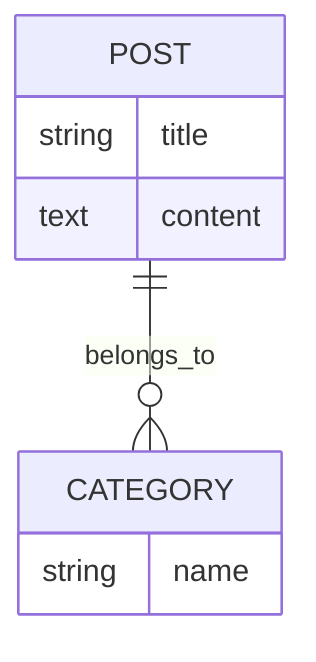
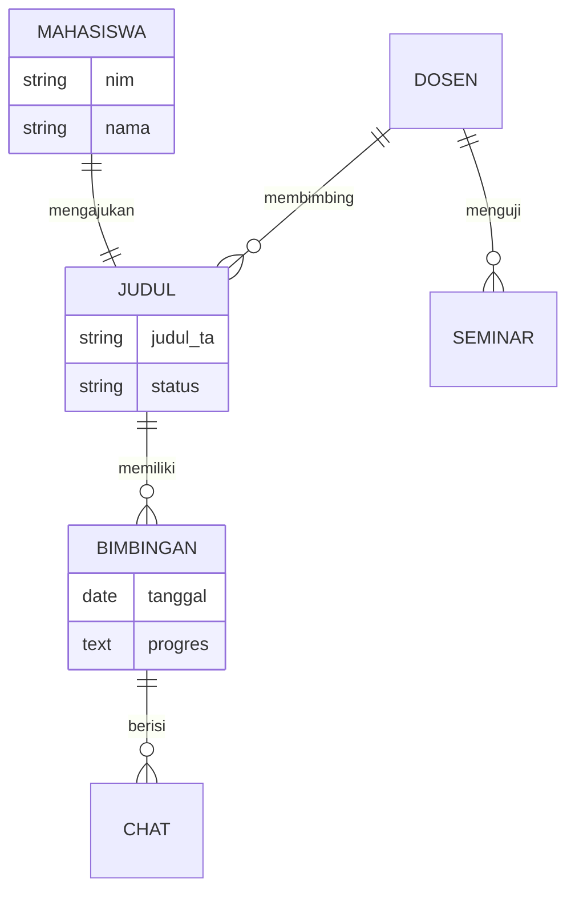
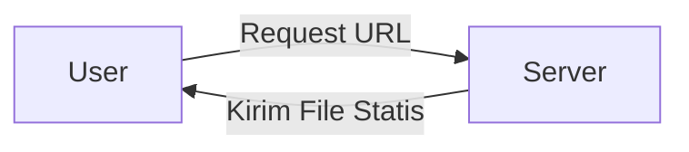
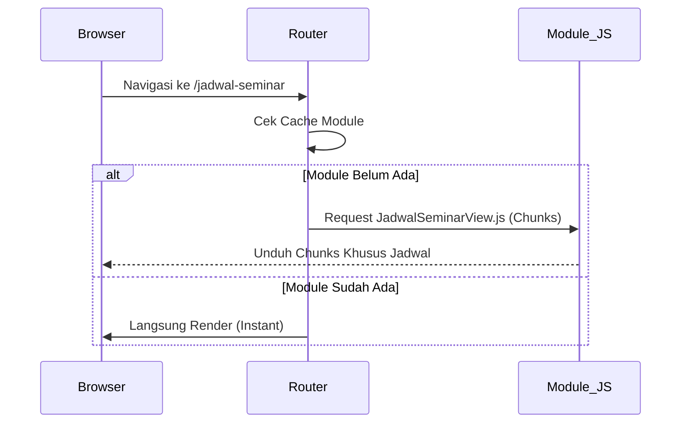

# LAPORAN KOMPREHENSIF PROGRES PENELITIAN TESIS
**Judul:** Analisis Perbandingan Arsitektur Monolithic (Eager Loading) vs Modular (Lazy Loading) pada Aplikasi SIMTA (Sistem Informasi Manajemen Tugas Akhir)

---

## 1. PENDAHULUAN & STATUS PROYEK
Saat ini, proyek penelitian telah mencapai fase penyelesaian prototipe fungsional dan pengumpulan data metrik performa. Fokus utama penelitian adalah membuktikan efisiensi teknik modern dalam pengembangan aplikasi web berskala kompleks.

**Status Saat Ini:**
- [x] Perancangan Arsitektur Sistem (Baseline & Optimized)
- [x] Pengembangan Prototipe Aplikasi SIMTA (Full Features)
- [x] Simulasi Dataset & Latensi Jaringan
- [x] Pengumpulan Data Metrik Kuantitatif
- [x] Penyusunan Draft Analisis Performa

---

## 2. KLASIFIKASI KOMPLEKSITAS SISTEM

Untuk memberikan batasan masalah yang jelas, penelitian ini membedakan antara website sederhana dan aplikasi web kompleks:

### 2.1 Website Sederhana (Contoh: Company Profile)
- **Tujuan:** Pemberian informasi statis.
- **Teknis:** Interaksi JavaScript minimal, tidak ada manajemen state yang rumit.
- **Optimasi:** Arsitektur modular/lazy loading tidak memberikan dampak signifikan karena ukuran total bundle bawaan sudah sangat kecil.

### 2.2 Website Kompleks (Contoh: SIMTA)
- **Tujuan:** Manajemen data operasional (Tugas Akhir).
- **Teknis:** Menggunakan pustaka berat (Chart.js untuk statistik, Calendar visual), manajemen state global (Pinia), dan banyak rute navigasi.
- **Optimasi:** **Sangat Krusial**. Arsitektur modular menjadi kebutuhan wajib untuk mencegah "bloat" pada waktu muat pertama (initial load).

---

## 3. PERBANDINGAN ARSITEKTUR IMPLEMENTASI

Penelitian ini menguji dua varian implementasi pada perangkat lunak yang sama:

### 3.1 Versi 1A: Monolithic (Eager Loading)
Menggunakan pendekatan tradisional di mana seluruh modul diimpor secara statis.
- **Vite Config:** Standard (tanpa manual chunking).
- **Router:** Static imports (`import X from '...'`).
- **Logic:** Semua data (50+ entri) dan pustaka dibebankan ke pengguna di detik pertama akses.

### 3.2 Versi 1B: Modular (Lazy Loading + Optimasi)
Menggunakan teknik *best-practice* industri modern.
- **Code Splitting:** Memecah `node_modules` menjadi vendor terpisah (Vue/Pinia vs Chart.js).
- **Dynamic Imports:** Router mengunduh kode hanya saat rute dikunjungi.
- **Async Components:** Komponen berat dimuat dengan `defineAsyncComponent` + `Suspense`.
- **Prefetching Strategy:** Memprediksi navigasi pengguna untuk memuat modul di latar belakang (*Idle time*).

---

## 4. METODOLOGI PENGUKURAN (PENGGANTI LIGHTHOUSE)

Berbeda dengan Lighthouse yang memberikan skor "magis", metode **DevTools Lab Metrics** menggunakan data mentah dari mesin browser (V8 Engine). Pengukuran dilakukan melalui dua jalur:

### 4.1 Jalur Manual (Chrome DevTools)
Menggunakan fitur bawaan browser tanpa *software* tambahan:
- **Coverage Profiler**: Merekam setiap bita (byte) kode yang dieksekusi. Algoritma penghitungannya: `Total Bytes - Unused Bytes = Efficiency Rate`.
- **Network Tracing**: Menghitung *Transferred Size* (payload terkompresi) vs *Resource Size* (ukuran asli).

### 4.2 Jalur Programatik (Performance Algorithm)
Saya menyertakan skrip "Algorithm Tracker" yang disuntikkan ke dalam aplikasi untuk menangkap data secara otomatis melalui **Performance Observer API**.

**Algoritma Pengukuran (Pseudo-code):**
```javascript
// Lokasi: src/utils/performanceTracker.js (Analogi)
Start_Observer {
  Monitor: ["paint", "resource", "longtask"]
  On_Entry(event) {
    if (event.type == "FCP") Simpan_Waktu_Muncul_Konten
    if (event.type == "longtask") Kalkulasi_TBT(duration - 50ms)
    if (event.type == "resource") Hitung_Ukuran_JS_Halaman
  }
}
```
Hasil dari algoritma ini lebih akurat karena mencatat perilaku sistem tepat saat interaksi terjadi, bukan sekadar simulasi sekali jalan.

---

## 5. PERBANDINGAN MODELING: SEDERHANA VS KOMPLEKS

Perbedaan mendasar antara website sederhana dan kompleks juga dapat dilihat dari pemodelan data (ERD) dan aliran datanya (DFD).

### 5.1 Perbandingan ERD (Entity Relationship Diagram)

**Sederhana (Company Profile):**
Hanya hubungan linear antara artikel dan kategori.


**Kompleks (SIMTA):**
Hubungan relasional yang saling mengunci (*Interlocking*).


### 5.2 Perbandingan DFD (Data Flow Diagram)

**Sederhana (Web Statis):** Alur data searah (Request -> Response).


**Kompleks (SIMTA):** Alur data berbasis *State* dan *Reactivity*.
```mermaid
graph TD
    U[User] -- Interaksi UI --> St[State Management / Pinia]
    St -- Trigger Action --> Ser[Service / Supabase]
    Ser -- Async Fetch --> DB[(Database Simulation)]
    DB -- Result --> Ser
    Ser -- Update --> St
    St -- Re-render Component --> U
    Note right of St: Data diproses di memori browser <br/>sebelum ditampilkan
```

### 5.3 Perbandingan Flowchart Navigasi (Optimized)

Pada sistem SIMTA, pemuatan komponen dilakukan secara kondisional (*Lazy*) untuk menghemat resource:



---
**Tertanda,**
*Mahasiswa Peneliti*

**Tertanda,**
*Mahasiswa Peneliti*
