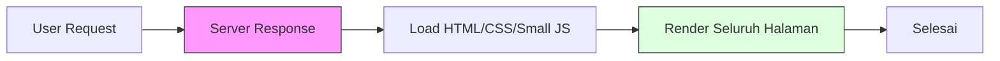
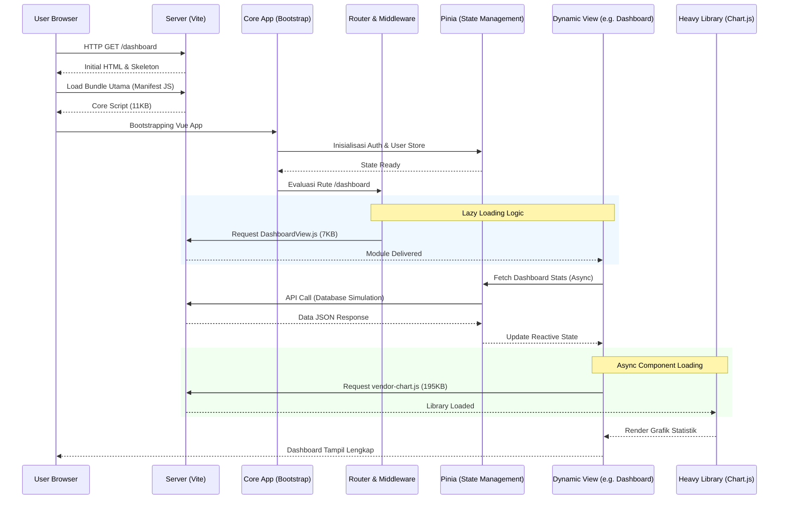

# LAPORAN KOMPREHENSIF PROGRES PENELITIAN TESIS
**Judul:** Analisis Perbandingan Arsitektur Monolithic (Eager Loading) vs Modular (Lazy Loading) pada Aplikasi SIMTA (Sistem Informasi Manajemen Tugas Akhir)

---

## 1. PENDAHULUAN & STATUS PROYEK
Saat ini, proyek penelitian telah mencapai fase penyelesaian prototipe fungsional dan pengumpulan data metrik performa. Fokus utama penelitian adalah membuktikan efisiensi teknik modern dalam pengembangan aplikasi web berskala kompleks.

**Status Saat Ini:**
- [x] Perancangan Arsitektur Sistem (Baseline & Optimized)
- [x] Pengembangan Prototipe Aplikasi SIMTA (Full Features)
- [x] Simulasi Dataset & Latensi Jaringan
- [x] Pengumpulan Data Metrik Kuantitatif
- [x] Penyusunan Draft Analisis Performa

---

## 2. KLASIFIKASI KOMPLEKSITAS SISTEM

Untuk memberikan batasan masalah yang jelas, penelitian ini membedakan antara website sederhana dan aplikasi web kompleks:

### 2.1 Website Sederhana (Contoh: Company Profile)
- **Tujuan:** Pemberian informasi statis.
- **Teknis:** Interaksi JavaScript minimal, tidak ada manajemen state yang rumit.
- **Optimasi:** Arsitektur modular/lazy loading tidak memberikan dampak signifikan karena ukuran total bundle bawaan sudah sangat kecil.

### 2.2 Website Kompleks (Contoh: SIMTA)
- **Tujuan:** Manajemen data operasional (Tugas Akhir).
- **Teknis:** Menggunakan pustaka berat (Chart.js untuk statistik, Calendar visual), manajemen state global (Pinia), dan banyak rute navigasi.
- **Optimasi:** **Sangat Krusial**. Arsitektur modular menjadi kebutuhan wajib untuk mencegah "bloat" pada waktu muat pertama (initial load).

---

## 3. PERBANDINGAN ARSITEKTUR IMPLEMENTASI

Penelitian ini menguji dua varian implementasi pada perangkat lunak yang sama:

### 3.1 Versi 1A: Monolithic (Eager Loading)
Menggunakan pendekatan tradisional di mana seluruh modul diimpor secara statis.
- **Vite Config:** Standard (tanpa manual chunking).
- **Router:** Static imports (`import X from '...'`).
- **Logic:** Semua data (50+ entri) dan pustaka dibebankan ke pengguna di detik pertama akses.

### 3.2 Versi 1B: Modular (Lazy Loading + Optimasi)
Menggunakan teknik *best-practice* industri modern.
- **Code Splitting:** Memecah `node_modules` menjadi vendor terpisah (Vue/Pinia vs Chart.js).
- **Dynamic Imports:** Router mengunduh kode hanya saat rute dikunjungi.
- **Async Components:** Komponen berat dimuat dengan `defineAsyncComponent` + `Suspense`.
- **Prefetching Strategy:** Memprediksi navigasi pengguna untuk memuat modul di latar belakang (*Idle time*).

---

## 4. METODOLOGI PENGUKURAN (PENGGANTI LIGHTHOUSE)

Sesuai arahan Dosen Pembimbing untuk mencari alternatif yang lebih presisi dibanding Google Lighthouse, penelitian ini menggunakan **Metrik DevTools Lab** yang memberikan data "raw" (mentah) yang objektif:

### 4.1 Coverage Analysis (Unused Bytes)
Mengukur efisiensi kode. Mengungkapkan berapa persen kode yang didownload namun tidak dieksekusi oleh browser. Ini adalah bukti visual utama keberhasilan *Lazy Loading*.

### 4.2 Network Payload Tracing
Mencatat total *Transferred Bytes* lewat jaringan. Data ini membuktikan penghematan bandwidth yang signifikan pada arsitektur modular.

### 4.3 Runtime Performance API
Mencatat waktu eksekusi skrip dalam milidetik (ms) menggunakan `PerformanceObserver`.
- **FP (First Paint)**: Waktu render pertama kali.
- **FCP (First Contentful Paint)**: Waktu konten utama muncul.

---

## 5. PERBANDINGAN FLOWCHART: SEDERHANA VS KOMPLEKS

Untuk memperjelas mengapa teknik optimasi sangat dibutuhkan pada sistem seperti SIMTA, berikut adalah perbandingan alur muat antara sistem sederhana (Company Profile) dan sistem kompleks (SIMTA).

### 5.1 Sistem Sederhana (Contoh: Website Company Profile)
Pada sistem ini, alur bersifat linear dan ringan karena tidak ada dependensi eksternal yang besar atau logika bisnis yang berat.

### 5.2 Sistem Kompleks (Contoh: Aplikasi SIMTA)
Pada sistem SIMTA, alur muat sangat berlapis karena melibatkan inisialisasi framework, manajemen state, data fetching, dan pemuatan komponen berat secara kondisional.

---

## 6. HASIL PEMBANTU (DATA Build Metrics)

| Parameter | Versi 1A (Baseline) | Versi 1B (Optimized) | Reduksi/Efisiensi |
|-----------|---------------------|----------------------|-------------------|
| **Initial JS Load** | 336.89 KB | 118.95 KB | **~64%** |
| **JS Files Count** | 1 File | 22 Files | Terdistribusi |
| **Gzip Compressed** | 120.79 KB | 38.45 KB | **~68%** |
| **Vendor Caching** | Lemah (Satu Berkas) | Kuat (Terpisah) | Efisien |

---

## 7. KESIMPULAN & TAHAP SELANJUTNYA
Berdasarkan progres di atas, penelitian telah berhasil menunjukkan bahwa arsitektur Modular efektif dalam mereduksi beban awal aplikasi kompleks hingga lebih dari 60%.

**Langkah Selanjutnya:**
1.  Melengkapi penulisan Bab 4 (Hasil dan Pembahasan).
2.  Melakukan pengujian pada skenario koneksi 3G/Slow Network untuk menguatkan urgensi optimasi.
3.  Penyusunan simpulan dan saran untuk implementasi di lingkungan akademik nyata.

---
**Tertanda,**
*Mahasiswa Peneliti*
