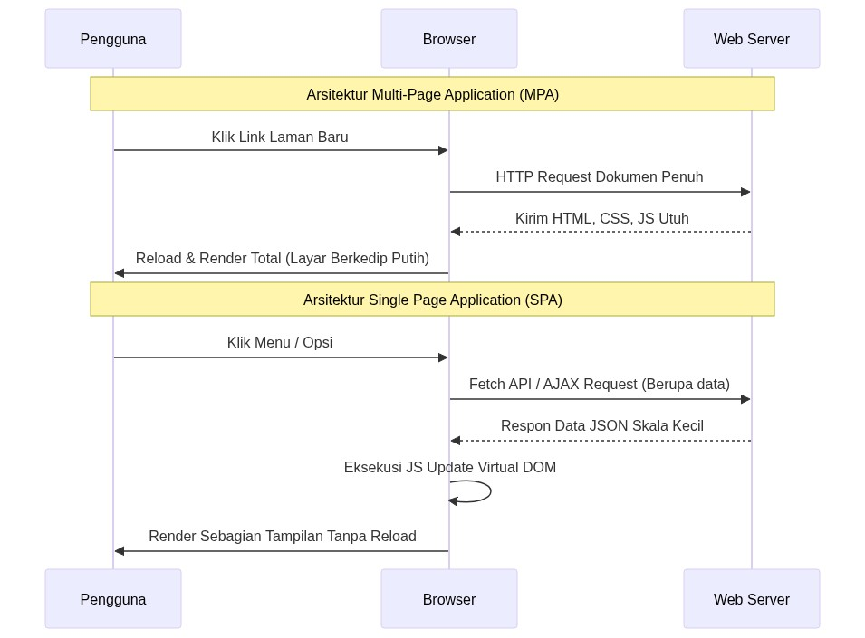

# BAB I PENDAHULUAN

## 1.1 Latar Belakang Masalah

Single Page Application (SPA) telah menjadi arsitektur dominan dalam pengembangan aplikasi web modern karena kemampuannya memberikan pengalaman pengguna yang responsif dan interaktif (Kowalczyk & Szandała, 2024). Berbeda dengan aplikasi web tradisional *Multi-Page Application* (MPA) yang memuat ulang seluruh halaman untuk setiap interaksi pengguna, SPA memuat seluruh konten dalam satu halaman HTML dan secara dinamis memperbarui tampilan tanpa *reload* halaman penuh, menghasilkan pengalaman yang lebih mirip aplikasi *desktop* (Taivalsaari & Mikkonen, 2021).

Dalam arsitektur MPA konvensional, setiap interaksi pengguna mengharuskan server memproses ulang halaman HTML secara utuh dan mengirimkannya kembali ke browser. Mekanisme pemuatan penuh (*full page reload*) ini tidak hanya membebani lalu lintas server, tetapi juga mendegradasi pengalaman pengguna karena timbulnya layar putih berkedip (*white screen blanking*) selama masa tunggu transmisi jaringan (Kowalczyk & Szandała, 2024).

  
   
  <i>Gambar 1.1 Perbandingan arsitektur MPA (Multi-Page Application) dan SPA (Single Page Application).</i>

Gambar 1.1 di atas memperlihatkan perbedaan mendasar antara arsitektur MPA dan SPA. Pada MPA, setiap klik pengguna memaksa server untuk memproses dan mengirimkan ulang seluruh halaman HTML, menghasilkan layar putih berkedip yang mengganggu pengalaman pengguna. Sebaliknya, pada SPA, server hanya mengirimkan data JSON berukuran kecil, sementara browser memperbarui tampilan secara parsial melalui JavaScript. Perbedaan inilah yang menjadi dasar mengapa ukuran *bundle* JavaScript pada SPA perlu dikelola dengan cermat melalui teknik seperti *lazy loading* dan *code splitting*.

Sebagai solusi dari masalah tersebut, paradigma SPA hadir sebagai standar industri mutakhir yang dipelopori oleh kerangka kerja JavaScript reaktif berbasis komponen seperti Vue.js, React, dan Angular. SPA memungkinkan aplikasi web untuk mengunduh satu kerangka HTML (`index.html`) pada muatan perdana, kemudian semua perubahan tampilan dikelola oleh JavaScript di browser. Ketika pengguna berpindah halaman, aplikasi hanya mengambil data kecil dalam format JSON dari server melalui API asinkron, lalu memperbarui bagian-bagian tertentu di layar saja (Taivalsaari & Mikkonen, 2021).

Namun, pertumbuhan kompleksitas aplikasi web menyebabkan peningkatan ukuran *bundle* JavaScript yang berdampak negatif pada performa. Ukuran *bundle* JavaScript yang besar berdampak langsung pada waktu muat halaman; keterlambatan pemuatan beberapa detik saja terbukti meningkatkan *bounce rate* secara signifikan (Google, 2020).

Ketika sebuah aplikasi SPA tidak dioptimalkan dengan benar, browser terpaksa mengunduh seluruh kode program — termasuk semua halaman, komponen, gambar, dan pustaka pihak ketiga — sekaligus dalam satu file JavaScript yang sangat besar (*monolithic build*). Untuk website sederhana seperti halaman profil perusahaan, hal ini mungkin tidak masalah. Tetapi untuk aplikasi yang kompleks seperti Sistem Informasi Manajemen Tugas Akhir (SIMTA) — yang menggunakan banyak fitur seperti grafik interaktif (*Chart.js*), manajemen data global (*Pinia*), lapisan layanan data asinkron, dan otentikasi pengguna — ukuran file-nya dapat melebihi batas wajar yang direkomendasikan untuk browser (lebih dari 300 KB terkompresi).

Pada tahap awal, aplikasi berkompleksitas tinggi ditetapkan melalui kajian awal (*preliminary study*). Kandidat awal berupa *dashboard* admin toko dinilai kurang representatif karena tidak memiliki ketergantungan pustaka eksternal yang cukup berat untuk menghasilkan perbedaan yang terukur secara signifikan pada strategi *code splitting*. Oleh karena itu, objek penelitian ditetapkan pada Sistem Informasi Manajemen Tugas Akhir (SIMTA) yang secara bersamaan menggunakan Chart.js (grafik interaktif), Pinia (*state management*), lapisan layanan data asinkron bergaya Supabase, dan Vue Router dengan 15+ rute. Kombinasi ini menghasilkan *bundle* monolitik yang jauh lebih besar sehingga mewakili aplikasi kompleksitas tinggi secara lebih representatif, tanpa mengubah pertanyaan penelitian, variabel, maupun tujuan yang telah ditetapkan.

Akibat dari *bundle* yang terlalu besar ini sangat merugikan. Nilai-nilai penting dalam pengukuran performa web yang disebut *Core Web Vitals* — yang digunakan oleh mesin pencari seperti Google — akan turun drastis (Google Chrome Developers, 2023). Perbaikan pada metrik pemuatan seperti LCP dan FCP berkorelasi dengan peningkatan keterlibatan pengguna dan penurunan *bounce rate*. Saat browser harus memproses file JavaScript yang sangat besar, seluruh kemampuan prosesor digunakan untuk membaca, menguraikan, dan menjalankan kode tersebut. Selama proses ini berlangsung, browser tidak bisa merespons klik atau interaksi pengguna sama sekali — kondisi yang diukur melalui metrik *Total Blocking Time* (TBT) (Google Chrome Developers, 2023).

Untuk mengatasi masalah ini, pendekatan *Code Splitting* dan *Lazy Loading* telah dikembangkan (Kumar, Singh & Sharma, 2024). Alih-alih mengirimkan semua kode sekaligus, hanya bagian yang diperlukan saat pengguna membuka halaman tertentu yang dikirimkan. Kumar, Singh, dan Sharma (2024) menunjukkan bahwa kombinasi *lazy loading* dan *code splitting* dapat menurunkan waktu muat halaman hingga sekitar 40% dibandingkan implementasi standar. Lebih lanjut, teknik *Hybrid Lazy Loading* atau *Prefetching* memanfaatkan waktu senggang browser untuk diam-diam mengunduh terlebih dahulu bagian kode yang kemungkinan akan dibutuhkan selanjutnya (Google Chrome Developers, 2023).

Tingkat kompleksitas aplikasi web mempengaruhi efektivitas strategi optimasi. Aplikasi dengan kompleksitas rendah seperti *company profile* memiliki karakteristik berbeda dengan aplikasi kompleksitas tinggi yang melibatkan operasi CRUD dan visualisasi data *real-time*. Namun, belum ada penelitian yang secara spesifik mengkaji bagaimana tingkat kompleksitas ini mempengaruhi efektivitas strategi *hybrid lazy loading* dan *code splitting*.

Berdasarkan permasalahan di atas, penelitian ini membahas topik: **"Optimasi Performa Single Page Application Menggunakan Hybrid Lazy Loading dan Code Splitting Berdasarkan Tingkat Kompleksitas Sistem"**.

---

## 1.2 Rumusan Masalah

Berdasarkan permasalahan yang telah diuraikan, penelitian ini difokuskan pada pertanyaan-pertanyaan berikut:

1. Bagaimana pengaruh implementasi *hybrid lazy loading* dan *code splitting* terhadap metrik performa SPA (FCP, LCP, TBT, dan *bundle size*) pada aplikasi dengan tingkat kompleksitas tinggi (SIMTA)?

2. Bagaimana pengaruh implementasi *hybrid lazy loading* dan *code splitting* terhadap metrik performa SPA pada aplikasi dengan tingkat kompleksitas rendah (*Company Profile*)?

3. Bagaimana perbedaan efektivitas strategi *hybrid lazy loading* dan *code splitting* antara aplikasi kompleksitas tinggi dan rendah?

4. Bagaimana rekomendasi strategi optimasi *hybrid lazy loading* dan *code splitting* yang sesuai berdasarkan tingkat kompleksitas aplikasi web?

---

## 1.3 Batasan Masalah

Agar penelitian ini fokus dan hasilnya dapat diukur dengan jelas, batasan penelitian ditetapkan sebagai berikut:

1. **Framework dan Build Tool:** Vue.js versi 3.x dengan Composition API, menggunakan Vite sebagai *build tool*.

2. Penelitian menggunakan dua jenis aplikasi sebagai objek percobaan:
   - **Aplikasi Kompleks/Tinggi (SIMTA):** Sistem Informasi Manajemen Tugas Akhir yang menggunakan Vue.js 3, Chart.js, Pinia, dan Vue Router secara bersamaan, dengan lapisan layanan data asinkron bergaya Supabase.
   - **Aplikasi Sederhana/Rendah (Company Profile):** Website profil perusahaan yang hanya menampilkan konten statis tanpa grafik interaktif atau manajemen data yang kompleks.

3. **Teknik Optimasi:** *Route-based lazy loading*, *component-based lazy loading*, *dynamic import*, *code splitting* berbasis *chunk*, dan *intelligent prefetching*.

4. **Metrik Performa:** *First Contentful Paint* (FCP), *Largest Contentful Paint* (LCP), *Total Blocking Time* (TBT), *Load Time*, penggunaan memori JavaScript (*JS Heap*), serta data tambahan dari Lighthouse (*Performance Score*, *Time to Interactive*).

5. **Alat pengukuran:** Kombinasi *W3C PerformanceObserver* (pengukuran langsung dari browser) dan Google Lighthouse (sebagai alat audit standar industri), dijalankan secara otomatis melalui Puppeteer.

6. **Pengujian:** Dilakukan di server lokal (*localhost*) menggunakan Puppeteer untuk automasi browser, dengan simulasi pelambatan CPU 4x melalui *Puppeteer Chromium API*, sehingga variabel jaringan dapat dieleminasi untuk mendapatkan pengukuran *CPU-bound* yang murni.

7. **Tidak mencakup:** *Server-Side Rendering* (SSR), *Progressive Web App* (PWA), dan optimasi *backend/database*.

---

## 1.4 Tujuan Penelitian

Penelitian ini bertujuan untuk:

1. Menganalisis pengaruh implementasi *hybrid lazy loading* dan *code splitting* terhadap metrik performa SPA pada aplikasi kompleksitas tinggi (SIMTA), khususnya dalam memisahkan pustaka-pustaka besar seperti Chart.js dan Pinia ke dalam file-file terpisah.

2. Menganalisis pengaruh implementasi *hybrid lazy loading* dan *code splitting* terhadap metrik performa SPA pada aplikasi kompleksitas rendah (*Company Profile*).

3. Membandingkan efektivitas strategi *hybrid lazy loading* dan *code splitting* antara aplikasi kompleksitas tinggi dan rendah.

4. Merumuskan rekomendasi strategi optimasi *hybrid lazy loading* dan *code splitting* berdasarkan tingkat kompleksitas aplikasi web.

---

## 1.5 Manfaat Penelitian

### 1.5.1 Manfaat Teoritis

1. Memberikan kontribusi pada *body of knowledge* terkait optimasi performa *Single Page Application* khususnya dalam konteks Vue.js dan Vite *build tool*.
2. Memperkaya literatur tentang strategi *adaptive optimization* yang mempertimbangkan karakteristik dan kompleksitas aplikasi web.
3. Memberikan referensi baru tentang cara mengoptimalkan performa SPA menggunakan pengukuran yang akurat dan langsung dari browser (W3C *PerformanceObserver*), sehingga hasilnya lebih representatif terhadap kondisi nyata.

### 1.5.2 Manfaat Praktis

1. **Bagi Developer:** Memberikan panduan praktis dalam menerapkan strategi *hybrid lazy loading* dan *code splitting* pada proyek Vue.js berdasarkan tingkat kompleksitas aplikasi.
2. **Bagi Industri:** Membantu organisasi dalam mengoptimalkan performa aplikasi web yang berdampak pada peningkatan *user experience* dan *conversion rate*.
3. **Bagi Peneliti Selanjutnya:** Menyediakan *baseline* dan metodologi yang dapat dikembangkan untuk penelitian lebih lanjut terkait optimasi performa web.

---

## 1.6 Tinjauan Pustaka / Penelitian Terdahulu

Optimasi performa *Single Page Application* melalui *code splitting* dan *lazy loading* telah menjadi fokus berbagai penelitian dalam beberapa tahun terakhir. Untuk memposisikan kontribusi penelitian ini secara jelas, Tabel 1.1 merangkum enam penelitian terdahulu yang paling relevan — mencakup fokus dan metode, temuan utama, serta kesenjangan (*gap*) masing-masing terhadap penelitian yang dilakukan. Sintesis dari keseluruhan tinjauan pustaka disajikan setelah tabel.

**Tabel 1.1** Rangkuman Perbandingan Penelitian Terdahulu

| No | Peneliti (Tahun) | Fokus & Metode | Hasil / Temuan | Gap & Perbedaan dengan Penelitian Ini |
|----|------------------|----------------|----------------|----------------------------------------|
| 1 | Kowalczyk & Szandała (2024) | Evaluasi SEO & visibilitas SPA vs MPA (*IEEE Access*); studi review + eksperimen. | SPA menghadapi tantangan indexing/SEO dibanding MPA; diusulkan strategi peningkatan visibilitas. | Fokus pada SEO, bukan optimasi performa. Penelitian ini fokus *lazy loading* + *code splitting* dan tingkat kompleksitas. |
| 2 | Emmanni (2023) | Analisis komparatif Angular, React, dan Vue.js untuk pengembangan SPA (benchmark + survei). | Setiap framework unggul pada konteks berbeda; pemilihan bergantung kebutuhan proyek. | Perbandingan bersifat umum; tidak menerapkan/mengukur teknik optimasi maupun faktor kompleksitas. Penelitian ini fokus Vue.js + Vite. |
| 3 | Bara, Boiangiu & Tudose (2024) | Analisis empiris dampak *lazy loading* (situs statis vs dinamis, variasi kondisi jaringan). | *Lazy loading* memperbaiki FCP/LCP, terutama pada jaringan lambat; terdapat *trade-off* eager vs lazy. | Hanya *lazy loading* tanpa *code splitting*; tidak spesifik Vue+Vite dan tidak mengklasifikasi tingkat kompleksitas. |
| 4 | Kumar, Singh & Sharma (2024) | Implementasi *lazy loading* + *code splitting* lintas framework (React, Angular, Vue). | Kombinasi keduanya menurunkan *page load time* hingga ±40%. | Bersifat umum; tidak *deep-dive* Vue.js + Vite dan tidak mempertimbangkan tingkat kompleksitas sistem sebagai penentu strategi. |
| 5 | Setiawan & Fauzi (2025) | Komparatif *lazy loading* + *code splitting* pada React/Vue/Angular berdasarkan skor Lighthouse (FCP, LCP, TBT, CLS). | React waktu muat tercepat & stabilitas layout terbaik; Vue fleksibel; Angular lebih rendah. | Pengukuran hanya via Lighthouse (bukan *PerformanceObserver* real-user), tanpa uji tingkat kompleksitas & *CPU throttling*; keduanya ditambahkan di penelitian ini. |
| 6 | Taivalsaari & Mikkonen (2021) | *Roadmap* arsitektur SPA di era *programmable world* (konseptual). | SPA memberi pengalaman responsif; menyoroti tantangan arsitektur & beban di sisi klien. | Bersifat visioner/konseptual, bukan evaluasi teknik optimasi konkret. |

Di luar keenam studi utama pada Tabel 1.1, sejumlah penelitian lain memperkuat konteks penelitian ini. Perbandingan performa antar-*framework* JavaScript modern telah banyak dikaji (Piastou, 2023; Jihadi & Syarabil, 2023; Sofi'ie & Qoiriah, 2023; Anggraeni dkk., 2024; Khoirurrizal dkk., 2024; Wijaya & Farisi, 2025), termasuk pengembangan SPA berbasis React (Jonathan & Suprihadi, 2023) dan efisiensi *build tool* modern seperti Vite (Fauzi, 2024). Teknik *lazy loading* dan *code splitting* untuk meningkatkan responsivitas juga menjadi perhatian (Turcotte, Gokhale & Tip, 2023; Larissa & Suartana, 2026), demikian pula aspek pendukung seperti manajemen *state* (Donvir dkk., 2024), kualitas kode JavaScript dan TypeScript (Saboury dkk., 2017; Johannes dkk., 2019; Bogner & Merkel, 2022), mekanisme *rendering* dan *Server-Side Rendering* (Noer & Suartana, 2024; Hermanto & Engel, 2025), pengujian *end-to-end* (Rezeki dkk., 2026), serta tinjauan umum teknik optimasi performa web (Vepsäläinen, Hellas & Vuorimaa, 2023).

**Gap Penelitian:** Berdasarkan tinjauan di atas, belum terdapat penelitian komprehensif yang mengkaji implementasi *hybrid lazy loading* dan *code splitting* pada Vue.js dengan Vite yang mempertimbangkan tingkat kompleksitas aplikasi sebagai faktor penentu strategi optimasi. Penelitian ini mengisi gap tersebut dengan membandingkan dua aplikasi dengan kompleksitas yang sangat berbeda, menggunakan kombinasi alat pengukuran (*PerformanceObserver* + Lighthouse), dan menguji pada kondisi perangkat yang terbatas (*CPU throttling*).

---

## 1.7 Sistematika Penulisan

Penulisan tesis ini dibagi menjadi empat bab utama:

- **BAB I PENDAHULUAN:** Menjelaskan latar belakang mengapa performa SPA perlu dioptimalkan, masalah yang ingin diselesaikan, batasan penelitian, tujuan, manfaat, dan ringkasan penelitian-penelitian terdahulu yang relevan.

- **BAB II METODE PENELITIAN DAN LANDASAN TEORI:** Menjelaskan teori-teori dasar yang digunakan serta metodologi penelitian secara detail termasuk variabel penelitian, spesifikasi alat yang digunakan, dan langkah-langkah pengujian.

- **BAB III HASIL DAN PEMBAHASAN:** Menyajikan hasil pengukuran dari kedua versi aplikasi (standar dan yang dioptimalkan), termasuk kode program, grafik perbandingan, data Lighthouse, analisis statistik, dan interpretasi mendalam tentang setiap temuan.

- **BAB IV PENUTUP:** Merangkum kesimpulan dari penelitian dan memberikan saran untuk penelitian lanjutan.
