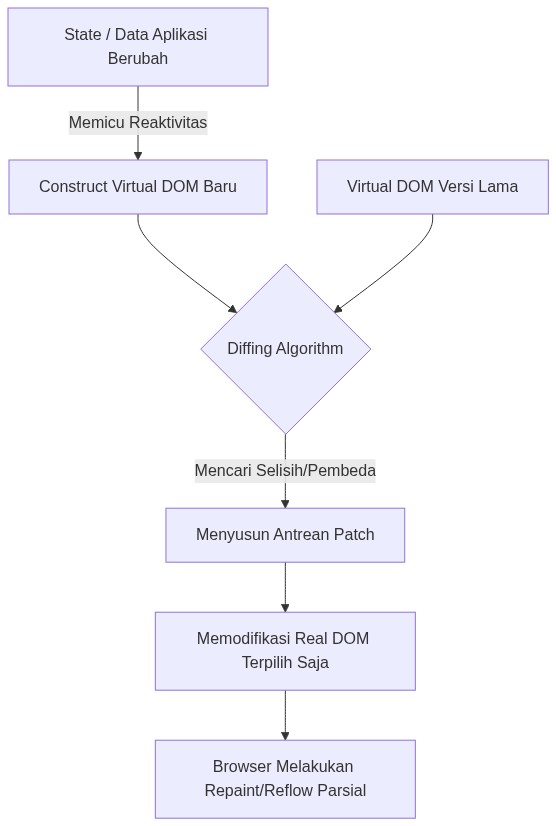
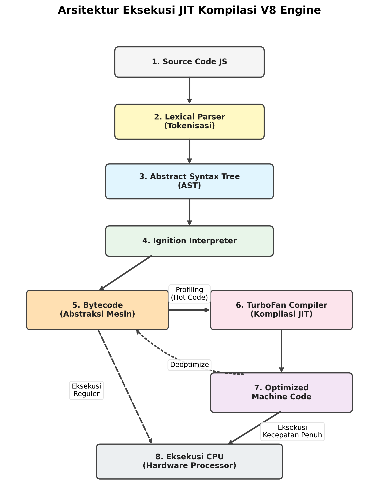
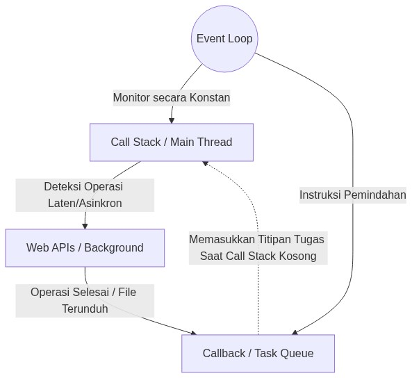
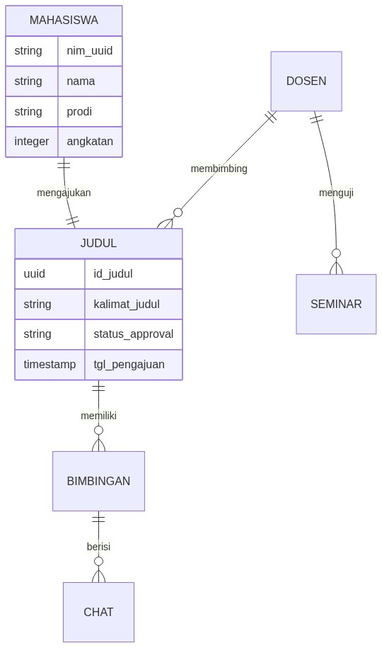
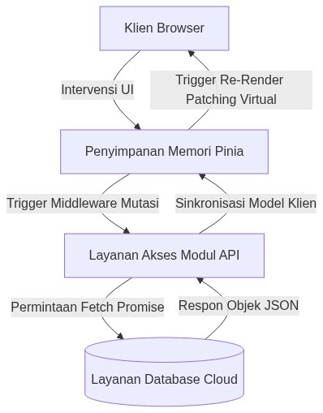
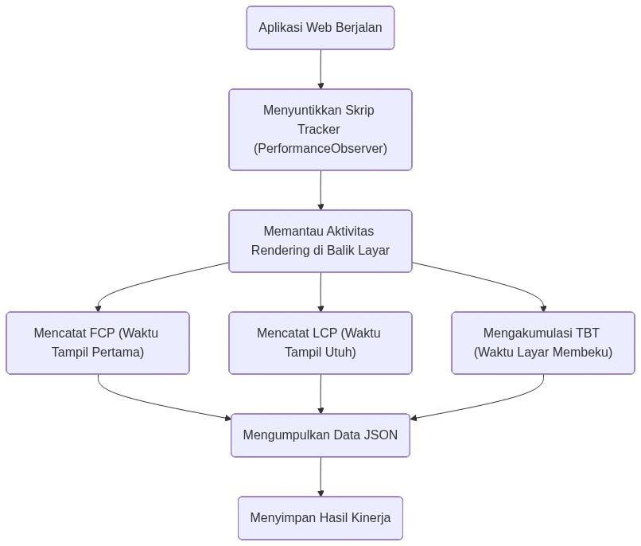
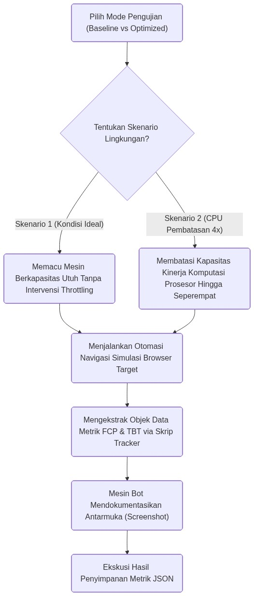

# BAB II METODE PENELITIAN DAN LANDASAN TEORI

## 2.1 Landasan Teori

### 2.1.1 Arsitektur *Single Page Application* (SPA) dan *Virtual DOM*

*Single Page Application* (SPA) adalah aplikasi web yang berinteraksi dengan pengguna melalui pemuatan ulang dinamis halaman tunggal, berbeda dengan aplikasi web tradisional yang memuat ulang seluruh halaman untuk setiap interaksi (Kowalczyk & Szandała, 2024). Menurut Taivalsaari dan Mikkonen (2021), SPA menawarkan pengalaman pengguna yang lebih responsif karena hanya memperbarui konten yang diperlukan tanpa *reload* seluruh halaman.

Salah satu fitur unggulan SPA adalah penggunaan *Virtual DOM*. *Virtual DOM* adalah representasi maya dari tampilan halaman yang disimpan di memori JavaScript. Ketika ada data yang berubah, Vue.js terlebih dahulu membuat *Virtual DOM* baru, membandingkannya dengan salinan lama (*diffing algorithm*), lalu memperbarui tampilan nyata hanya pada bagian yang berbeda saja. Cara ini jauh lebih efisien dibandingkan memuat ulang seluruh halaman (You et al., 2023).

<div align="center">
  
  <br>
  <i>Gambar 2.1 Mekanisme pembaruan antarmuka melalui algoritma diffing Virtual DOM.</i>
</div>

Gambar 2.1 di atas mengilustrasikan cara *Virtual DOM* mengoptimalkan proses pembaruan antarmuka. Daripada menggambar ulang seluruh halaman setiap kali data berubah, Vue.js hanya memperbarui *node-node* DOM yang benar-benar berbeda antara *snapshot Virtual DOM* lama dan baru. Efisiensi ini sangat relevan dengan topik penelitian karena menjelaskan mengapa penundaan *parsing* JavaScript melalui *lazy loading* tidak mengurangi kecepatan pembaruan antarmuka setelah komponen berhasil dimuat.

### 2.1.2 Vue.js *Framework*

Vue.js adalah *progressive JavaScript framework* yang dirancang untuk membangun *user interface* dengan pendekatan *bottom-up incremental adoption* (You et al., 2023). Vue.js 3 memperkenalkan *Composition API* sebagai alternatif *Options API*, serta *reactivity system* menggunakan ES6 *Proxy* yang menghasilkan performa lebih baik. Menurut dokumentasi resmi Vue.js (You et al., 2023), Vue 3 menghadirkan peningkatan *rendering performance*, *memory footprint* yang lebih rendah, serta *bundle size* yang lebih kecil dibandingkan Vue 2.

### 2.1.3 Vite *Build Tool* dan *Code Splitting*

Vite adalah *build tool* modern yang dikembangkan oleh Evan You dengan fokus pada *developer experience* dan performa (Vite Team, 2024). Berbeda dengan *bundler* tradisional seperti Webpack, Vite memanfaatkan *native ES modules* di browser untuk melayani kode secara *on-demand*. Vite juga menyediakan optimasi ukuran *bundle* secara *default* melalui konfigurasi Rollup yang telah dioptimasi untuk web (Vite Team, 2024). Untuk *production build*, Vite menggunakan Rollup sebagai *bundler* dengan konfigurasi yang sudah dioptimasi, termasuk *code splitting* berbasis *dynamic import* dan *vendor chunk separation*.

### 2.1.4 *Lazy Loading*

*Lazy loading* adalah teknik optimasi yang menunda *loading resource* hingga benar-benar diperlukan oleh pengguna (Bara, Boiangiu & Tudose, 2024). Terdapat beberapa strategi yang dapat diterapkan pada Vue.js:

1. ***Route-based Lazy Loading:*** Memuat komponen *route* hanya ketika *route* tersebut diakses pertama kali.
2. ***Component-based Lazy Loading:*** Memuat komponen individual secara *on-demand*, biasanya untuk komponen yang berat atau jarang digunakan.
3. ***Conditional Lazy Loading:*** Memuat komponen berdasarkan kondisi tertentu seperti *user role* atau *device type*.

Bara, Boiangiu, dan Tudose (2024) menemukan bahwa penerapan *lazy loading* efektif mengurangi *initial bundle size* dan memperbaiki metrik pemuatan awal, terutama pada kondisi jaringan lambat.

### 2.1.5 Strategi Optimasi Hibrida

Penelitian terbaru menunjukkan bahwa pendekatan hibrida yang mengkombinasikan beberapa teknik optimasi menghasilkan hasil lebih baik dibandingkan pendekatan tunggal (Setiawan & Fauzi, 2025). Efektivitas strategi hibrida ini bergantung pada karakteristik aplikasi, termasuk jumlah *routes* dan komponen, ukuran individual komponen, kompleksitas *dependency graph*, pola navigasi pengguna, serta kondisi target perangkat dan jaringan.

### 2.1.6 Bagaimana Browser Memproses File JavaScript

File JavaScript tidak bisa langsung dijalankan oleh browser. Browser — khususnya yang menggunakan mesin V8 seperti Google Chrome — harus melalui beberapa tahap (Hasanuddin, 2021):

1. **Mengunduh file (*Resolution & Downloading*):** Browser menjalin koneksi TCP via HTTP *Request* untuk mengunduh file JavaScript dari server.
2. **Membaca dan mengurai kode (*Lexical Parsing & AST*):** Browser membaca kode dan mengubahnya menjadi *Abstract Syntax Tree*. Proses ini menyita seluruh kapasitas *Main Thread*.
3. **Mengompilasi (*JIT Compilation*):** Struktur kode diubah menjadi instruksi yang bisa dijalankan langsung oleh prosesor.
4. **Menjalankan dan mengalokasikan memori (*Execution & Memory Allocation*):** Semua fungsi, variabel, dan pustaka ditempatkan di memori (*JS Heap*), lalu Vue.js mulai menggambar tampilan di layar.

Karena JavaScript bekerja secara *single-threaded*, ketika browser sedang memproses file JS yang sangat besar, browser tidak bisa merespons interaksi pengguna (Google Chrome Developers, 2023). Inilah yang disebut *Event Loop Blocking*, dan yang diukur oleh metrik *Total Blocking Time* (TBT).

<div align="center">
  
  <br>
  <i>Gambar 2.2 Tahapan pemrosesan file JavaScript oleh mesin V8 di browser.</i>
</div>

Gambar 2.2 di atas menunjukkan bahwa pemrosesan JavaScript merupakan proses bertahap yang membebani *Main Thread* secara eksklusif. Tahap *Parsing* dan Kompilasi adalah yang paling kritis karena selama tahap ini browser sepenuhnya tidak dapat merespons interaksi pengguna — inilah yang diukur oleh metrik *Total Blocking Time* (TBT). Pemahaman atas tahapan ini menjadi landasan teknis mengapa *code splitting* efektif: dengan memperkecil ukuran file yang harus diproses pada muatan awal, durasi pemblokiran *Main Thread* dapat dikurangi secara signifikan.

### 2.1.7 *Event Loop* dan Mekanisme Asinkron

*Event Loop* adalah mekanisme bawaan browser untuk menangani tugas-tugas yang butuh waktu lama tanpa membekukan layar. Tugas-tugas yang memakan waktu tidak diproses langsung, melainkan dititipkan ke area penantian khusus (*Callback Queue*). Sambil menunggu, browser tetap bisa merespons interaksi pengguna. Setelah tampilan dasar selesai digambar, barulah browser mengambil tugas-tugas yang menunggu (W3C, 2022). Prinsip inilah yang membuat *Lazy Loading* bisa bekerja dengan baik — modul-modul besar ditunda pengunduhan dan pemrosesannya hingga benar-benar dibutuhkan.

<div align="center">
  
  <br>
  <i>Gambar 2.3 Mekanisme Event Loop dalam menangani tugas asinkron JavaScript.</i>
</div>

Gambar 2.3 di atas memperlihatkan bahwa *Event Loop* adalah mekanisme yang memungkinkan *lazy loading* bekerja tanpa membekukan antarmuka. Ketika pengguna berpindah ke halaman baru, permintaan pengunduhan modul ditempatkan ke *Web APIs* dan *Callback Queue*, sehingga browser tetap responsif sambil modul sedang diunduh di latar belakang. Mekanisme inilah yang menjadi fondasi teknis dari strategi *hybrid lazy loading* yang diimplementasikan dalam penelitian ini.

### 2.1.8 Metrik Performa Web (*Core Web Vitals*)

Performa sebuah website diukur menggunakan standar *Core Web Vitals* (Google Chrome Developers, 2023):

1. **First Contentful Paint (FCP):** Waktu dari saat pengguna membuka website hingga sesuatu pertama kali muncul di layar. Standar yang baik: ≤ 1.800 ms.

2. **Largest Contentful Paint (LCP):** Waktu hingga elemen terbesar di halaman selesai dimuat. Standar yang baik: ≤ 2.500 ms.

3. **Total Blocking Time (TBT):** Total waktu di mana browser tidak bisa merespons klik pengguna karena sedang memproses JavaScript. Nilai TBT yang baik harus ≤ 200-300 ms (Google Chrome Developers, 2023). TBT adalah metrik yang paling langsung mengukur dampak *bundle* JavaScript yang besar terhadap interaktivitas pengguna.

4. **Time to Interactive (TTI):** Waktu hingga halaman *fully interactive* dan dapat merespons input pengguna secara *reliable*. Target: ≤ 3,8 detik (Google Chrome Developers, 2023).

### 2.1.9 Kompleksitas Aplikasi Web

Kompleksitas aplikasi web dapat dikategorikan berdasarkan beberapa faktor:

1. **Kompleksitas Rendah:** 5-10 *routes/pages*, < 50 komponen, minimal *state management* (*local state*), konten dominan statis, interaksi pengguna sederhana.
2. **Kompleksitas Tinggi:** 10-30+ *routes/pages*, 50-200+ komponen, *centralized state management* (Vuex/Pinia), operasi CRUD dengan integrasi API, visualisasi data (*Chart.js*), *complex user workflows*, integrasi dengan layanan eksternal (Supabase, dll).

Strategi optimasi yang efektif untuk aplikasi kompleksitas rendah tidak selalu efektif untuk kompleksitas tinggi. *Aggressive code splitting* pada aplikasi sederhana justru dapat menghasilkan *overhead HTTP requests* yang kontraproduktif — konsisten dengan adanya *trade-off* eager vs lazy loading yang dilaporkan Bara, Boiangiu, dan Tudose (2024).

---

## 2.2 Jenis dan Pendekatan Penelitian

Penelitian ini menggunakan pendekatan eksperimental kuantitatif dengan desain *comparative experimental*. Dua versi aplikasi dikompilasi dan diuji dengan cara yang sama:

1. **Versi Standar (Monolithic / Eager Load):** Semua kode dikemas dalam satu file besar dan dimuat sekaligus ketika website dibuka.
2. **Versi Dioptimalkan (Hybrid Splitting):** Kode dipecah menggunakan *Code Splitting*, *Lazy Loading*, kompresi (Brotli/Gzip), dan *Prefetching*.

Eksperimen dilakukan pada dua tingkat kompleksitas aplikasi (SIMTA sebagai aplikasi kompleksitas tinggi dan *Company Profile* sebagai aplikasi kompleksitas rendah).

## 2.3 Variabel Penelitian

### 2.3.1 Variabel Independen

1. **Strategi Optimasi:** Tanpa optimasi (*baseline*) vs. Dengan *hybrid lazy loading* dan *code splitting*.
2. **Tingkat Kompleksitas Aplikasi:** Tinggi (SIMTA) vs. Rendah (*Company Profile*).

### 2.3.2 Variabel Dependen

Berdasarkan kajian literatur dan kebutuhan pengukuran yang lebih komprehensif, variabel dependen yang digunakan dalam penelitian ini adalah:

1. *First Contentful Paint* (FCP) — dalam milidetik
2. *Largest Contentful Paint* (LCP) — dalam milidetik
3. *Total Blocking Time* (TBT) — dalam milidetik. Metrik ini ditambahkan karena secara langsung mengukur dampak *blocking* JavaScript terhadap interaktivitas, yang merupakan inti permasalahan yang diteliti.
4. *Load Time* — dalam milidetik
5. *JS Heap Memory Used* — dalam MB
6. Lighthouse *Performance Score* — skala 0-100
7. *Time to Interactive* (TTI) — dalam milidetik (via Lighthouse)
8. *Bundle Size* — dalam kilobyte

Variabel dependen utama dalam penelitian ini mencakup *Initial Bundle Size*, *Total Bundle Size*, dan *Number of Chunks*. Selain itu, *Total Blocking Time* (TBT) turut ditetapkan sebagai variabel dependen utama karena terbukti menjadi indikator paling sensitif terhadap efek *code splitting* pada *Main Thread blocking*, sementara *Time to Interactive* (TTI) tetap diukur melalui Lighthouse sebagai data sekunder.

### 2.3.3 Variabel Kontrol

1. Versi Vue.js (3.x) dan Versi Vite
2. *Hardware* pengujian (spesifikasi sama untuk seluruh skenario)
3. Browser (*Chrome/Chromium* versi terbaru via Puppeteer)
4. Jaringan (*localhost*, eliminasi variabel jaringan untuk mendapatkan pengukuran *CPU-bound* yang murni)

## 2.4 Spesifikasi Perangkat yang Digunakan

### 2.4.1 Perangkat Keras

- Sistem Operasi: Windows 10/11, 64-bit
- Prosesor: Setara generasi *quad core* atau *octa core*
- RAM: Minimal 8 GB
- Jaringan: Server lokal (*localhost*)

### 2.4.2 Perangkat Lunak

1. Node.js (versi LTS v18/v20) — untuk menjalankan server lokal
2. Vue.js versi 3 — kerangka kerja untuk membangun tampilan
3. Vue-Router 4, Pinia Store v2, Chart.js, Tailwind CSS — pustaka pendukung SIMTA
4. Vite.js — alat untuk mengompilasi dan mengemas kode
5. Puppeteer — alat otomasi browser untuk menjalankan pengujian secara otomatis
6. Google Lighthouse v11.x — alat audit performa standar industri

## 2.5 Langkah-Langkah Penelitian

Penelitian dilakukan melalui enam tahap:

1. **Membangun dua aplikasi uji:** Membuat aplikasi SIMTA (kompleks/tinggi) dan *Company Profile* (sederhana/rendah) sebagai objek perbandingan.
2. **Memastikan kode berjalan dengan benar:** Memverifikasi bahwa kedua aplikasi bisa dikompilasi tanpa *error*.
3. **Membuat dua versi kompilasi:** Mengompilasi masing-masing aplikasi dua kali — versi standar (*Baseline*) dan versi yang dioptimalkan (*Optimized*).
4. **Memasang alat ukur performa:** Menambahkan kode pelacak *PerformanceObserver* (standar W3C) ke dalam aplikasi, serta mengkonfigurasi Lighthouse untuk pengukuran tambahan.
5. **Menjalankan pengujian otomatis:** Menggunakan Puppeteer untuk membuka website secara otomatis dan merekam metrik. Pengujian dilakukan dalam dua kondisi (normal dan CPU diperlambat 4x), dengan **5 repetisi per skenario** untuk memastikan validitas data.
6. **Menganalisis hasil:** Menghitung rata-rata dan standar deviasi, membandingkan data dari semua skenario, dan membuat grafik perbandingan.

## 2.6 Gambaran Kompleksitas Sistem SIMTA

SIMTA (Sistem Informasi Manajemen Tugas Akhir) mengelola banyak jenis data yang saling terhubung — mulai dari data mahasiswa, jadwal bimbingan, catatan pertemuan, hingga laporan akhir. Kompleksitas SIMTA dapat diukur dari beberapa karakteristik:

1. 15+ rute navigasi yang berbeda
2. 50+ komponen Vue.js
3. Ketergantungan pada 3 pustaka besar secara bersamaan: Chart.js, Pinia, dan Vue-Router
4. Operasi CRUD melalui lapisan layanan data asinkron
5. Visualisasi data *real-time* menggunakan Chart.js
6. Alur autentikasi pengguna

Kerumitan ini menjadi alasan utama mengapa pendekatan *Lazy Loading* diperlukan — untuk meringankan beban browser saat pertama kali halaman dibuka, terutama dengan memindahkan Chart.js (yang tidak dibutuhkan di halaman login) ke *chunk* terpisah.

Perlu dicatat bahwa lapisan akses data pada SIMTA diimplementasikan sebagai *service layer* asinkron yang meniru pola pemanggilan Supabase (*promise-based* dengan penundaan jaringan tersimulasi), bukan koneksi ke basis data daring. Pilihan ini diambil agar pengujian sepenuhnya *CPU-bound* dan hasilnya dapat direproduksi tanpa bergantung pada ketersediaan layanan pihak ketiga maupun latensi jaringan. Karena strategi *code splitting* yang diteliti bekerja pada lapisan pemuatan modul JavaScript, keputusan ini tidak memengaruhi validitas perbandingan antara versi *baseline* dan *optimized*.

### 2.6.1 Struktur Data (*Entity Relationship Diagram*)

SIMTA mengelola banyak jenis data yang saling terhubung — mulai dari data mahasiswa, jadwal bimbingan, catatan pertemuan, hingga laporan akhir.

<div align="center">
  
  <br>
  <i>Gambar 2.4 Entity Relationship Diagram (ERD) dari modul bimbingan SIMTA.</i>
</div>

Gambar 2.4 di atas menggambarkan kompleksitas relasi data pada SIMTA yang menjadi justifikasi utama dipilihnya aplikasi ini sebagai objek penelitian kompleksitas tinggi. Terdapat lima entitas utama yang saling terhubung melalui relasi *one-to-many* dan *one-to-one*. Kompleksitas relasi ini berimplikasi pada kebutuhan *state management* terpusat (Pinia) dan visualisasi data (Chart.js) — dua pustaka yang masing-masing berkontribusi signifikan terhadap ukuran *bundle* JavaScript dan menjadi target utama pemisahan *chunk* dalam implementasi *code splitting*.

### 2.6.2 Aliran Data (*Data Flow Diagram*)

Setiap perubahan data (misalnya ketika grafik baru dimuat atau daftar mahasiswa diperbarui) memicu pembaruan tampilan secara otomatis melalui Pinia dan Vue.js.

<div align="center">
  
  <br>
  <i>Gambar 2.5 Aliran data asinkron pada aplikasi SIMTA.</i>
</div>

Gambar 2.5 di atas mengilustrasikan aliran data reaktif pada SIMTA yang melibatkan tiga lapisan: komponen Vue sebagai lapisan tampilan, Pinia *Store* sebagai lapisan *state management*, dan lapisan layanan data asinkron (*service layer*) yang meniru pola akses Supabase. Setiap perubahan data dari lapisan layanan tersebut secara otomatis memperbarui seluruh komponen yang berlangganan (*subscribe*) *state* terkait tanpa intervensi manual. Kompleksitas aliran data ini memperkuat argumentasi bahwa SIMTA memerlukan strategi *lazy loading* yang berbeda dari aplikasi *Company Profile* yang tidak memiliki lapisan reaktivitas serumit ini.

## 2.7 Instrumen Pengumpulan Data

### 2.7.1 Instrumen Primer: W3C *PerformanceObserver*

*PerformanceObserver* adalah antarmuka bawaan browser yang menjadi standar resmi W3C untuk merekam metrik secara langsung tanpa menambah beban pada sistem. Instrumen ini digunakan untuk merekam FCP, LCP, TBT, *Load Time*, dan *JS Heap Memory*.

<div align="center">
  
  <br>
  <i>Gambar 2.6 Struktur kerja alat ukur performa bawaan browser (PerformanceObserver).</i>
</div>

Gambar 2.6 di atas memperlihatkan cara kerja instrumen pengukuran primer yang digunakan dalam penelitian ini. *PerformanceObserver* beroperasi secara pasif di dalam browser — ia tidak menambah beban proses karena browser sendiri yang mendorong *data entry* ke *callback observer* saat *event* terjadi. Pendekatan pengukuran ini lebih akurat dibandingkan *polling* manual atau alat eksternal karena data diambil langsung dari mesin pengukur internal browser, sehingga hasil yang diperoleh mencerminkan kondisi performa yang sesungguhnya dialami oleh pengguna akhir.

Pengukuran performa dilakukan menggunakan kombinasi W3C *PerformanceObserver* dan Puppeteer. Pendekatan ini dipilih karena: (1) *PerformanceObserver* mengukur metrik secara langsung dari dalam browser tanpa *overhead* eksternal, sehingga menghasilkan data yang lebih akurat dan *reproducible*; (2) Puppeteer memungkinkan otomasi pengujian yang konsisten dengan 5 repetisi per skenario dan simulasi *CPU throttling* yang terkontrol; dan (3) pengukuran tidak bergantung pada koneksi internet eksternal yang dapat menambahkan variabel jaringan yang tidak diinginkan. Kombinasi ini juga memungkinkan triangulasi data antara *PerformanceObserver* dan Lighthouse.

Berikut contoh potongan kode untuk merekam nilai FCP:

```javascript
const paintObserver = new PerformanceObserver((list) => {
    for (const entry of list.getEntriesByName('first-contentful-paint')) {
        let fcpDelay = Math.round(entry.startTime);
        MetricsTracker.record({ "FCP_ms": fcpDelay });
    }
});
paintObserver.observe({ type: 'paint', buffered: true });
```

### 2.7.2 Instrumen Sekunder: Google Lighthouse

Sebagai pelengkap pengukuran *PerformanceObserver*, penelitian ini juga menggunakan Google Lighthouse v11.x untuk mengaudit performa secara standar industri. Lighthouse memberikan metrik tambahan yang penting: *Performance Score* (0-100), *Time to Interactive* (TTI), dan *Speed Index*. Penggunaan dua instrumen ini bertujuan untuk **triangulasi data** — memvalidasi hasil pengukuran dari satu instrumen dengan instrumen lainnya.

## 2.8 Skenario Pengujian

Pengujian dilakukan dalam dua kondisi menggunakan Puppeteer:

1. **Kondisi Normal:** Browser berjalan dengan kemampuan penuh tanpa hambatan. Berfungsi sebagai patokan awal.
2. **Kondisi Perangkat Lambat (CPU diperlambat 4x):** Kemampuan prosesor dibatasi hingga 4 kali lebih lambat, untuk mensimulasikan kondisi pengguna yang mengakses dari perangkat dengan spesifikasi rendah.

<div align="center">
  
  <br>
  <i>Gambar 2.7 Alur pengujian otomatis dalam kondisi normal dan perangkat lambat.</i>
</div>

Gambar 2.7 di atas menggambarkan alur otomasi pengujian yang memastikan konsistensi dan reprodusibilitas data. Setiap skenario dijalankan 5 kali pengulangan pada dua kondisi berbeda, menghasilkan total 20 titik data per metrik per aplikasi. Penggunaan Puppeteer sebagai pengontrol browser mengeliminasi variabilitas yang muncul akibat interaksi manual, sementara percabangan kondisi Normal dan *CPU Throttled* 4x memungkinkan penelitian untuk mengisolasi dampak beban komputasi terhadap efektivitas strategi optimasi.

Pengujian dilakukan pada kondisi *CPU throttling* 4x melalui *Puppeteer Chromium API*. Kondisi ini dipilih karena: (1) *CPU throttling* lebih representatif untuk mengukur dampak *bundle* JavaScript yang besar, karena masalah utama terletak pada beban *parsing* dan eksekusi kode pada *Main Thread*, bukan latensi jaringan; (2) pengujian di *localhost* mengeliminasi variabel jaringan sehingga seluruh perbedaan yang terukur dapat diatribusikan murni pada strategi *code splitting*; dan (3) hasilnya lebih *reproducible* karena tidak bergantung pada kondisi ISP atau CDN. Untuk penelitian lanjutan, kombinasi *network throttling* dan *CPU throttling* direkomendasikan.

Setiap skenario dijalankan **5 kali** untuk memastikan konsistensi data. Dengan menggunakan alat otomasi, hasil pengujian menjadi lebih akurat dan konsisten karena tidak ada variasi dari perbedaan reaksi manusia.
