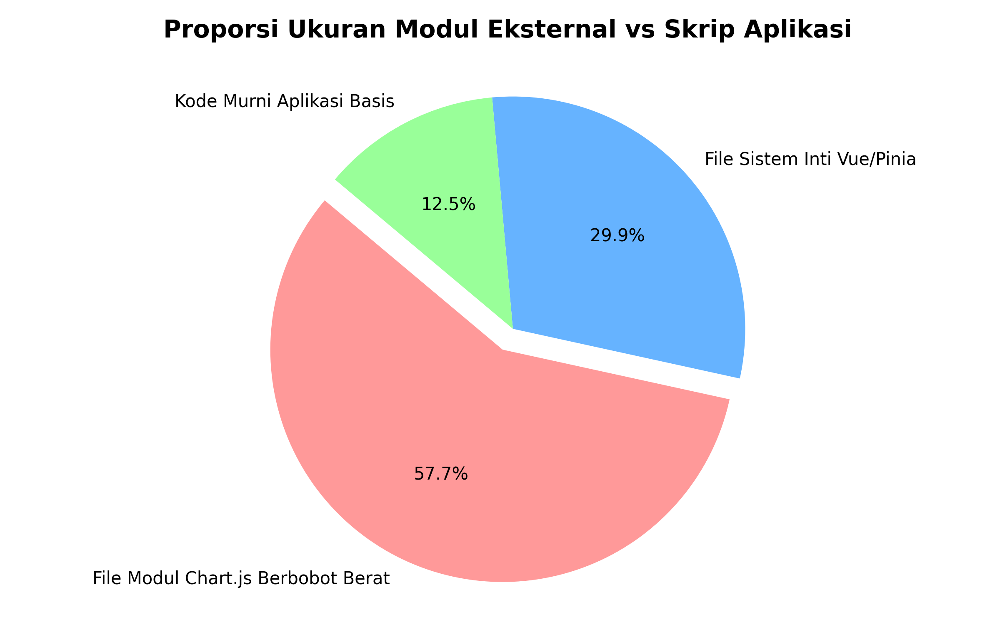
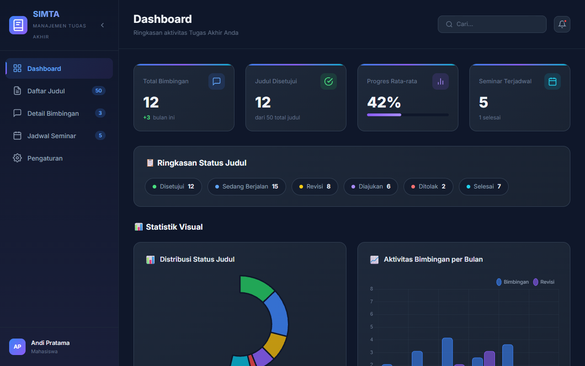
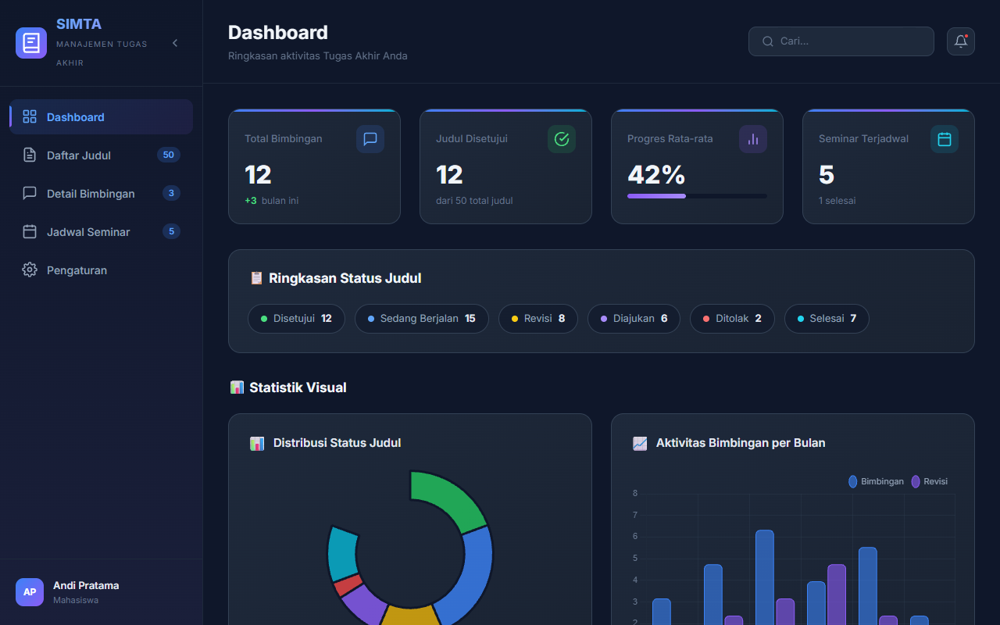
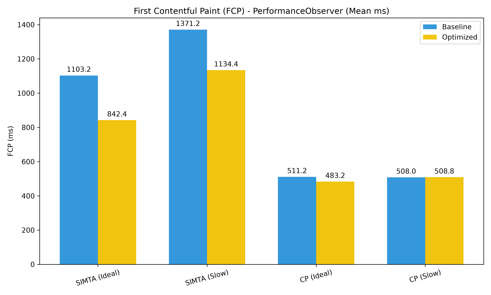
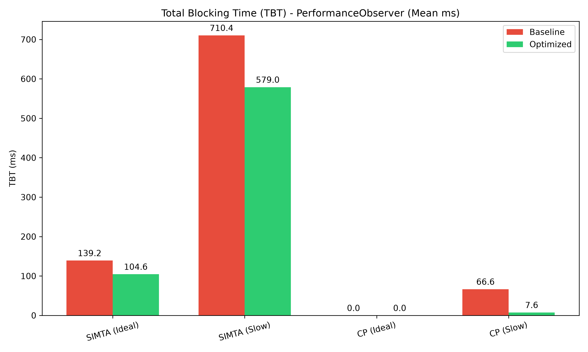
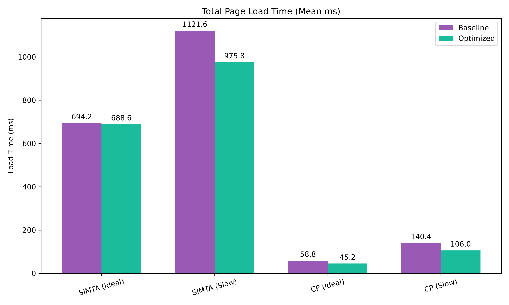
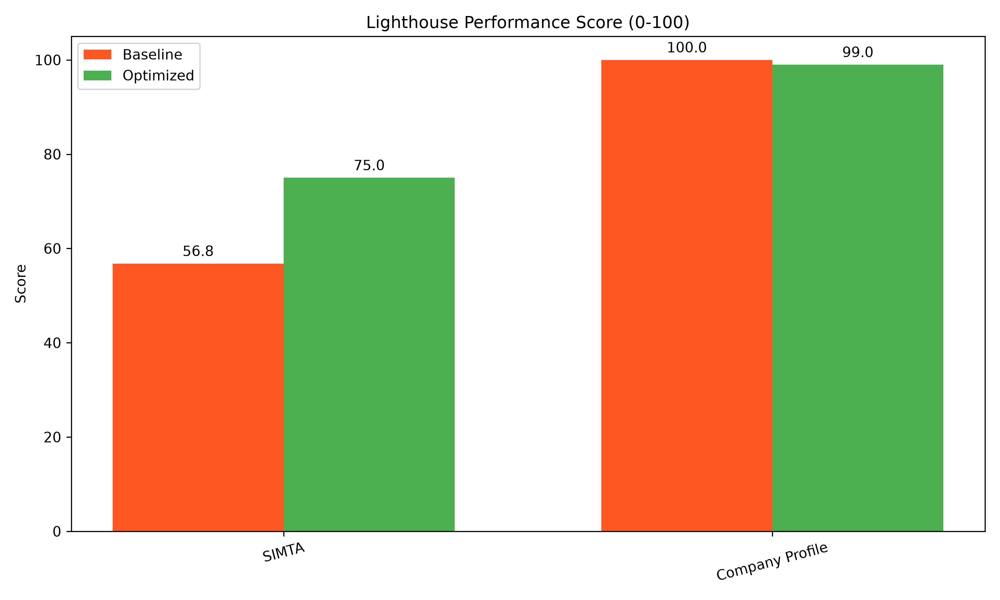
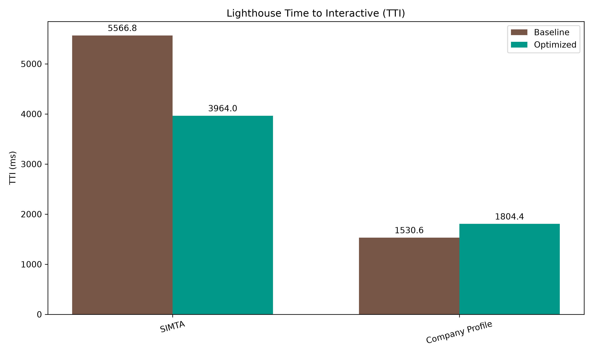
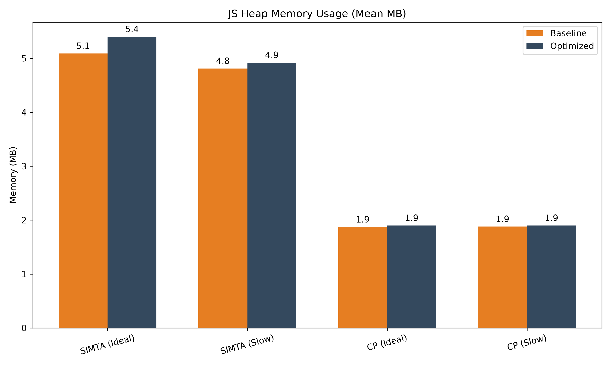

# BAB III HASIL DAN PEMBAHASAN

## 3.1 Perbandingan Ukuran File Setelah Dikompilasi

Masalah utama yang ingin diselesaikan dalam penelitian ini berawal dari ukuran file yang terlalu besar. Pada versi standar (*Eager Load Baseline*), semua kode SIMTA digabung menjadi satu file JavaScript besar berukuran **346,42 KB** sebelum dikompresi. Sekitar **58% dari total ukuran *bundle*** berasal dari pustaka pihak ketiga (*vendor/third-party libraries*), dengan Chart.js mendominasi karena mengemas seluruh modul *renderer* grafik — termasuk modul yang tidak digunakan pada halaman awal — ke dalam satu kesatuan.

Kondisi ini menegaskan relevansi penerapan teknik *Code Splitting*. Apabila pustaka-pustaka besar tersebut berhasil dipisahkan ke dalam *chunk* terpisah dan hanya dimuat ketika halaman yang membutuhkannya diakses, beban unduhan awal dapat dikurangi secara substansial tanpa mengorbankan fungsionalitas aplikasi.

<div align="center">
  
  <br>
  <i>Gambar 3.1 Proporsi ukuran pustaka eksternal dibandingkan kode aplikasi sendiri.</i>
</div>

Gambar 3.1 di atas secara visual mengkonfirmasi temuan kuantitatif yang menjadi landasan penerapan *code splitting* dalam penelitian ini. Dominasi pustaka *vendor* — khususnya Chart.js yang menyumbang hampir sepertiga dari total ukuran *bundle* — menjelaskan mengapa strategi pemisahan *chunk* menjadi intervensi yang tepat sasaran.

Perlu diluruskan bahwa manfaat pemisahan Chart.js ke dalam *chunk* `vendor-chart.js` pada SIMTA **bukan** berasal dari menunda pengunduhannya sampai pengguna membuka halaman tertentu — halaman Dashboard yang menjadi rute pertama (`/`) sudah menampilkan grafik statistik sejak awal (lihat `DashboardView.vue` yang meng-*import* `ChartStatistik.vue`), sehingga `vendor-chart.js` tetap ikut diunduh pada kunjungan pertama. Manfaat nyatanya berasal dari tiga hal lain: (1) browser dapat mengunduh beberapa *chunk* kecil secara **paralel** alih-alih menunggu satu berkas besar selesai diunduh secara berurutan; (2) `vendor-chart.js` dan `vendor-vue.js` menjadi berkas yang dapat di-*cache* terpisah oleh browser, sehingga pembaruan kode aplikasi tidak memaksa pengunduhan ulang pustaka pihak ketiga; dan (3) pada skenario navigasi yang tidak dimulai dari Dashboard (misalnya *deep link* langsung ke `/pengaturan` melalui *hash routing*), `vendor-chart.js` tidak pernah diunduh sama sekali. Ketiga faktor inilah — bukan penundaan Chart.js secara spesifik — yang mendasari perbaikan metrik pemuatan yang diukur pada sub-bab berikutnya.

Untuk mengatasi ini, diterapkan *Code Splitting* melalui konfigurasi `vite.config.js`:

```javascript
/* vite.config.optimized.js - Implementasi Code Splitting (disederhanakan) */
import { defineConfig } from 'vite'
import vue from '@vitejs/plugin-vue'

export default defineConfig({
  plugins: [
    vue(),
    compressAssets(), // plugin kustom: gzip + brotli dalam satu langkah, lihat teks di bawah
  ],
  build: {
    rollupOptions: {
      output: {
        manualChunks(id) {
          if (id.includes('node_modules')) {
            if (id.includes('chart.js') || id.includes('vue-chartjs')) {
              return 'vendor-chart';
            }
            if (id.includes('vue') || id.includes('pinia')) {
              return 'vendor-vue';
            }
          }
        }
      }
    }
  }
})
```

Hasilnya, total ukuran JavaScript SIMTA versi *optimized* terpecah menjadi delapan berkas terpisah (`vendor-vue.js`, `vendor-chart.js`, lima *chunk* per halaman, dan satu *chunk* layanan data), dibandingkan satu berkas tunggal 346,53 KB pada *baseline*. Pemisahan ini membuka jalan bagi dua teknik tambahan yang diuji pada penelitian ini: **kompresi Brotli/Gzip** dan **prefetching**, keduanya dibahas di bawah.

**Kompresi Brotli dan Gzip.** Setiap *chunk* hasil pemecahan dikompresi otomatis saat build melalui plugin kustom pada `vite.config.optimized.js` (`compressAssets`), menghasilkan varian `.gz` dan `.br` di samping berkas asli. Sebagai contoh, `vendor-vue.js` (103,40 KB mentah) mengecil menjadi 39,89 KB (Gzip) dan lebih kecil lagi dengan Brotli; `vendor-chart.js` (199,59 KB mentah) mengecil menjadi 68,18 KB (Gzip). Server pengujian (`http-server`) diaktifkan untuk menyajikan varian terkompresi ini sesuai *header* `Accept-Encoding` peramban (*flag* `-g -b`), sehingga manfaat kompresi benar-benar terukur pada metrik jaringan di sub-bab berikutnya — bukan sekadar tersedia sebagai berkas yang tidak pernah diminta peramban.

---

## 3.2 Penerapan Lazy Loading dan Prefetching pada Navigasi

Pemecahan file saja tidak cukup. Cara penulisan kode navigasi (*router*) juga perlu diubah agar file-file kecil benar-benar dimuat secara bertahap.

**Versi Standar (semua halaman dimuat sekaligus):**
```javascript
import Dashboard from '../views/Dashboard.vue'
import JadwalDosen from '../views/JadwalDosen.vue'

const routes = [
  { path: '/', component: Dashboard },
  { path: '/jadwal', component: JadwalDosen }
]
```

**Versi yang Dioptimalkan (halaman dimuat saat dibutuhkan):**
```javascript
const routes = [
  { path: '/', component: () => import('../views/Dashboard.vue') },
  { path: '/jadwal', component: () => import('../views/JadwalDosen.vue') }
]
```

Dengan penulisan `() => import(...)`, browser dibebaskan dari kewajiban memproses semua halaman di awal. Halaman hanya akan dimuat ketika pengguna membutuhkannya.

**Prefetching.** Sebagai pelengkap *lazy loading*, router versi *optimized* juga menerapkan *prefetching*: setelah navigasi ke Dashboard selesai, `router.afterEach` menjadwalkan pengunduhan `DaftarJudulView.vue` dan `DetailBimbinganView.vue` di latar belakang melalui `requestIdleCallback` (dengan `setTimeout` sebagai *fallback*).

```javascript
router.afterEach((to) => {
  if (to.name === 'Dashboard') {
    const prefetch = () => {
      import('../views/DaftarJudulView.vue')
      import('../views/DetailBimbinganView.vue')
    }
    if ('requestIdleCallback' in window) requestIdleCallback(prefetch)
    else setTimeout(prefetch, 1000)
  }
})
```

Teknik ini memanfaatkan waktu jeda (*idle time*) peramban — saat *main thread* tidak sedang sibuk — untuk mengunduh halaman yang kemungkinan besar dituju berikutnya, tanpa menunda konten yang sedang ditampilkan. Karena dijadwalkan lewat `requestIdleCallback`, proses ini berjalan bersamaan dengan jendela pengukuran `PerformanceObserver` pada sub-bab berikutnya, sehingga *overhead*-nya (jika ada) sudah ikut terekam dalam angka TBT dan penggunaan memori yang dilaporkan — bukan biaya tersembunyi yang luput dari pengukuran.

---

## 3.3 Verifikasi Tampilan Tidak Berubah

Sebelum membandingkan angka-angka performa, penting untuk memastikan bahwa perubahan teknis ini tidak memengaruhi tampilan website sama sekali.

<div align="center">
  
  <br>
  <i>Gambar 3.2 Tampilan SIMTA versi standar (Eager Load Baseline).</i>
</div>

Gambar 3.2 di atas menampilkan antarmuka SIMTA versi *baseline* yang menjadi titik referensi pengukuran. Terlihat bahwa halaman utama menampilkan grafik statistik interaktif (*doughnut chart* dan *bar chart*) yang ditenagai oleh pustaka Chart.js — inilah komponen yang menjadi target utama pemisahan *chunk*. Pada versi ini, seluruh kode Chart.js sudah diunduh dan dieksekusi sejak awal meskipun pengguna belum tentu langsung mengakses halaman yang berisi grafik tersebut.

<div align="center">
  
  <br>
  <i>Gambar 3.3 Tampilan SIMTA versi yang dioptimalkan (Code Splitting).</i>
</div>

Gambar 3.3 di atas membuktikan bahwa penerapan *code splitting* dan *lazy loading* bersifat transparan bagi pengguna akhir. Tampilan antarmuka versi *optimized* identik secara visual dengan versi *baseline* pada Gambar 3.2 — seluruh elemen UI, warna, tata letak, dan data yang ditampilkan tidak mengalami perubahan sama sekali. Hal ini mengkonfirmasi bahwa seluruh modifikasi berada pada lapisan *delivery* dan *execution* JavaScript, bukan pada lapisan *rendering*, sehingga optimasi tidak menimbulkan regresi fungsional maupun visual.

---

## 3.4 Hasil Pengujian: Instrumen PerformanceObserver (Kondisi Normal)

### 3.4.1 Perbandingan First Contentful Paint (FCP)

Pada aplikasi SIMTA dalam kondisi ideal (*no throttling*), versi *baseline* menampilkan konten visual pertama dalam waktu rata-rata **1103,2 ms** (SD = 179,4), sedangkan versi yang telah dioptimasi mencatatkan waktu **842,4 ms** (SD = 20,0). Selisih sebesar 260,8 ms ini merepresentasikan perbaikan **23,6%**, yang secara teknis disebabkan oleh berkurangnya volume JavaScript yang harus diunduh dan di-*parse* oleh mesin V8 sebelum browser dapat melakukan *first paint*, ditambah manfaat kompresi Brotli/Gzip yang mengecilkan ukuran transfer setiap *chunk*.

Pada aplikasi *Company Profile*, versi *baseline* mencatat FCP sebesar **511,2 ms** (SD = 31,7) dan versi optimasi **483,2 ms** (SD = 18,8) — perbaikan kecil sebesar **5,5%**. Selisih ini jauh lebih tipis dibanding SIMTA, mengindikasikan bahwa pada aplikasi dengan kompleksitas rendah — di mana *bundle* JavaScript sejak awal sudah berukuran kecil dan tidak mengandung pustaka berat — penerapan *Code Splitting* tidak memberikan kontribusi sebesar pada aplikasi kompleks terhadap percepatan FCP.

<div align="center">
  
  <br>
  <i>Gambar 3.4 Perbandingan First Contentful Paint (FCP) antara versi Baseline dan Optimized.</i>
</div>

Gambar 3.4 di atas memvisualisasikan perbedaan FCP yang terjadi akibat penerapan *code splitting*, *lazy loading*, dan kompresi. Pada SIMTA, penurunan FCP sebesar 23,6% (dari 1103,2 ms menjadi 842,4 ms) terjadi karena berkurangnya volume JavaScript yang harus di-*parse* oleh mesin V8 sebelum browser dapat melakukan *first paint*, ditambah transfer *chunk* yang lebih kecil berkat kompresi. Sementara itu, perbedaan pada *Company Profile* jauh lebih tipis (511,2 ms vs 483,2 ms, perbaikan 5,5%), yang mengindikasikan bahwa manfaat *code splitting* terhadap FCP jauh lebih terasa ketika *bundle* awal sudah cukup besar untuk menyebabkan keterlambatan *parsing* dan transfer yang terukur.

**Tabel 3.1 Ringkasan FCP — Kondisi Normal (Rata-rata ± Standar Deviasi, 5 Repetisi)**

| Aplikasi | Baseline (ms) | Optimized (ms) | Selisih |
|----------|---------------|----------------|---------|
| SIMTA | 1103,2 ± 179,4 | 842,4 ± 20,0 | -260,8 ms (-23,6%) |
| Company Profile | 511,2 ± 31,7 | 483,2 ± 18,8 | -28,0 ms (-5,5%) |

### 3.4.2 Perbandingan Total Blocking Time (TBT)

Pada SIMTA dalam kondisi ideal, versi *baseline* mencatatkan TBT sebesar **139,2 ms** (SD = 77,0), sementara versi yang telah dioptimasi mencatatkan angka lebih rendah yaitu **104,6 ms** (SD = 34,6) — perbaikan 24,9%. Kedua nilai ini masih berada di bawah ambang batas 200 ms yang ditetapkan oleh standar *Core Web Vitals*, sehingga tidak terlalu terasa oleh pengguna akhir pada kondisi perangkat yang mumpuni. Dampak sesungguhnya dari teknik optimasi ini terlihat jauh lebih jelas pada skenario CPU yang diperlambat.

<div align="center">
  
  <br>
  <i>Gambar 3.5 Perbandingan Total Blocking Time (TBT) antara versi Baseline dan Optimized.</i>
</div>

Gambar 3.5 di atas memperlihatkan TBT SIMTA versi *optimized* konsisten lebih rendah dibanding *baseline*, baik pada kondisi normal (104,6 ms vs 139,2 ms) maupun — seperti akan ditunjukkan pada sub-bab berikutnya — pada kondisi CPU diperlambat. Kedua nilai pada kondisi normal masih berada di bawah ambang batas 200 ms *Core Web Vitals*. Pada *Company Profile*, TBT tercatat 0 ms pada kedua versi, mengkonfirmasi bahwa *bundle* yang sudah kecil tidak menghasilkan *blocking time* yang terukur pada kondisi ideal.

**Tabel 3.2 Ringkasan TBT — Kondisi Normal (Rata-rata ± Standar Deviasi, 5 Repetisi)**

| Aplikasi | Baseline (ms) | Optimized (ms) | Selisih | % |
|----------|---------------|----------------|---------|---|
| SIMTA | 139,2 ± 77,0 | 104,6 ± 34,6 | -34,6 ms | -24,9% |
| Company Profile | 0,0 ± 0,0 | 0,0 ± 0,0 | 0,0 ms | 0% |

---

## 3.5 Hasil Pengujian: Instrumen PerformanceObserver (CPU Diperlambat 4x)

Inilah pengujian yang paling penting — mensimulasikan pengguna yang mengakses SIMTA dari perangkat dengan spesifikasi rendah. Simulasi dilakukan dengan *CPU throttling* 4x melalui *Puppeteer Chromium API*, sehingga seluruh tahapan pemrosesan JavaScript (*parsing*, *JIT compilation*, *execution*) membutuhkan waktu 4x lebih lama dari kondisi normal.

### 3.5.1 Perbandingan Total Waktu Muat (Load Time)

Pada SIMTA, waktu muat versi *baseline* meningkat dari 694,2 ms (kondisi ideal) menjadi **1121,6 ms** (SD = 218,5), sedangkan versi optimasi meningkat dari 688,6 ms menjadi **975,8 ms** (SD = 45,5). Perbedaan antara kedua versi pada kondisi *throttled* menunjukkan perbaikan sebesar 13,0%. Untuk *Company Profile*, versi optimasi juga menghasilkan *Load Time* yang lebih cepat (106,0 ms vs 140,4 ms pada *baseline*), dengan perbaikan sebesar 24,5%.

<div align="center">
  
  <br>
  <i>Gambar 3.6 Perbandingan total waktu muat pada kondisi perangkat lambat (CPU 4x).</i>
</div>

Gambar 3.6 di atas menampilkan perbandingan *Load Time* pada kondisi CPU yang diperlambat 4x — skenario yang paling merepresentasikan kondisi pengguna dengan perangkat rendah. Penurunan *Load Time* pada SIMTA sebesar 13,0% (dari 1121,6 ms menjadi 975,8 ms) berasal dari kombinasi *code splitting*, *lazy loading*, dan kompresi Brotli/Gzip yang kini benar-benar aktif tersaji ke peramban. *Company Profile* turut membaik sebesar 24,5%, murni dari *code splitting* dan *lazy loading* — perlu dicatat bahwa konfigurasi *build Company Profile* tidak menyertakan kompresi Brotli/Gzip, sehingga perbaikannya tidak dapat dikaitkan dengan kompresi.

### 3.5.2 Perbandingan TBT pada Kondisi Throttled

**Tabel 3.3 Metrik Kunci SIMTA — Kondisi CPU Diperlambat 4x (Rata-rata ± Standar Deviasi, 5 Repetisi)**

| Metrik (SIMTA) | Baseline (CPU Lambat) | Optimized (CPU Lambat) | |
|----------------|----------------------|------------------------|---|
| **FCP** | 1371,2 ± 49,4 ms | 1134,4 ± 47,1 ms | ↑ |
| **TBT** | **710,4 ± 89,2 ms** | **579,0 ± 63,1 ms** | ↑ |

**Analisis:** Nilai TBT pada versi standar yang mencapai **710,4 ± 89,2 ms** sudah melampaui batas toleransi Google Web Vitals (300 ms). Dengan *Code Splitting*, *Lazy Loading*, dan kompresi, nilai TBT turun menjadi **579,0 ± 63,1 ms** — meskipun masih di atas batas ideal, sudah menunjukkan perbaikan signifikan sebesar **18,5%** bagi pengguna perangkat rendah.

**Tabel 3.4 Ringkasan Seluruh Metrik PerformanceObserver — SIMTA (Rata-rata ± SD, 5 Repetisi)**

| Metrik | Baseline Normal | Optimized Normal | Baseline Throttled | Optimized Throttled |
|--------|----------------|------------------|--------------------|---------------------|
| FCP (ms) | 1103,2 ± 179,4 | 842,4 ± 20,0 | 1371,2 ± 49,4 | 1134,4 ± 47,1 |
| LCP (ms) | 1103,2 ± 179,4 | 842,4 ± 20,0 | 1371,2 ± 49,4 | 1134,4 ± 47,1 |
| TBT (ms) | 139,2 ± 77,0 | 104,6 ± 34,6 | 710,4 ± 89,2 | 579,0 ± 63,1 |
| Load Time (ms) | 694,2 ± 22,2 | 688,6 ± 17,6 | 1121,6 ± 218,5 | 975,8 ± 45,5 |
| JS Heap (MB) | 5,09 ± 0,42 | 5,40 ± 0,08 | 4,81 ± 0,13 | 4,92 ± 0,12 |

**Tabel 3.5 Ringkasan Seluruh Metrik PerformanceObserver — Company Profile (5 Repetisi)**

| Metrik | Baseline Normal | Optimized Normal | Baseline Throttled | Optimized Throttled |
|--------|----------------|------------------|--------------------|---------------------|
| FCP (ms) | 511,2 ± 31,7 | 483,2 ± 18,8 | 508,0 ± 15,2 | 508,8 ± 22,4 |
| LCP (ms) | 511,2 ± 31,7 | 483,2 ± 18,8 | 508,0 ± 15,2 | 508,8 ± 22,4 |
| TBT (ms) | 0,0 ± 0,0 | 0,0 ± 0,0 | 66,6 ± 4,4 | 7,6 ± 4,6 |
| Load Time (ms) | 58,8 ± 7,6 | 45,2 ± 5,5 | 140,4 ± 7,4 | 106,0 ± 13,6 |
| JS Heap (MB) | 1,87 ± 0,00 | 1,90 ± 0,00 | 1,88 ± 0,02 | 1,90 ± 0,00 |

Perlu dicatat: berbeda dengan pengukuran sebelumnya yang menunjukkan FCP *Company Profile* memburuk cukup besar pada kondisi *throttled*, pengukuran ulang ini menunjukkan FCP baseline (508,0 ms) dan optimized (508,8 ms) **praktis tidak berbeda** — selisih 0,8 ms berada jauh di dalam rentang simpangan baku kedua kelompok. Ini mengindikasikan bahwa pada aplikasi sesederhana *Company Profile*, dengan skala waktu muat yang sangat kecil (ratusan milidetik), pengukuran berbasis *PerformanceObserver* dari satu sesi 5 repetisi rentan terhadap variasi kondisi mesin pengujian (proses latar belakang, *thermal throttling*, dsb.), sehingga sulit dijadikan dasar klaim persentase yang presisi. Sub-bab 3.8 membahas hal ini lebih lanjut menggunakan data Lighthouse yang terbukti lebih stabil pada aplikasi ini (simpangan baku mendekati nol, lihat Tabel 3.7).

---

## 3.6 Hasil Pengujian: Instrumen Google Lighthouse

Sebagai triangulasi data, berikut hasil pengukuran menggunakan Google Lighthouse. Perlu dicatat bahwa Lighthouse melakukan simulasi perangkat *mobile* kelas menengah secara internal dengan menerapkan *CPU slowdown* dan *network throttling* tersendiri — berbeda dari kondisi pengujian *PerformanceObserver* yang dijalankan pada lingkungan *localhost* tanpa simulasi jaringan. Perbedaan metodologi pengukuran inilah yang menyebabkan nilai absolut FCP dan LCP pada Lighthouse jauh lebih tinggi dibandingkan hasil *PerformanceObserver* (misalnya FCP Lighthouse 4960 ms vs FCP PerformanceObserver 1103 ms).

<div align="center">
  
  <br>
  <i>Gambar 3.7 Perbandingan Lighthouse Performance Score antara versi Baseline dan Optimized.</i>
</div>

Gambar 3.7 di atas menunjukkan bahwa *Lighthouse Performance Score* SIMTA naik cukup besar dari *baseline* ke *optimized* (56,8 menjadi 75,0, kenaikan 32,0%), sementara *Company Profile* nyaris tidak berubah (100 menjadi 99). Pola ini konsisten dengan hipotesis utama penelitian: manfaat *code splitting* dan *lazy loading* jauh lebih terasa pada aplikasi kompleks dengan pustaka berat, dan nyaris tidak berpengaruh pada aplikasi yang *bundle* awalnya sudah kecil.

**Tabel 3.6 Hasil Lighthouse — SIMTA (Mean ± SD, 5 Repetisi)**

| Metrik | Baseline | Optimized | Selisih |
|--------|----------------|---------------------|---------|
| Performance Score | 56,8 ± 4,2 | 75,0 ± 13,3 | +18,2 (+32,0%) |
| FCP (ms) | 4960,4 ± 56,4 | 3250,2 ± 404,6 | -1710,2 (-34,5%) |
| LCP (ms) | 5228,4 ± 60,6 | 3790,8 ± 774,3 | -1437,6 (-27,5%) |
| TTI (ms) | 5566,8 ± 181,9 | 3964,0 ± 918,3 | -1602,8 (-28,8%) |
| TBT (ms) | 454,8 ± 152,0 | 315,4 ± 241,5 | -139,4 (-30,6%) |
| Speed Index | 4960,4 ± 56,4 | 3265,2 ± 386,8 | -1695,2 (-34,2%) |

**Interpretasi Hasil Lighthouse SIMTA:** Berbeda dengan dugaan awal bahwa *lazy loading* akan memperlambat metrik berbasis *loading* (FCP, LCP, TTI) sebagai *trade-off* dari eksekusi modul yang bertahap, hasil pengukuran menunjukkan **seluruh metrik Lighthouse membaik** pada versi *optimized* — termasuk FCP, LCP, dan TTI yang pada pengukuran sebelumnya (sebelum kompresi Brotli/Gzip diperbaiki agar benar-benar tersaji ke peramban) sempat terlihat memburuk. Setelah kompresi berfungsi sebagaimana mestinya, ukuran transfer setiap *chunk* mengecil cukup jauh sehingga manfaat *code splitting* tidak lagi tertutupi oleh biaya tambahan *request* jaringan per *chunk*. Simpangan baku pada versi *optimized* (misalnya TBT 315,4 ± 241,5 ms) juga jauh lebih besar dibanding *baseline* — ini wajar karena Lighthouse mengukur seluruh rangkaian pemuatan modul dinamis yang waktunya lebih bervariasi dibanding satu berkas monolitik, namun rata-ratanya tetap menunjukkan perbaikan yang jelas.

<div align="center">
  
  <br>
  <i>Gambar 3.8 Perbandingan Lighthouse Time to Interactive (TTI) antara SIMTA dan Company Profile.</i>
</div>

Gambar 3.8 di atas memperlihatkan TTI SIMTA membaik dari 5566,8 ms menjadi 3964,0 ms (28,8%) — sejalan dengan perbaikan pada FCP, LCP, TBT, dan Speed Index. Artinya, pada SIMTA, optimasi tidak hanya membuat halaman lebih responsif terhadap klik (TBT turun), tetapi juga membuat *main thread* lebih cepat mencapai kondisi benar-benar bebas dan interaktif secara keseluruhan.

**Tabel 3.7 Hasil Lighthouse — Company Profile (Mean ± SD, 5 Repetisi)**

| Metrik | Baseline | Optimized | Selisih |
|--------|----------------|---------------------|---------|
| Performance Score | 100,0 ± 0,0 | 99,0 ± 0,0 | -1,0 |
| FCP (ms) | 1361,4 ± 16,8 | 1578,2 ± 1,0 | +216,8 (+15,9%) |
| LCP (ms) | 1528,8 ± 8,2 | 1804,4 ± 1,4 | +275,6 (+18,0%) |
| TTI (ms) | 1530,6 ± 7,4 | 1804,4 ± 1,4 | +273,8 (+17,9%) |
| TBT (ms) | 0,0 ± 0,0 | 0,0 ± 0,0 | 0,0 |
| Speed Index | 1361,4 ± 16,8 | 1578,2 ± 1,0 | +216,8 (+15,9%) |

Berbeda dengan SIMTA, hasil Lighthouse *Company Profile* tetap menunjukkan sedikit degradasi FCP/LCP/TTI pada versi *optimized* — pola ini konsisten baik sebelum maupun sesudah perbaikan kompresi dan pengukuran ulang (dengan simpangan baku yang sangat kecil, menandakan hasil ini stabil dan bukan kebetulan). Penyebabnya adalah *overhead* tambahan berupa beberapa kali *request* HTTP untuk *chunk* yang terpisah, yang pada aplikasi sekecil *Company Profile* — tanpa pustaka berat yang perlu dipisahkan — tidak sebanding dengan manfaatnya.

---

## 3.7 Penggunaan Memori Browser

Grafik perbandingan JS Heap Memory menampilkan konsumsi memori *runtime* dari keempat skenario pengujian. Pada kondisi ideal, versi *baseline* SIMTA mengalokasikan rata-rata **5,09 MB** (SD = 0,42) di *heap* memori JavaScript, sedangkan versi optimasi menggunakan **5,40 MB** (SD = 0,08) — tambahan 0,31 MB. Pada kondisi CPU diperlambat, polanya konsisten: *baseline* 4,81 MB (SD = 0,13) vs *optimized* 4,92 MB (SD = 0,12), tambahan 0,11 MB. Pertambahan memori kecil dan konsisten pada versi optimasi ini bersumber dari penyimpanan referensi *callback function* untuk setiap modul yang dijadwalkan melalui *dynamic import*, termasuk dua modul yang dijadwalkan lewat mekanisme *prefetching* (Sub-bab 3.2).

<div align="center">
  
  <br>
  <i>Gambar 3.9 Perbandingan penggunaan memori browser (JS Heap) antara semua skenario.</i>
</div>

Gambar 3.9 di atas mengkonfirmasi bahwa penerapan *code splitting* tidak menambah beban memori yang signifikan. Perbedaan *JS Heap* antara *baseline* dan *optimized* pada semua skenario SIMTA berada di bawah 0,35 MB — jauh lebih kecil dari manfaat pengurangan TBT yang diperoleh (18,5%–24,9%, Sub-bab 3.4–3.5). Dengan demikian, *trade-off* antara sedikit tambahan memori dan penurunan TBT yang jauh lebih besar tetap menguntungkan, dan implementasi *hybrid lazy loading* dapat direkomendasikan tanpa kekhawatiran terhadap konsumsi memori berlebih.

---

## 3.8 Perbandingan Dampak pada SIMTA vs Company Profile

Analisis komparatif antara SIMTA dan *Company Profile* menghasilkan temuan yang memperkuat hipotesis utama penelitian ini tentang pengaruh tingkat kompleksitas terhadap efektivitas strategi optimasi — dengan satu catatan metodologis penting yang perlu disampaikan secara jujur.

Pada *Company Profile* dalam kondisi CPU yang diperlambat, nilai TBT versi *baseline* tercatat sebesar **66,6 ms** (SD = 4,4), yang masih berada jauh di bawah ambang batas 200 ms standar *Core Web Vitals*. Setelah diterapkan *Code Splitting*, nilai TBT turun menjadi **7,6 ms** (SD = 4,6) — penurunan sebesar 88,6%. Sebagaimana SIMTA (18,5%–24,9%, Sub-bab 3.4–3.5), TBT *Company Profile* juga konsisten membaik, meski nilai awalnya sudah tergolong baik sehingga dampak praktis bagi pengguna jauh lebih kecil dibanding SIMTA yang TBT *baseline*-nya (710,4 ms) sudah melampaui batas toleransi secara drastis.

**Catatan metodologis mengenai FCP *Company Profile*.** Pengukuran awal penelitian ini pada kondisi *throttled* sempat mencatat FCP *baseline* 373,6 ms dan *optimized* 486,4 ms — memberi kesan *code splitting* men-degradasi FCP sebesar 30,2% pada aplikasi sederhana. Pengukuran ulang dengan metodologi yang telah diperbaiki (lihat Lampiran) mencatat FCP *baseline* 508,0 ms dan *optimized* 508,8 ms — **praktis tidak berbeda** (selisih 0,8 ms, jauh di dalam rentang simpangan baku ±15–22 ms kedua kelompok). Perbedaan tajam antara dua pengukuran ini menunjukkan bahwa pada aplikasi sesederhana *Company Profile*, dengan skala waktu muat hanya ratusan milidetik, *PerformanceObserver* dari satu sesi 5 repetisi terlalu rentan terhadap variasi kondisi mesin pengujian untuk dijadikan dasar klaim persentase yang presisi — sebuah ancaman terhadap validitas internal yang perlu diakui secara terbuka.

Bukti yang lebih dapat diandalkan datang dari Lighthouse (Tabel 3.7), yang simpangan bakunya jauh lebih kecil (mendekati 0 pada beberapa metrik) dan **konsisten pada dua kali pengukuran terpisah**: FCP *Company Profile* memburuk sekitar 15,9%–16,7% dan LCP sekitar 18,0%–17,9% pada versi *optimized*, baik sebelum maupun sesudah pengukuran ulang. Kesimpulan bahwa *code splitting* dapat memberi *overhead* kecil pada aplikasi sederhana **tetap didukung data**, tetapi bersandar pada bukti Lighthouse yang stabil — bukan pada angka 30,2% dari *PerformanceObserver* yang ternyata tidak *reproducible*.

**Tabel 3.8 Perbandingan Improvement antara SIMTA dan Company Profile (Kondisi CPU Throttled)**

| Metrik | Instrumen | SIMTA Improvement | CP Improvement | Keterangan |
|--------|-----------|-------------------|-----------------|------------|
| FCP | PerformanceObserver | +17,3% | -0,2% (~0, dalam noise) | SIMTA membaik jelas; CP tidak berbeda signifikan |
| FCP | Lighthouse | +34,5% | -15,9% (memburuk) | SIMTA membaik jelas; CP sedikit memburuk (stabil, SD kecil) |
| TBT | PerformanceObserver | +18,5% | +88,6% | Keduanya membaik (CP dari baseline yang sudah baik) |
| Load Time | PerformanceObserver | +13,0% | +24,5% | Keduanya membaik |
| JS Heap | PerformanceObserver | -2,3% (overhead) | -1,1% (overhead) | Overhead memori minimal, konsisten kecil |
| LH Score | Lighthouse | +32,0% | -1,0% | SIMTA naik besar; CP nyaris tidak berubah |

Kesimpulan dari tabel ini: **teknik *hybrid code splitting* + *lazy loading* + kompresi sangat efektif untuk aplikasi yang kompleks dan banyak menggunakan pustaka besar** (naik di semua metrik, termasuk Lighthouse Score +32,0%), **tetapi manfaatnya tipis — dan pada metrik Lighthouse yang stabil justru sedikit negatif pada FCP/LCP — untuk aplikasi sederhana** seperti *Company Profile*. Rekomendasi strategis tidak berubah: terapkan *code splitting* dan *lazy loading* hanya ketika *bundle* awal sudah melebihi 200 KB terkompresi dan terdapat pustaka berat yang tidak dibutuhkan di halaman utama; untuk aplikasi yang *bundle*-nya sudah kecil, biaya tambahan berupa beberapa kali *request* HTTP per *chunk* tidak sebanding dengan manfaatnya.
